# Architecture Guide — kotakbank (AEM Edge Delivery Services)

This guide explains how the project is actually built. It is an **AEM Edge Delivery Services (EDS)** project (xwalk / Universal Editor) on `aem-boilerplate-xwalk` — vanilla **JavaScript (ES6+), CSS3, JSON**, served from GitHub via **AEM Code Sync**.

> **Reality check.** Several requested topics — **OSGi bundles, Core bundle, UI Apps, UI Content, Dispatcher, Content packages, Cloud Manager pipeline** — belong to the *traditional* AEM-as-a-Cloud-Service stack and **do not exist in this repository**. Each section below states that plainly and maps it to the true EDS equivalent (mirroring `AGENTS.md`). Everything is verified against the repo, not a generic template.

---

## 1. Folder structure

Verified top-level layout:

```
├── blocks/                 # 50 blocks — shared (cards, columns, hero, header, footer, fragment…) + dedicated k811-*
│   └── {name}/{name}.js|.css|_{name}.json
├── scripts/
│   ├── aem.js              # EDS platform core — NEVER MODIFY
│   ├── scripts.js          # entry point; three-phase loadPage()
│   ├── delayed.js          # delayed-phase work
│   ├── editor-support.js / editor-support-rte.js   # Universal Editor WYSIWYG
│   ├── sentry.js           # @sentry/browser init
│   ├── dompurify.min.js    # HTML sanitization
│   ├── eligibility-modal.js / compare-modal.js / credit-card.js  # shared feature logic
│   └── k811/               # k811 runtime: k811-common.js, aos.*, lottie-player.min.js
├── styles/                 # styles.css (global+LCP), lazy-styles.css, fonts.css, kotak811.css, eligibility-modal.css
├── models/                 # _component-*.json (aggregation inputs) + _page/_section/_text/_title/_image/_button.json
├── icons/  fonts/          # optimized assets only
├── content/                # authored HTML snapshots — DO NOT hand-edit
├── drafts/                 # static HTML for local testing (--html-folder drafts)
├── data/                   # data resources
├── tools/importer/         # migration: parsers/, transformers/, page-templates.json, bundles, dist/
├── head.html               # global <head>: CSP + eager loads of aem.js, scripts.js, styles.css
├── 404.html                # custom 404
├── fstab.yaml              # content mountpoint (author delivery URL)
├── helix-query.yaml        # query-index.json config
├── helix-sitemap.yaml      # sitemap config
├── .hlxignore              # files NOT served (dotfiles, *.md, package*.json, test/*, _*, snapshots/*)
├── component-definition.json / component-models.json / component-filters.json  # AGGREGATES (generated)
├── xwalk.json
├── docs/                   # skills/, prompts/, CODING_STANDARDS.md, this guide (not served)
└── .github/workflows/      # main.yaml (lint + JSON-sync gate), cleanup-on-create.yaml
```

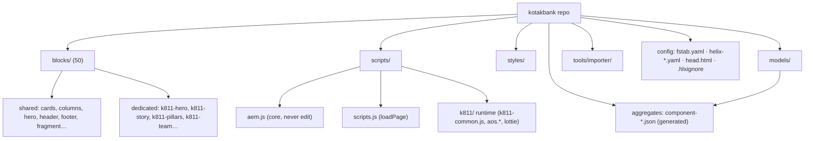

---

## 2. Modules

There is no module system beyond **ES modules** (imported with explicit `.js` extensions). The functional modules are:

| Module | Role |
|---|---|
| `scripts/aem.js` | EDS platform core (decoration helpers, `loadSection(s)`, `createOptimizedPicture`, `loadCSS`, sampleRUM). **Never modify.** |
| `scripts/scripts.js` | Page entry point. Exports `decorateMain`, `moveInstrumentation`, `decorateButtons`; runs `loadPage()` → eager/lazy/delayed. |
| `scripts/delayed.js` | Delayed-phase, non-critical work (martech). |
| `scripts/k811/k811-common.js` | Shared **k811 runtime**: `initK811(block)` marks `main.kotak811`, loads `styles/kotak811.css` + Manrope once, and drives a single `IntersectionObserver` scroll-reveal (with `prefers-reduced-motion` fallback, staggered children, counter animation). Exports `revealOnScroll`, `initK811`. |
| `scripts/editor-support*.js` | Universal Editor WYSIWYG enhancements. |
| `scripts/dompurify.min.js` | Sanitize authored/remote HTML before `innerHTML`. |
| `scripts/sentry.js` | `@sentry/browser` error monitoring init. |
| shared feature modules | `eligibility-modal.js`, `compare-modal.js`, `credit-card.js`. |
| `blocks/{name}/{name}.js` | Per-block `decorate(block)` — the component logic unit. |

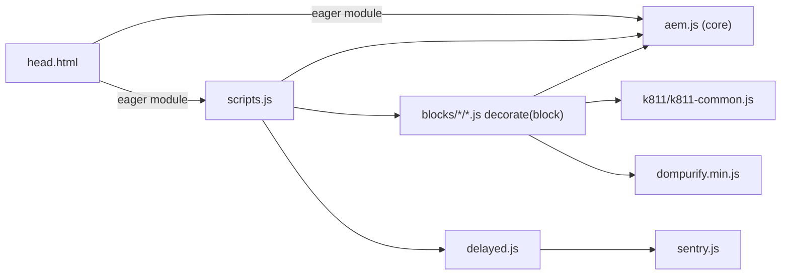

---

## 3. Dependencies

From `package.json` — deliberately minimal:

- **Runtime dependency (ships to browser):** `@sentry/browser` (loaded via `scripts/sentry.js`). Migration blocks also bundle small **local** assets (`scripts/k811/aos.*`, `lottie-player.min.js`) — but the lightweight `IntersectionObserver` in `k811-common.js` is preferred over heavy animation libs.
- **Dev/tooling only:** ESLint (`airbnb-base`, `plugin:import`, `plugin:json`, `plugin:xwalk`), Stylelint (`stylelint-config-standard`), Husky, `merge-json-cli`, `npm-run-all`, `@babel/eslint-parser`.
- **No bundler, no transpiler, no application build.** The only "build" is JSON aggregation (`npm run build:json`). Code ships as authored.

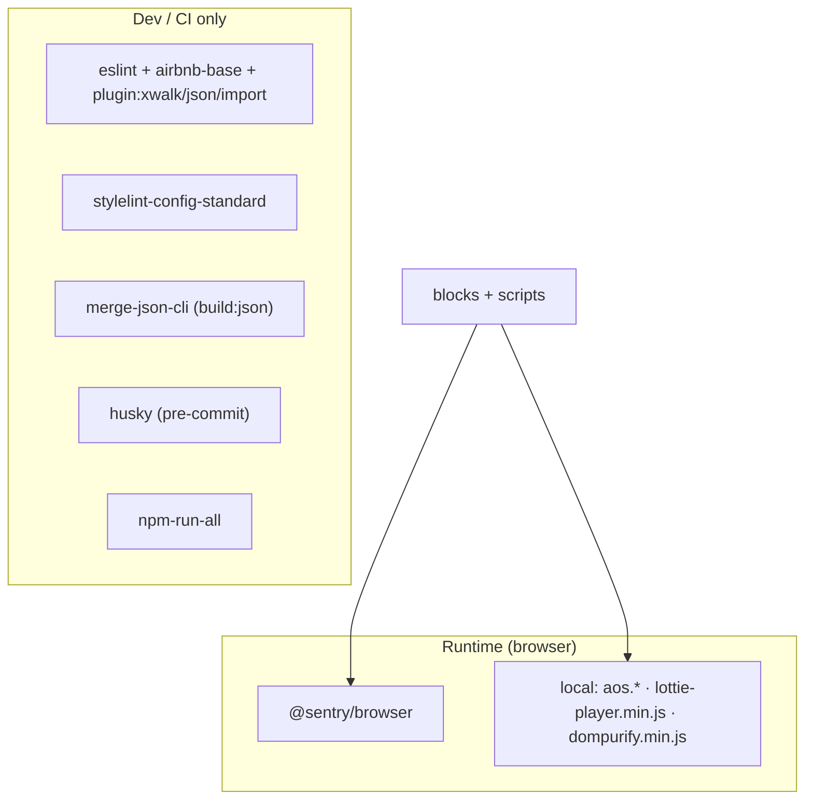

---

## 4. OSGi bundles → *N/A (ES modules)*

**There is no OSGi container, bundles, `@Component`, or Felix console.** Shared logic is packaged as small ES modules under `scripts/`; configuration lives in YAML/HTML. Import with `.js` extensions; keep modules dependency-free where possible. The nearest thing to a "system bundle" is `scripts/aem.js` — treat it as read-only.

---

## 5. Core bundle → *N/A (`scripts/aem.js`)*

**There is no Java "core" bundle.** The platform core is **`scripts/aem.js`** — it provides the decoration primitives (`decorateSections`, `decorateBlocks`, `loadSection`, `loadBlock`, `createOptimizedPicture`, `loadCSS`, RUM). It is delivered by the platform and **must never be modified**. Project-wide shared logic that *you* own lives in `scripts/scripts.js` and `scripts/k811/k811-common.js`.

---

## 6. UI Apps → *N/A (blocks + models)*

**There is no `ui.apps` package, `/apps` tree, or `.content.xml`.** The equivalent of "application code / component definitions" is:
- **Blocks** (`blocks/{name}/`) — the runtime component code + styles.
- **Universal Editor models** (`_{block}.json` + `models/_component-*.json`) — the authoring definitions, aggregated into `component-definition.json` / `component-models.json` / `component-filters.json`.

---

## 7. UI Content → *N/A (authored content source)*

**There is no `ui.content` package or committed JCR content.** Authored content lives in the **AEMaaCS author** and is mounted via `fstab.yaml`. The `content/` folder holds `*.plain.html` **reference snapshots** only — **never hand-edit them**; create content via the import tooling in `tools/importer/`.

---

## 8. Dispatcher → *N/A (Edge CDN + `.hlxignore`)*

**There is no Apache/Dispatcher tier.** Delivery and caching are handled by the Edge Delivery CDN. What you control:
- **`.hlxignore`** — which files are *not* served (dotfiles, `*.md`, `package*.json`, `test/*`, `_*` partials, `snapshots/*`).
- **`head.html`** — the strict CSP (`script-src 'nonce-aem' 'strict-dynamic' …`) and eager asset loads.
- **"Invalidation"** = re-publish (push the branch). No TTL tuning, no `dispatcher.any`.

---

## 9. Content packages → *N/A (git + Code Sync)*

**There are no CRX content packages (`.zip`/FileVault).** "Deployment" is a `git push`; **AEM Code Sync** publishes the branch. Content is authored in AEMaaCS and delivered via the `fstab` mount — it is never packaged into the repo. Migration content is produced by `tools/importer/` bundles, not packaged by hand.

---

## 10. Cloud Manager pipeline → *N/A (GitHub Actions + Code Sync + PSI)*

**There is no Adobe Cloud Manager.** CI/CD is GitHub Actions plus AEM Code Sync. Verified `.github/workflows/main.yaml`:

1. `actions/checkout` → Node 20 → `npm ci`
2. `npm run lint` (JS + CSS)
3. **JSON-sync gate:** `npm run build:json` then `git diff --exit-code` on the three aggregates — **fails the build if they are stale.**

`cleanup-on-create.yaml` runs boilerplate cleanup on repo creation. Renovate keeps dependencies current. Quality gates: green Actions (`gh pr checks`), successful Code Sync publish, PSI target 100 on the preview URL, and a PR review requiring a `https://{branch}--kotakbank--xeragobiz.aem.page/{path}` link.

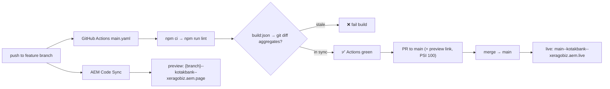

---

## 11. Deployment flow

Push-driven; no manual deploy step.

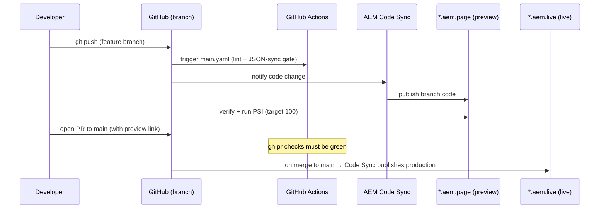

---

## 12. Author → Publish flow

Content and code travel on **separate paths** and meet at the Edge. Content is authored in AEMaaCS (Universal Editor) and delivered as markup through the `franklin.delivery` endpoint declared in `fstab.yaml`; code comes from GitHub via Code Sync.

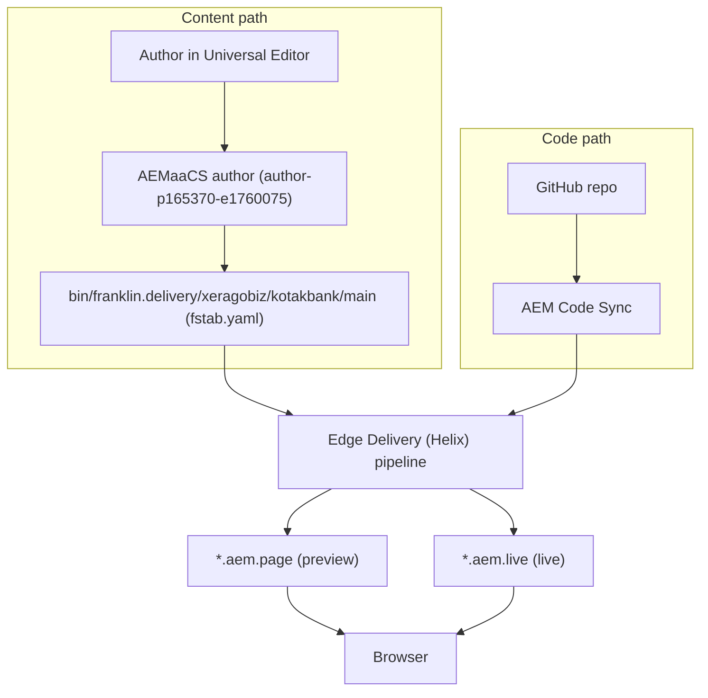

---

## 13. Rendering flow

The AEM backend emits **semantic HTML** for sections/blocks; the browser runs `scripts.js`, which decorates the DOM. Verified `loadPage()` in `scripts/scripts.js`:

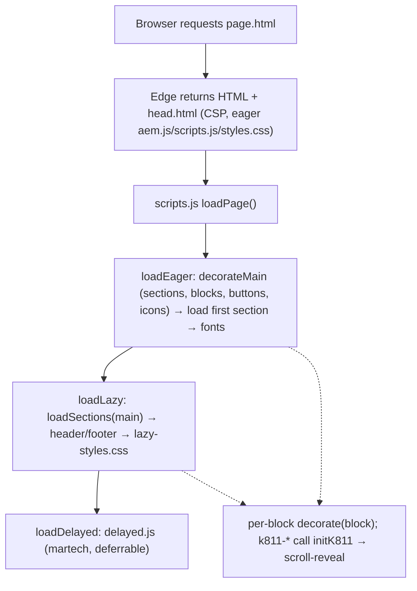

**Eager** does only LCP essentials, **lazy** loads the rest + header/footer + `lazy-styles.css`, **delayed** runs martech. Don't move lazy/delayed work into eager.

---

## 14. Request lifecycle

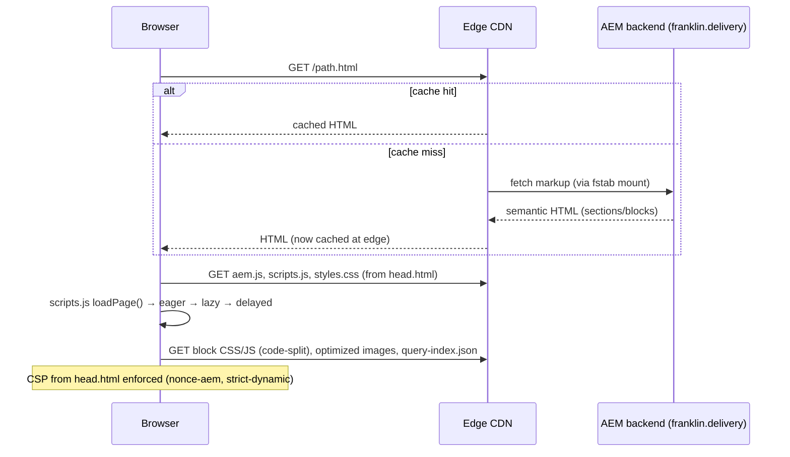

Note: `.plain.html` returns the raw block markup (used during development: `curl http://localhost:3000/path.plain.html`); `.md` returns the markdown source.

---

## 15. Component (block) lifecycle

Each block moves from delivered markup → decorated DOM. Decoration is **idempotent** and **defensive**.

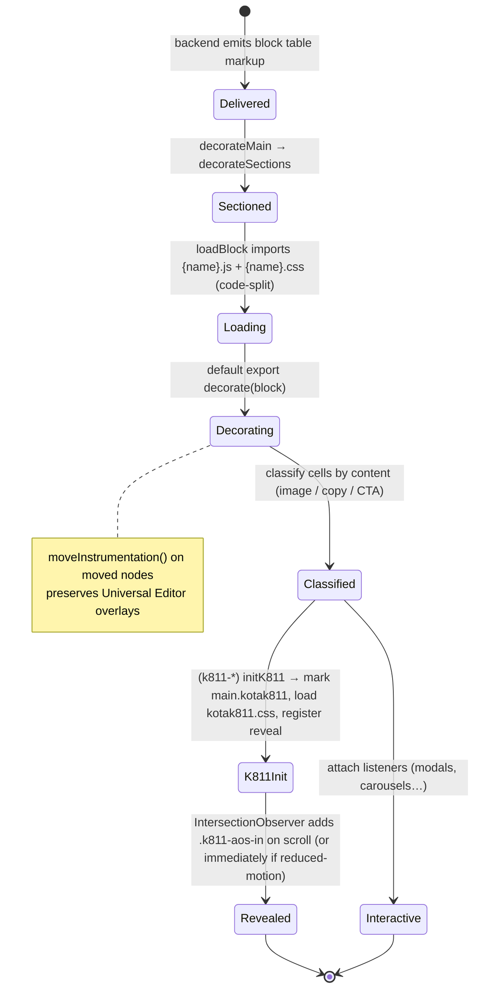

Rules: classify cells by content (not index — UE field-collapsing varies cell counts); tolerate missing/extra cells; never throw; use `createOptimizedPicture` for images; `moveInstrumentation()` when moving nodes.

---

## 16. Image delivery

Authored images are rendered responsively by `createOptimizedPicture` (from `aem.js`), which emits a `<picture>` with WebP `<source>`s at multiple widths, served/optimized by the Edge. The LCP image follows the **`k811-hero` preload pattern** (verified): media-scoped `<link rel="preload" as="image" type="image/webp" fetchpriority="high">` with `imagesrcset`, so the preload scanner fetches exactly one art-directed source.

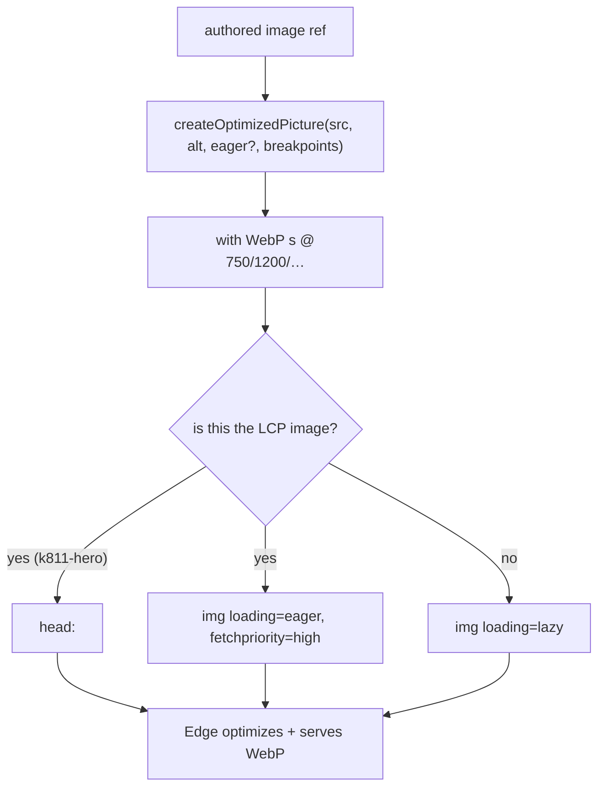

Only the LCP image is eager/preloaded; all other images are `loading="lazy"`. Committed images/icons/fonts must be optimized and size-checked; fonts subset.

---

## 17. Caching

Handled entirely by the **Edge Delivery CDN** (no Dispatcher). HTML is cached at the edge on first miss and refreshed on **publish** (push → Code Sync). Static assets (block CSS/JS, images, fonts) are code-split and cached by the CDN. `.hlxignore` controls what is served at all; `head.html` controls security headers. To "invalidate", re-publish — there is no manual cache flush or TTL knob in this repo.

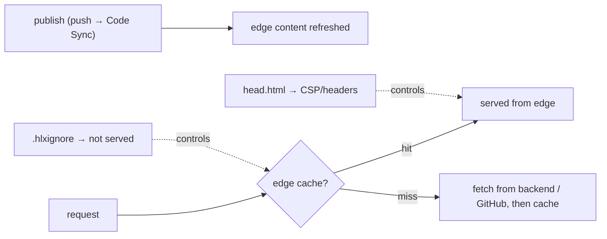

---

## Summary: traditional AEM → this repo

| Requested topic | Reality in this repo |
|---|---|
| OSGi bundles | ES modules in `scripts/` |
| Core bundle | `scripts/aem.js` (platform core, read-only) |
| UI Apps | `blocks/` + `_{block}.json` models (→ aggregates) |
| UI Content | AEMaaCS author via `fstab.yaml`; `content/` = reference snapshots |
| Dispatcher | Edge CDN + `.hlxignore` + `head.html` |
| Content packages | git + AEM Code Sync (no CRX packages) |
| Cloud Manager pipeline | GitHub Actions (`main.yaml`) + Code Sync + PSI |

See also: `docs/skills/` (reference), `.cursor/rules/` (enforcement), `docs/prompts/` (task templates), `docs/CODING_STANDARDS.md`, and `AGENTS.md`.
