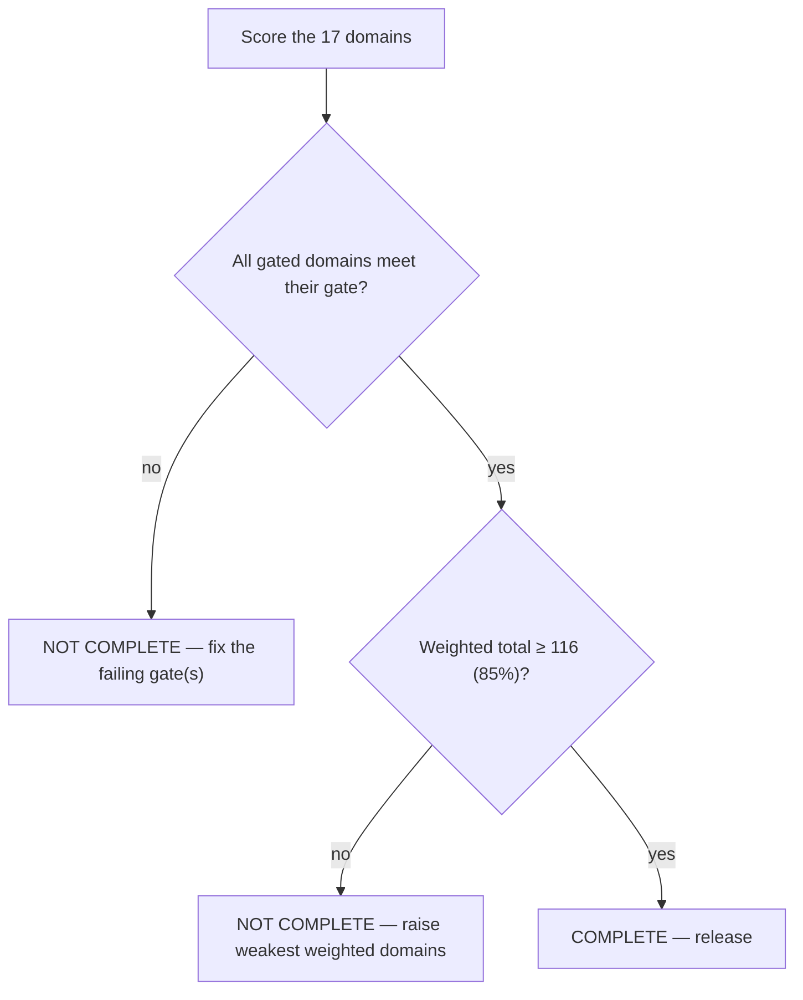

# EDS Implementation Completion Scorecard

The internal scorecard used to decide whether an Adobe Edge Delivery Services implementation is **complete**. Unlike `docs/PR_CHECKLIST.md` (author self-check) and `docs/REVIEW_CHECKLIST.md` (reviewer gate), this is a **scored** assessment: each domain is rated, weighted, and rolled up to a release verdict. Use it at the end of a feature/page/site before declaring "done."

> **Stack:** EDS (xwalk / Universal Editor). Grounded in this repo's gates (`npm run lint`, `build:json`, PSI on preview, `gh pr checks`) and `AGENTS.md` Definition of Done.

## How scoring works
Each domain is scored **0–4** against explicit criteria:

| Score | Meaning |
|---|---|
| **0 — Absent** | Not addressed at all |
| **1 — Poor** | Attempted, major gaps; would fail in production |
| **2 — Partial** | Works in the happy path; known gaps remain |
| **3 — Good** | Meets the standard; minor polish outstanding |
| **4 — Excellent** | Meets standard + verified with evidence (PSI run, a11y tree checked, redirects crawl-tested) |

**Weights** reflect blast radius. **Gates** are pass/fail domains that override the score — a "gated" domain scoring below its gate blocks release regardless of the total.

| Domain | Weight | Gate (min to release) |
|---|---|---|
| Performance | ×3 | ≥3 |
| Core Web Vitals | ×3 | ≥3 |
| Accessibility | ×3 | ≥3 |
| SEO | ×2 | ≥3 |
| Metadata | ×2 | ≥3 |
| Caching | ×1 | ≥2 |
| Images | ×2 | ≥3 |
| Structured Data | ×1 | ≥2 |
| Authoring | ×2 | ≥3 |
| Content Reuse | ×1 | ≥2 |
| Maintainability | ×2 | ≥2 |
| Scalability | ×1 | ≥2 |
| Analytics | ×1 | ≥2 |
| Error Handling | ×2 | ≥2 |
| Testing | ×2 | ≥3 |
| Deployment | ×2 | ≥3 |
| Quality Assurance | ×3 | ≥3 |

**Release verdict:** complete only when **(a)** every gated domain meets its gate, **and (b)** the weighted total ≥ 85% of the maximum. *Why two conditions:* a high average can hide one catastrophic domain (e.g. broken redirects), so gates catch the veto items; the 85% threshold ensures overall quality, not just gate-clearing.

Max weighted score = Σ(weight×4) = **136**. Release threshold = **116 (85%)**.

---

## 1. Performance ×3 · gate ≥3
- **0** no perf consideration · **1** heavy deps/eager bloat · **2** reasonable but unmeasured · **3** PSI ~100 on preview, phases correct · **4** PSI 100 at mobile/tablet/desktop, LCP image preloaded, no unnecessary deps, verified.
- **Criteria:** eager = LCP-only; martech in `delayed.js`; critical vs lazy CSS split; per-block code-split; measured on the **preview**, not localhost.
- **Why gated:** performance is the platform's core promise and a ranking factor; a slow EDS page is a failed EDS page.

## 2. Core Web Vitals ×3 · gate ≥3
- **0** unknown · **1** one metric red · **2** green on desktop only · **3** LCP≤2.5s, CLS≤0.1, INP healthy on preview · **4** all three green at 3 widths with PSI evidence attached.
- **Criteria:** LCP element identified + eager/preloaded; no layout-shifting late content; images sized; no long tasks on interaction.
- **Why gated + separate from Performance:** CWV are the *user-experienced* outcomes; PSI score and CWV can diverge (a 95 with a 3s LCP). Score both.

## 3. Accessibility ×3 · gate ≥3
- **0** not considered · **1** major violations · **2** static content OK, interactive blocks fail keyboard · **3** WCAG 2.1 AA met · **4** AA met + verified via a11y tree (`snapshot`) and manual keyboard test.
- **Criteria:** one `<h1>`/no skips; alt text; keyboard-operable interactive blocks (focus, `Esc`, arrows, no traps); correct ARIA; `prefers-reduced-motion`; AA contrast; labeled forms + announced errors.
- **Why gated:** legal/ethical baseline; inaccessible interactive components block real users entirely.

## 4. SEO ×2 · gate ≥3
- **0** ignored · **1** metadata/redirects dropped · **2** metadata present, redirects incomplete · **3** metadata + 301s + heading hierarchy + crawlable content · **4** + redirects crawl-tested (301→200), sitemap submitted, verified in Search Console.
- **Criteria:** every old URL 301s; no chains/loops; tab/accordion/FAQ content in the DOM; canonical/robots correct.
- **Why gated at 3:** SEO regressions surface weeks later as traffic loss — must be right at release.

## 5. Metadata ×2 · gate ≥3
- **0** missing · **1** title only · **2** title+description · **3** title/description/og/robots/canonical/lang all correct · **4** + indexed via `helix-query.yaml`, sitemap generates, social preview verified.
- **Criteria:** per-page metadata complete; `helix-query.yaml` indexes consumed fields (lean); `og:image` valid.
- **Why:** metadata is the mechanism for SEO, social, and listings — invisible until it fails.

## 6. Caching ×1 · gate ≥2
- **0** misunderstood (tried to hand-tune) · **1** ad-hoc · **2** relies on edge CDN correctly · **3** `.hlxignore` correct, publish=invalidate understood · **4** + verified served/not-served files and headers.
- **Criteria:** no Dispatcher/TTL hacks; `.hlxignore` excludes private/build files; `head.html` headers correct.
- **Why lower weight:** the platform handles most caching; the risk is small but real (leaking a file, misunderstanding invalidation).

## 7. Images ×2 · gate ≥3
- **0** raw oversized images · **1** unoptimized · **2** some `createOptimizedPicture`, LCP not special-cased · **3** all content images optimized, LCP eager+preloaded, rest lazy · **4** + breakpoints match layout, assets size-checked, `alt` on all.
- **Criteria:** `createOptimizedPicture`; LCP preload pattern; `loading="lazy"` elsewhere; fonts subset.
- **Why gated:** images are usually the largest bytes and the LCP element.

## 8. Structured Data ×1 · gate ≥2
- **0** none where expected · **1** malformed · **2** present on key pages · **3** valid JSON-LD (FAQ/Product/Breadcrumb) where relevant · **4** + validated with a structured-data test, rich results confirmed.
- **Criteria:** re-emit source structured data; keep it in the delivered DOM.
- **Why lower weight:** high value where applicable, but not every page needs it.

## 9. Authoring ×2 · gate ≥3
- **0** not editable · **1** imports but breaks on edit · **2** editable, cryptic model · **3** semantic labels, typed fields, optionals marked, variants as `select`, editable in UE/DA · **4** + author-tested (add/remove/reorder fields, switch variant) with instrumentation intact.
- **Criteria:** block insertable + editable; `moveInstrumentation()` preserved; tolerates omitted fields.
- **Why gated:** a page that renders but can't be maintained has failed the CMS's purpose.

## 10. Content Reuse ×1 · gate ≥2
- **0** everything duplicated · **1** obvious duplication · **2** some reuse · **3** shared content via `fragment`, reused blocks/variants · **4** + no duplicated content across pages, single-source verified.
- **Criteria:** shared banners/disclaimers/nav as fragments; blocks reused/varied not forked.
- **Why:** duplication guarantees future drift; reuse is a maintainability multiplier.

## 11. Maintainability ×2 · gate ≥2
- **0** unreadable/forked · **1** inconsistent with repo style · **2** works but hard to follow · **3** matches conventions, scoped CSS, JSDoc, no `aem.js` edits · **4** + no near-duplicate blocks, clear models, decisions documented.
- **Criteria:** Airbnb JS + scoped CSS + naming conventions; reuse over duplication; `aem.js` untouched; aggregates generated.
- **Why weighted 2:** every future change pays the maintainability tax; low here compounds.

## 12. Scalability ×1 · gate ≥2
- **0** one-off hacks · **1** won't generalize · **2** works for current volume · **3** template/variant approach generalizes to more pages · **4** + verified across multiple pages/templates, dedupe done.
- **Criteria:** migrate-by-template; block variants over new blocks; lean index; no per-page snowflakes.
- **Why:** enterprise sites grow; a solution that doesn't generalize becomes rework.

## 13. Analytics ×1 · gate ≥2
- **0** none / broken · **1** loads eagerly (perf hit) · **2** loads, basic events · **3** in the **delayed** phase, key events tracked · **4** + verified events fire, no PII, consent respected.
- **Criteria:** analytics/martech in `delayed.js`; RUM/`sampleRUM` intact; no PII/secrets.
- **Why:** must not harm LCP and must not leak PII; otherwise lower stakes.

## 14. Error Handling ×2 · gate ≥2
- **0** throws/crashes page · **1** unhandled fetch failures · **2** happy path only · **3** blocks degrade gracefully (guarded fields, try/catch on fetch, hide sub-part on failure) · **4** + Sentry captures without PII, failures verified not to break the page.
- **Criteria:** defensive decoration (no throw on null cell); dynamic fetches degrade; honest failure not fake success.
- **Why weighted 2:** a block that throws can break the whole page render.

## 15. Testing ×2 · gate ≥3
- **0** untested · **1** eyeballed once · **2** rendered on one width · **3** lint green, rendered at 3 widths, parity checked, shared-block regressions smoke-tested · **4** + a11y tree + PSI + (where valuable) unit tests for pure logic.
- **Criteria:** `npm run lint`; Playwright `snapshot`/`evaluate` at mobile/tablet/desktop; content/visual parity for migration.
- **Why gated:** unverified work is not complete work.

## 16. Deployment ×2 · gate ≥3
- **0** not shippable · **1** local only · **2** pushed, CI red · **3** `gh pr checks` green, Code Sync published, PR has preview link · **4** + redirects loaded + sitemap submitted at cutover, rollback path known.
- **Criteria:** feature branch; lint + JSON-sync green; published to preview; mandatory preview link; no direct-to-`main`.
- **Why gated:** "complete" means shippable through the real pipeline, not just working locally.

## 17. Quality Assurance ×3 · gate ≥3
- **0** no QA · **1** author checked once · **2** partial review · **3** review checklist walked, all validation domains pass · **4** + independent/adversarial verification on high-value pages, sign-off recorded.
- **Criteria:** consolidates 1–16; failures route back to their owning domain; human review on the preview (not the diff).
- **Why gated + highest weight:** QA is the meta-gate that certifies the rest; it's the last line before production.

---

## Scoring worksheet
```
Domain              Score(0-4)  Weight  Weighted   Gate met?
Performance         [ ]         ×3      [   ]      (≥3)
Core Web Vitals     [ ]         ×3      [   ]      (≥3)
Accessibility       [ ]         ×3      [   ]      (≥3)
SEO                 [ ]         ×2      [   ]      (≥3)
Metadata            [ ]         ×2      [   ]      (≥3)
Caching             [ ]         ×1      [   ]      (≥2)
Images              [ ]         ×2      [   ]      (≥3)
Structured Data     [ ]         ×1      [   ]      (≥2)
Authoring           [ ]         ×2      [   ]      (≥3)
Content Reuse       [ ]         ×1      [   ]      (≥2)
Maintainability     [ ]         ×2      [   ]      (≥2)
Scalability         [ ]         ×1      [   ]      (≥2)
Analytics           [ ]         ×1      [   ]      (≥2)
Error Handling      [ ]         ×2      [   ]      (≥2)
Testing             [ ]         ×2      [   ]      (≥3)
Deployment          [ ]         ×2      [   ]      (≥3)
Quality Assurance   [ ]         ×3      [   ]      (≥3)
                                        ─────
TOTAL (max 136)                         [   ]
```

## Verdict


- **Complete:** all gates met **and** total ≥ 116/136.
- **Not complete:** any gate failed (fix it regardless of total) **or** total < 116.

## Why a scored scorecard (not just a checklist)
A binary checklist treats a 51%-done domain the same as a 99%-done one and hides *where* the weakness is. Scoring 0–4 surfaces the weakest domains for targeted effort; **weights** make the team spend that effort where blast radius is largest (perf/CWV/a11y/QA over analytics); **gates** prevent a high average from masking a release-blocking failure (broken redirects, inaccessible nav). The two-condition verdict — gates *and* 85% — is what separates "technically passes every box" from "actually good enough to ship."
