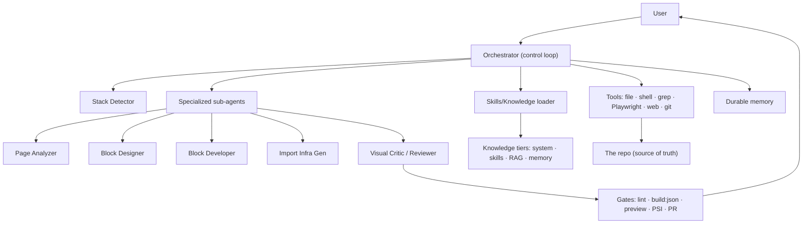

# 14 · Reference Implementation Blueprint

How to actually assemble the assistant, in what order, with the decisions that matter at each step.

## System diagram


## Build order (dependency-ordered, with rationale)
1. **Domain model + system prompt** ([02](02-domain-knowledge-model.md), [10](10-prompt-and-context-engineering.md)). *Why first:* nothing else is correct without stack-awareness and the golden rules.
2. **Core tools** ([05](05-tooling-and-capabilities.md)): file read/edit, grep, shell, git. *Why:* the loop can't ground or verify without them.
3. **Control loop + verification ladder** ([03](03-agent-architecture.md), [09](09-verification-and-validation.md)): observe→act→verify with lint/preview. *Why:* establishes "verify before done" before adding generative surface.
4. **Skills system** ([04](04-knowledge-and-skills-system.md)): one-topic skills + selection. *Why:* turns the loop into an expert; where most quality lives.
5. **Block generation** ([07](07-block-generation.md)) + Playwright verification. *Why:* the core authoring capability.
6. **Grounding gates** ([08](08-grounding-and-anti-hallucination.md)): read-before-write, citation, schema validation. *Why:* harden generation against hallucination.
7. **Migration pipeline** ([06](06-content-migration-pipeline.md)) + sub-agents. *Why:* the high-value capability; depends on all the above.
8. **Guardrails** ([11](11-guardrails-safety-security.md)) throughout, hardened before any write/push/publish.
9. **Eval suite** ([12](12-evaluation-and-metrics.md)) + **UX** ([13](13-ux-and-human-in-the-loop.md)): measure and make it usable.
*Why this order:* each layer depends on the one below; building migration before verification, or generation before stack-detection, produces an unreliable system that's hard to fix later.

## Minimum viable assistant (the smallest useful cut)
System prompt (two-stack + golden rules) + file/shell/grep tools + lint verification + the `building-blocks` skill + Playwright render check. This alone can create and verify EDS blocks correctly. Everything else (migration, sub-agents, eval) is additive.

## The decisions that most determine quality (recap)
1. **Stack detection first** — prevents the dominant failure.
2. **Read ground truth before acting** — prevents invented APIs/DOM.
3. **Classify cells by content** — prevents the #1 block bug.
4. **Deterministic migration scripts** — makes migrations reproducible/auditable.
5. **Verify before done** — makes correctness earned.
6. **Skills over model size** — makes expertise durable and improvable.
7. **Secrets never in-band** — eliminates a whole security class.
Each is a *constraint*, reinforcing the library's thesis: reliability comes from constraint, not cleverness.

## End-to-end worked example (migration, fully traced)
```
User: "Migrate https://acme.com/savings to EDS."
1  Stack Detector: repo has blocks/ + scripts/aem.js, no pom.xml → EDS. (states it)
2  Scrape: fetch DOM+images, write cleaned.html, analysis.json.
3  Page Analyzer (schema-forced): sections=[hero, benefits(grid), calculator, faq, cta].
4  Block mapping: hero→k811-hero(variant); benefits→cards(92% match, reuse);
   calculator→existing savings-calculator; faq→k811-faq; cta→k811-cta. (surfaces the reuse)
5  Infra Gen: parsers for the two matched variants + transformers (cleanup, sections, DM rewrite);
   page-templates.json entry.
6  Import (scripted): bundle runs → content HTML produced (never hand-edited).
7  Verify: preview at 3 widths; Visual Critic diffs vs original; 1 iteration fixes hero spacing.
8  Gates: npm run lint ✓; build:json ✓; PSI 97 (LCP 2.2s) ✓.
9  Reviewer: walks REVIEW_CHECKLIST; opens PR to main with preview link.
Report: "Done & verified. Preview …aem.page/savings. Reused cards + savings-calculator;
new content via import (no hand-editing). PR #124."
```
Every principle in the library appears exactly once here — detection, grounding, reuse, determinism, verification, safety, communication.

## Where the reference material lives (this repo as a live example)
This repository *is* a worked reference for the output such an assistant produces:
- `AGENTS.md` — the operating contract.
- `docs/skills/` (20), `docs/prompts/` (14), `.cursor/rules/` (8) — the knowledge/skills layer.
- `docs/ARCHITECTURE.md`, `docs/REVERSE_ENGINEERED.md` — grounded architecture + real APIs.
- `docs/TEMPLATES.md`, `docs/EXAMPLES.md` — scaffolds + real annotated block code.
- `tools/importer/` — the deterministic migration pipeline in practice.
Study these to see the abstractions in this library instantiated.

## Closing decision: why document this as a library, not a spec
An AI assistant's quality is not a fixed spec — it's a living system of prompts, skills, tools, and gates that co-evolve with the model and the domain. A **library of decision-explained documents** is maintainable (fix one file when a failure appears), inspectable (auditors see *why*), and teachable (a new engineer reads the reasoning, not just the rules). That maintainability is itself the final design decision: build the assistant so its own knowledge can be improved as easily as a Markdown edit.
