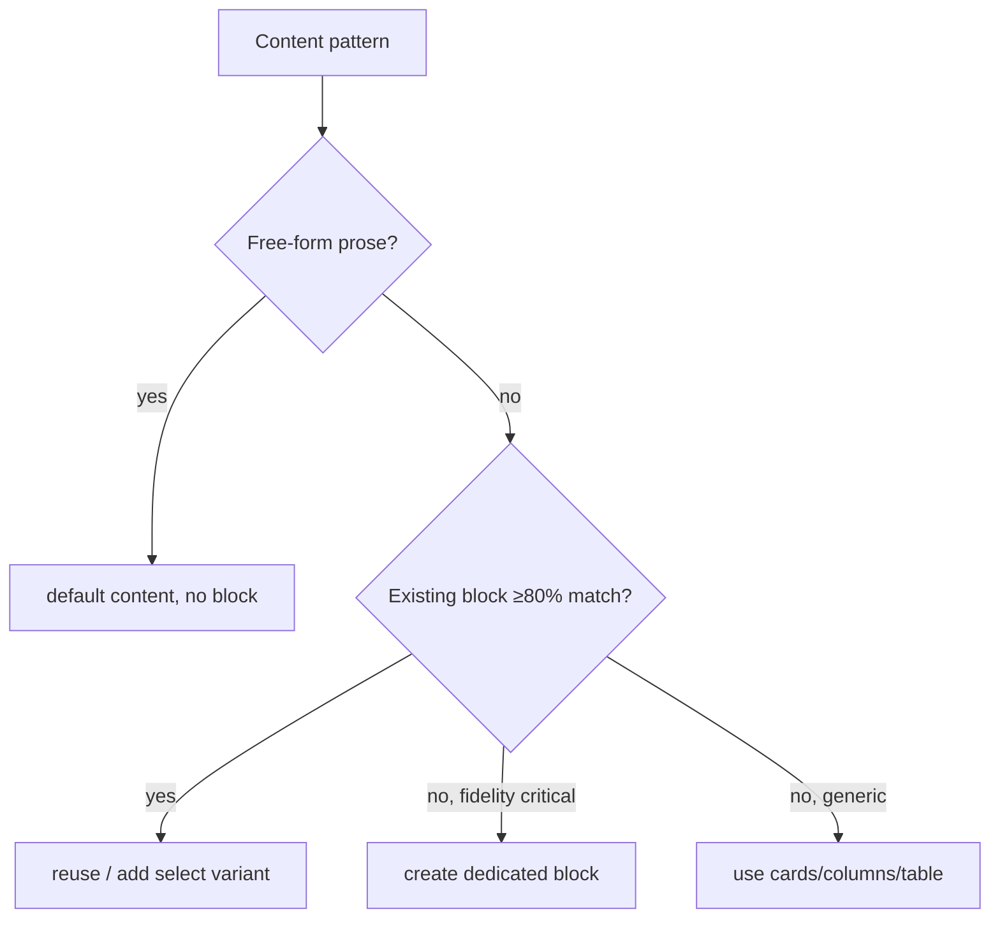

# 01 · Block Development

## Purpose
Create or modify an EDS block — the reusable component unit (`blocks/{name}/{name}.js|.css|_{name}.json`).

## When to use
- A content pattern repeats or has a distinct shape (cards, hero, table, accordion, FAQ, tabs).
- You need authored, editable, reusable componentry.

## When NOT to use
- The content is free-form prose → use **default content** (no block).
- An existing block covers it → reuse or add a variant (see Decision logic).
- The request implies Java/HTL/OSGi → wrong stack; there are no such components here.

## Inputs
- The content pattern + reference design/URL.
- The delivered DOM (`curl http://localhost:3000/{path}.plain.html`).
- The existing block palette (grep `blocks/`).

## Outputs
- `blocks/{name}/{name}.js` (default `decorate(block)`), `{name}.css` (scoped), `_{name}.json` (model).
- Regenerated aggregates (`npm run build:json`).

## Decision logic

## Validation
- [ ] Three files present; lowercase-hyphenated name.
- [ ] Delivered DOM inspected before coding.
- [ ] `npm run build:json` run; aggregates in sync; `npm run lint` passes.
- [ ] Renders + editable at mobile/tablet/desktop.

## Performance considerations
Block CSS/JS auto code-splits — a page only loads what it uses. **Why it matters:** keep block assets self-contained; a shared global dependency defeats code-splitting and loads everywhere.

## SEO considerations
Emit semantic HTML and preserve heading hierarchy inside the block. **Why:** the block's output is the crawlable DOM; a block that wraps everything in `
` erases SEO signal.

## Accessibility considerations
Interactive blocks need keyboard + ARIA from the start (see [11](11-accessibility-engineering.md)). **Why:** retrofitting a11y after the block ships is far costlier than building it in.

## Examples
Real: `blocks/k811-cta/k811-cta.js` (see `docs/EXAMPLES.md`) — classify image/title cells, build inner, `revealOnScroll`.

## Anti-patterns
- Duplicating a near-identical block instead of a variant.
- Blocking prose that should be default content.
- Reading cells by index (see [02](02-decorate-pattern.md)).

## Troubleshooting
- **Block not decorating** → name mismatch between folder/`_{name}.json`/section table; check the delivered `.plain.html` class.
- **CSS not applied** → block CSS not loading (name mismatch) or selector not scoped.
- **CI fails after model edit** → forgot `npm run build:json`.
