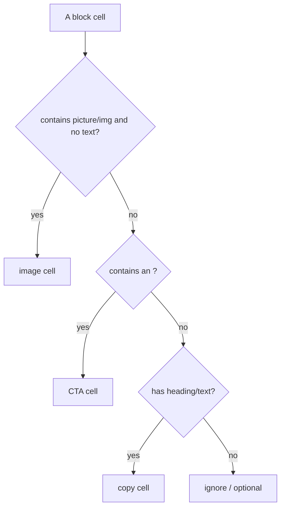

# 02 · Decorate Pattern

## Purpose
Write the `decorate(block)` function that transforms a block's delivered DOM — the EDS equivalent of a view/controller.

## When to use
- Any time you author a block's JS behavior or restructure its markup.

## When NOT to use
- To build server-side templates (there is no HTL/server render).
- To fetch large data on the critical path (defer; see [14](14-dynamic-content.md)).

## Inputs
- The block element (delivered DOM: rows → cells).
- Helpers from `scripts/aem.js` (`createOptimizedPicture`) and `scripts/scripts.js` (`moveInstrumentation`).

## Outputs
- A default-exported, JSDoc'd `decorate(block)` that mutates `block` idempotently.

## Decision logic (cell classification)


## Validation
- [ ] Cells classified by content, never index.
- [ ] Every field guarded (no throw on null cell).
- [ ] Idempotent (re-running `decorate` is safe).
- [ ] `moveInstrumentation()` used on moved nodes.

## Performance considerations
Keep `decorate` synchronous and light; defer network/heavy work. **Why:** eager-phase blocks run on the critical path; a slow `decorate` delays LCP.

## SEO considerations
Preserve semantics/heading order while transforming. **Why:** decoration is the last step before the crawlable DOM; destroying `<h2>`→`<div>` loses ranking signal.

## Accessibility considerations
Build native elements (`<button>`, `<a>`), not clickable `<div>`s; keep alt text. **Why:** native elements carry roles/keyboard behavior for free.

## Examples
```js
export default function decorate(block) {
  const cells = [...block.children].map((r) => r.querySelector(':scope > div') || r);
  const img = cells.find((c) => c.querySelector('picture, img'));
  const cta = cells.find((c) => c.querySelector('a'));
  const copy = cells.find((c) => c !== img && c.textContent.trim() && !c.querySelector('a'));
  const inner = document.createElement('div');
  if (copy) inner.append(copy);
  if (img) inner.append(img);
  if (cta) inner.append(cta);
  block.textContent = ''; block.append(inner); // idempotent rebuild
}
```

## Anti-patterns
- `const title = cells[1]` — breaks on field-collapsing.
- `block.innerHTML = ...` from authored content without DOMPurify.
- Non-idempotent decoration that double-wraps on re-run.
- Reaching out to mutate other blocks/globals.

## Troubleshooting
- **Works once, breaks in Universal Editor** → non-idempotent; rebuild deterministically.
- **Author can't edit after decoration** → missing `moveInstrumentation()`.
- **Undefined cell error** → index-based access; switch to classification + guards.
