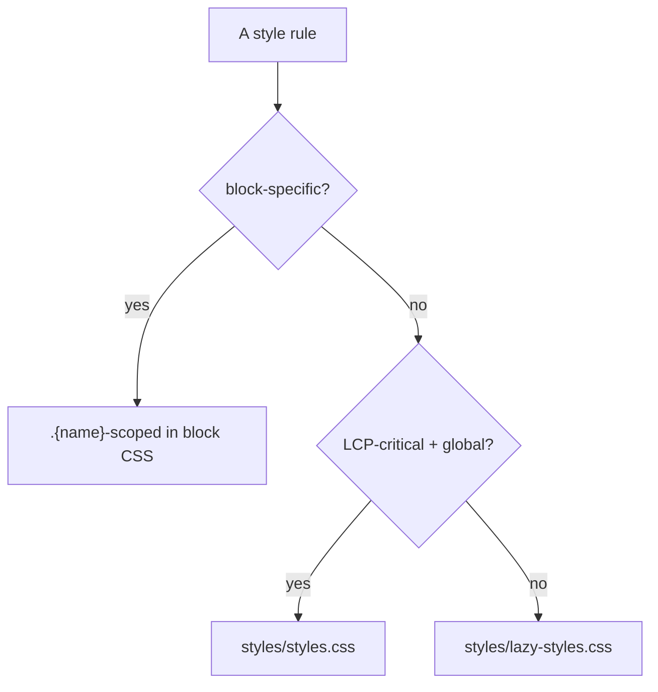

# 03 · CSS & Styling

## Purpose
Write scoped, responsive, token-driven block CSS.

## When to use
- Styling any block or adjusting global/lazy styles.

## When NOT to use
- To style sections globally → use Section Metadata ([04](04-sections-and-metadata.md)), not block CSS.
- To add SCSS/Tailwind — not used here; plain CSS3 + custom properties only.

## Inputs
- The block's DOM (post-decorate) and class names.
- Design tokens (`styles/kotak811.css` custom properties) and breakpoints (600/900/1200).

## Outputs
- `blocks/{name}/{name}.css`, every selector scoped to `.{name}`, mobile-first.

## Decision logic


## Validation
- [ ] Every selector prefixed `.{name}`; no bare/`-container`/`-wrapper`.
- [ ] Mobile-first base + `min-width` 600/900/1200.
- [ ] Tokens used, not magic numbers; `npm run lint` (Stylelint) passes.

## Performance considerations
Keep critical CSS in `styles.css` minimal; block CSS code-splits. **Why:** the eager stylesheet is render-blocking for LCP; every non-critical rule there costs first paint.

## SEO considerations
Don't hide crawlable content with CSS (`display:none` on tab/FAQ bodies that should be indexed). **Why:** crawlers may skip visually-hidden content.

## Accessibility considerations
Provide visible `:focus` styles; meet AA contrast; respect `prefers-reduced-motion`. **Why:** removing focus outlines strands keyboard users; motion without the guard harms vestibular-sensitive users.

## Examples
```css
.k811-cta { max-width: 1040px; margin: 0 auto; background: #000; }
.k811-cta .k811-cta-title .k811-cta-highlight { color: var(--k811-link, #d1101f); }
@media (min-width: 900px) { .k811-cta .k811-cta-inner { flex-direction: row; } }
```

## Anti-patterns
- Bare selectors (`.title`) leaking site-wide.
- Targeting `.{name}-wrapper`/`-container` (section-owned).
- Desktop-first; animating layout props (width/top/left) → CLS.

## Troubleshooting
- **Styles leak to other blocks** → unscoped selector.
- **Style not applying** → block CSS didn't load (name mismatch) or specificity/order.
- **Layout shift** → animating non-compositor properties; switch to transform/opacity.
