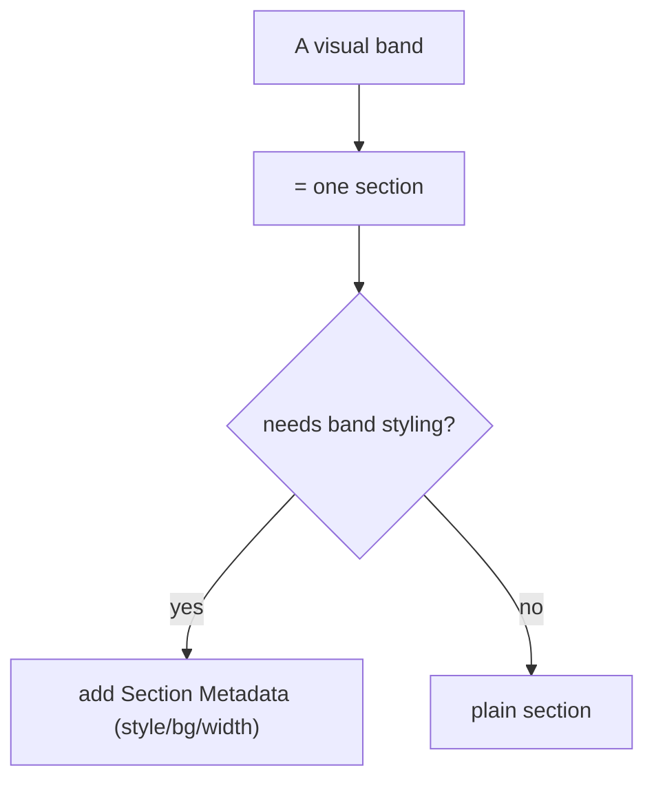

# 04 · Sections & Section Metadata

## Purpose
Define section boundaries and section-level styling (background, spacing, width) via Section Metadata.

## When to use
- Structuring a page into bands; applying band-level styling; adding per-section behavior.

## When NOT to use
- For block-internal styling → block CSS ([03](03-css-styling.md)).
- To force unrelated content into one section for layout convenience.

## Inputs
- The page's visual bands (from analysis).
- Section Metadata options the project supports (style/background/width).

## Outputs
- Section breaks delimiting bands; a Section Metadata block per styled section.

## Decision logic

## Validation
- [ ] One band = one section; first section holds the LCP element.
- [ ] Band styling via Section Metadata, not per-element CSS.
- [ ] Mixed sections (default content + block) render correctly.

## Performance considerations
The **first section loads eagerly**; everything after is lazy. **Why:** put the LCP element in section 1 and keep it lean — sections are the platform's progressive-loading unit.

## SEO considerations
Section order = document order = reading order for crawlers. **Why:** keep the logical content sequence intact across sections.

## Accessibility considerations
Section order is also the DOM/tab order. **Why:** a visually-reordered section (via CSS) that leaves DOM order wrong confuses screen-reader and keyboard users.

## Examples
- Section 1: hero block (LCP). Section 2: intro (default content). Section 3: `cards`. Section 4: `faq` + Section Metadata `style: grey`.

## Anti-patterns
- Per-element background/spacing CSS instead of Section Metadata.
- Cramming the whole page into one section (loses progressive loading).
- Visual reordering that breaks DOM/reading order.

## Troubleshooting
- **Band styling missing** → Section Metadata not authored/recognized; check the metadata table.
- **LCP slow** → LCP element isn't in the first (eager) section.
- **Unexpected gap/overlap** → section vs block spacing conflict; move band spacing to Section Metadata.
