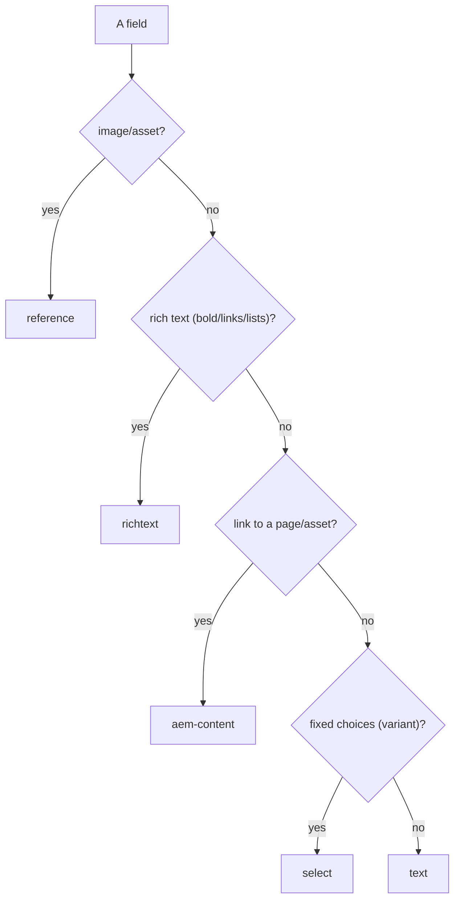

# 05 · Content Modeling (Universal Editor)

## Purpose
Design the `_{block}.json` model — the fields authors edit for a block.

## When to use
- Creating/changing a block's authored fields, variants, or insertion rules.

## When NOT to use
- To build Granite/Coral dialogs — not used here.
- To model free-form prose — that's default content, not fields.

## Inputs
- The block's content structure (rows/cells decided first).
- Field component types: `reference`, `richtext`, `text`, `select`, `aem-content`.

## Outputs
- `blocks/{name}/_{name}.json` (`definitions` + `models` + `filters`); regenerated aggregates via `npm run build:json`.

## Decision logic

## Validation
- [ ] `resourceType: core/franklin/components/block/v1/block` in definitions.
- [ ] Semantic labels; optionals marked; variants as `select`.
- [ ] `npm run build:json` run; three aggregates in sync; `plugin:xwalk` lint passes.

## Performance considerations
Model only what's needed. **Why:** unused fields add authoring noise and can pull unused assets; lean models keep pages lean.

## SEO considerations
Model a proper heading field (not just styled text) and alt for images. **Why:** the model determines whether authors can produce correct semantic/SEO markup.

## Accessibility considerations
Provide alt-text fields for images; label fields clearly. **Why:** if the model has no alt field, authors can't supply alt — an a11y gap baked into every instance.

## Examples
Real: `blocks/k811-feature/_k811-feature.json` — `reference` (Video Thumbnail), `richtext` (Text), `text` (Video Link URL).

## Anti-patterns
- Cryptic names (`text1`); wrong types (text where richtext needed).
- Hand-editing `component-*.json` aggregates.
- Separate blocks per layout instead of a `select` variant.

## Troubleshooting
- **CI JSON-sync fails** → run `build:json`, commit aggregates.
- **Field not showing in editor** → wrong component name or stale aggregates.
- **Author can't set a link** → used `text` instead of `aem-content`.
