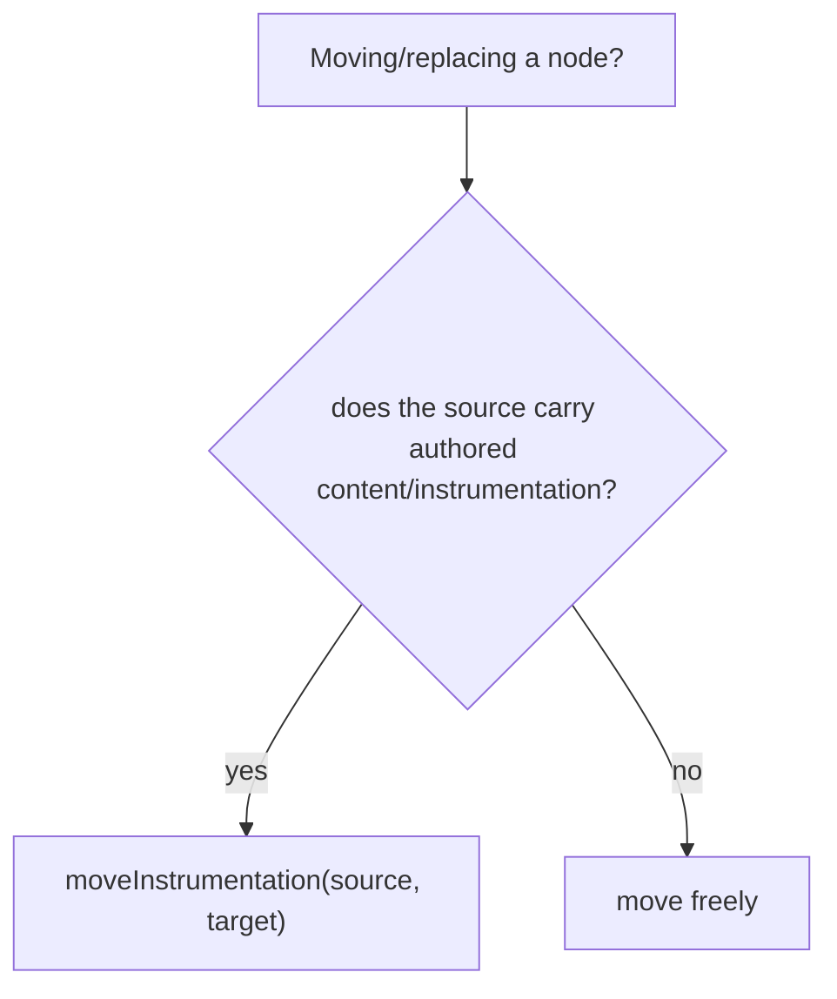

# 06 · Universal Editor Instrumentation

## Purpose
Keep blocks editable in Universal Editor by preserving the instrumentation attributes decoration would otherwise strip.

## When to use
- Any `decorate()` that **moves, replaces, or rebuilds** DOM nodes.

## When NOT to use
- Blocks that only add classes/listeners without relocating authored nodes (instrumentation stays attached).

## Inputs
- Source nodes carrying `data-aue-*` (and `data-richtext-*`) attributes.
- `moveInstrumentation(from, to)` and `moveAttributes(from, to, attrs)` from `scripts/scripts.js`.

## Outputs
- Rebuilt DOM where editable nodes retain their instrumentation → editing overlays still attach.

## Decision logic


## Validation
- [ ] In Universal Editor, each authored field shows an editing overlay and is editable in place.
- [ ] Re-decoration (edit → re-render) doesn't detach overlays (idempotent).

## Performance considerations
`moveInstrumentation` is negligible cost. **Why:** never skip it "for perf" — the cost is trivial and the authoring breakage is severe.

## SEO considerations
None directly (instrumentation is editor-only, not delivered to visitors).

## Accessibility considerations
None directly for end users; it enables authors (including those using assistive tech in the editor) to edit content.

## Examples
```js
import { moveInstrumentation } from '../../scripts/scripts.js';
const newCard = document.createElement('div');
moveInstrumentation(sourceRow, newCard); // carry data-aue-* so UE can still edit it
newCard.append(...sourceRow.childNodes);
```

## Anti-patterns
- Rebuilding a card grid with `innerHTML` (wipes all instrumentation).
- Cloning nodes without moving instrumentation.

## Troubleshooting
- **Overlays missing / content not editable** → instrumentation lost during a move; add `moveInstrumentation`.
- **Edits don't persist / duplicate** → non-idempotent decoration re-instrumenting; rebuild deterministically.
