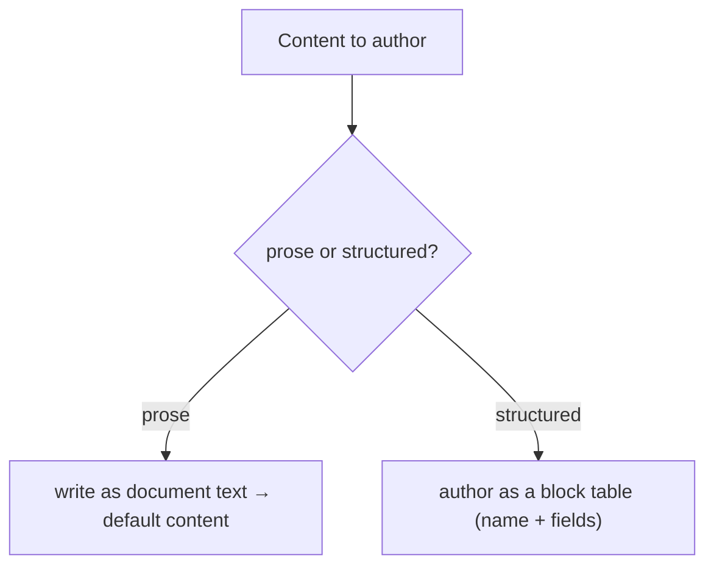

# 07 · Document Authoring

## Purpose
Support document-based authoring (Word/gdocs-style) where blocks are expressed as tables in a document and content is edited as prose.

## When to use
- High-volume, text-heavy content (blogs, articles, support KB, policies).
- Projects/sections using the Document Authoring surface rather than Universal Editor.

## When NOT to use
- Visually-composed marketing/landing pages needing in-context WYSIWYG → Universal Editor ([06](06-universal-editor-instrumentation.md)).

## Inputs
- Source documents / prose content.
- Block table conventions (block name in the first cell, fields in rows).

## Outputs
- Documents whose tables map to blocks + prose that becomes default content, delivered by EDS.

## Decision logic

## Validation
- [ ] Block tables use the correct block name + field order.
- [ ] Prose renders as semantic default content (headings/lists preserved).
- [ ] Delivered page matches intent (`.plain.html` / preview).

## Performance considerations
Same three-phase delivery as UE-authored pages. **Why:** authoring surface is independent of delivery — DA pages get the same EDS performance model ([08](08-three-phase-loading.md)).

## SEO considerations
Document heading styles map to `<h1>–<h6>`. **Why:** authors must use real heading styles (not bold text) so the delivered hierarchy is correct.

## Accessibility considerations
Encourage semantic authoring (lists as lists, headings as headings, image alt). **Why:** DA content is only as accessible as the document structure authors create.

## Examples
- A block expressed as a table: first row = block name (`Cards`), subsequent rows = one card each (image | text | link).
- An article body = plain document prose → default content.

## Anti-patterns
- Faking headings with bold text (breaks hierarchy/SEO/a11y).
- Pasting HTML/styles from Word without cleanup (noise → cleanup transformer).
- Building a visual landing page in a document when UE fits better.

## Troubleshooting
- **Block not recognized** → table's first cell isn't the exact block name.
- **Broken layout** → field order in the table doesn't match the block's expectation.
- **Messy markup** → Word cruft; run a cleanup transformer on import.
