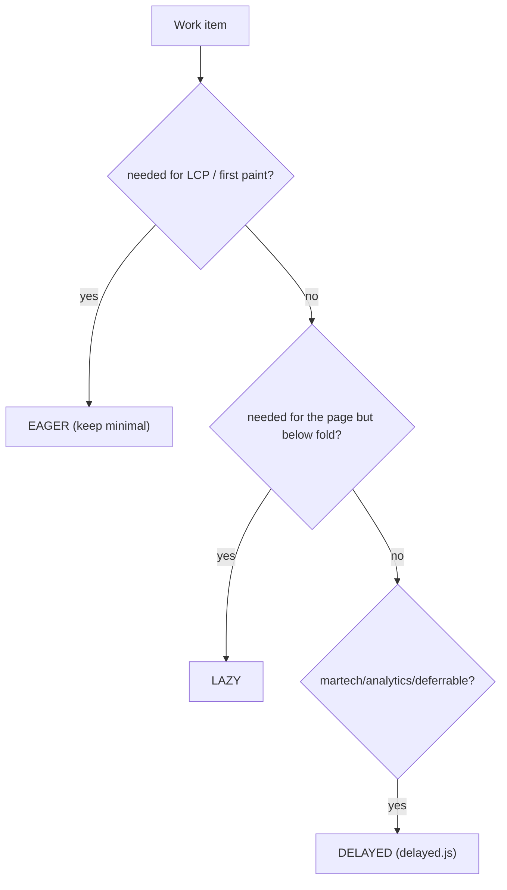

# 08 · Three-Phase Loading

## Purpose
Place work in the correct phase — eager / lazy / delayed — so the critical path stays minimal (`scripts/scripts.js` → `loadPage`).

## When to use
- Deciding where any new work (script, style, block behavior, martech) runs.

## When NOT to use
- N/A — every added behavior needs a phase decision.

## Inputs
- The work item and whether LCP depends on it.

## Outputs
- Work correctly placed: eager (LCP-critical), lazy (rest + header/footer + `lazy-styles.css`), delayed (`delayed.js`).

## Decision logic

## Validation
- [ ] Eager phase contains only LCP essentials.
- [ ] Header/footer/rest + `lazy-styles.css` in lazy.
- [ ] Martech/analytics in delayed; nothing non-critical eager.

## Performance considerations
This *is* the performance model. **Why:** LCP = how fast the eager path completes; misplacing work into eager is the #1 EDS perf regression.

## SEO considerations
Content needed for indexing must be in the rendered DOM (eager/lazy), not delayed. **Why:** crawlers may not execute delayed-phase JS that injects content.

## Accessibility considerations
Don't defer content/controls users need immediately into the delayed phase. **Why:** a keyboard/screen-reader user shouldn't wait on martech to access core UI.

## Examples
- Eager: decorate main + first section + LCP image + fonts.
- Lazy: remaining sections, header, footer, `lazy-styles.css`.
- Delayed: Sentry, analytics, chat widget, experimentation (`delayed.js`).

## Anti-patterns
- Loading analytics/chat in eager.
- Putting below-the-fold block CSS in `styles.css`.
- Injecting indexable content only in the delayed phase.

## Troubleshooting
- **High LCP/TBT** → non-critical work in eager; move to lazy/delayed.
- **CLS on load** → late-injected content shifting layout; reserve space or move earlier.
- **Missing content in view-source/crawl** → content injected too late (delayed).
