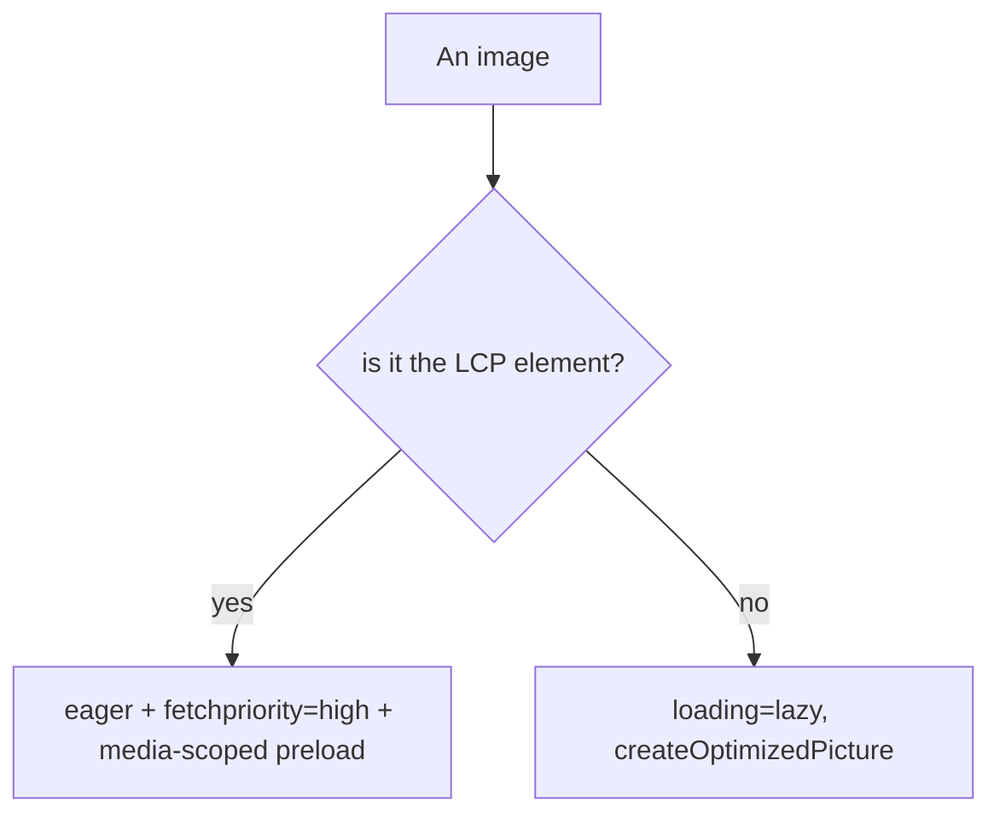

# 09 · LCP & Image Optimization

## Purpose
Deliver the LCP element fast and all images optimally (`createOptimizedPicture` + the hero preload pattern).

## When to use
- Any page with an above-the-fold image/hero; any block rendering images.

## When NOT to use
- N/A for images generally; the *preload* treatment applies only to the LCP image.

## Inputs
- The identified LCP element per template (usually the hero image).
- Source image + art-directed variants; layout breakpoints.

## Outputs
- LCP `<picture>` via `createOptimizedPicture`, eager + `fetchpriority="high"` + media-scoped `<link rel=preload as=image>`.
- All other images `loading="lazy"`, optimized.

## Decision logic

## Validation
- [ ] Exactly one LCP image treated as eager/preloaded; all others lazy.
- [ ] Images via `createOptimizedPicture` with layout-matched breakpoints; `alt` set.
- [ ] PSI LCP ≤2.5s on preview at 3 widths.

## Performance considerations
The preload lets the scanner fetch the LCP image before the JS runs. **Why:** a JS-built image is invisible to the preload scanner otherwise; the media-scoped preload fetches exactly one art-directed source immediately.

## SEO considerations
`alt` + descriptive filenames aid image SEO; fast LCP is a ranking factor. **Why:** CWV feeds ranking; images are also discoverable content.

## Accessibility considerations
`alt` on meaningful images, `alt=""` on decorative. **Why:** screen-reader users perceive images only via alt.

## Examples
Real: `blocks/k811-hero/k811-hero.js` `preloadPicture()` emits `<link rel=preload as=image type=image/webp imagesrcset=… media=… fetchpriority=high>`; the LCP `` gets `fetchpriority="high"`.

## Anti-patterns
- Lazy-loading the LCP image (delays LCP).
- Eager-loading many images (bandwidth contention).
- Raw `` for content images (no responsive/WebP).
- Missing `alt`.

## Troubleshooting
- **LCP high despite preload** → preload `media`/`imagesrcset` mismatch, or image not actually the LCP element.
- **Wrong image variant downloaded** → breakpoints/`sizes` mismatch.
- **CLS around hero** → image lacks intrinsic dimensions; set width/height.
