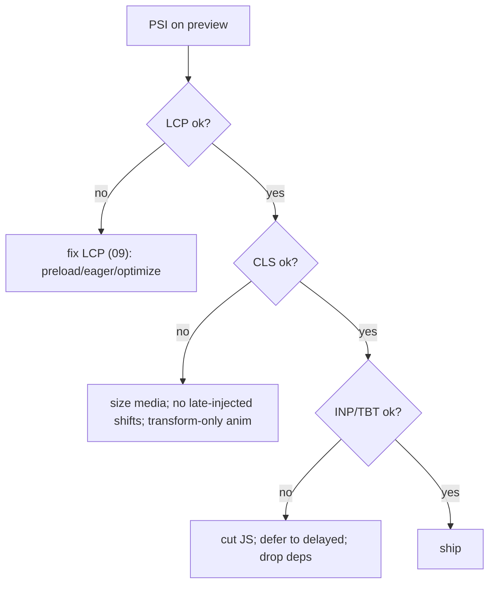

# 10 · Performance Engineering

## Purpose
Achieve/maintain Lighthouse-PSI 100 and healthy Core Web Vitals.

## When to use
- Any change touching markup/CSS/JS/images/fonts; before every PR.

## When NOT to use
- N/A — performance is a standing gate, not an occasional task.

## Inputs
- The feature preview URL; PSI; the change diff.

## Outputs
- A page meeting LCP≤2.5s, CLS≤0.1, healthy INP, PSI≈100 at 3 widths.

## Decision logic

## Validation
- [ ] Eager minimal; martech delayed; LCP image eager+preloaded, rest lazy.
- [ ] Critical vs lazy CSS split; no unnecessary dependencies.
- [ ] PSI run on preview (target 100); CWV within thresholds at mobile/tablet/desktop.

## Performance considerations
(Core topic.) Prefer the ~2KB shared IntersectionObserver over animation libs; rely on per-block code-splitting. **Why:** a single global dependency loads on every page and dwarfs page JS.

## SEO considerations
CWV are ranking factors. **Why:** performance work is also SEO work; don't trade one for the other.

## Accessibility considerations
Respect `prefers-reduced-motion`; don't ship jank that impairs use. **Why:** performance and a11y both serve real usability, not just scores.

## Examples
- Move Sentry/analytics to `delayed.js`.
- Replace a carousel library with CSS scroll-snap + the shared observer.

## Anti-patterns
- Measuring on localhost instead of preview.
- Adding a library for one small effect.
- Animating layout properties.

## Troubleshooting
- **PSI good on localhost, bad on preview** → measure on preview; localhost skips edge realities.
- **INP spikes** → long tasks in eager; profile and defer.
- **Regression after adding a block** → its CSS/JS or an image; check code-split weight + image loading attrs.
