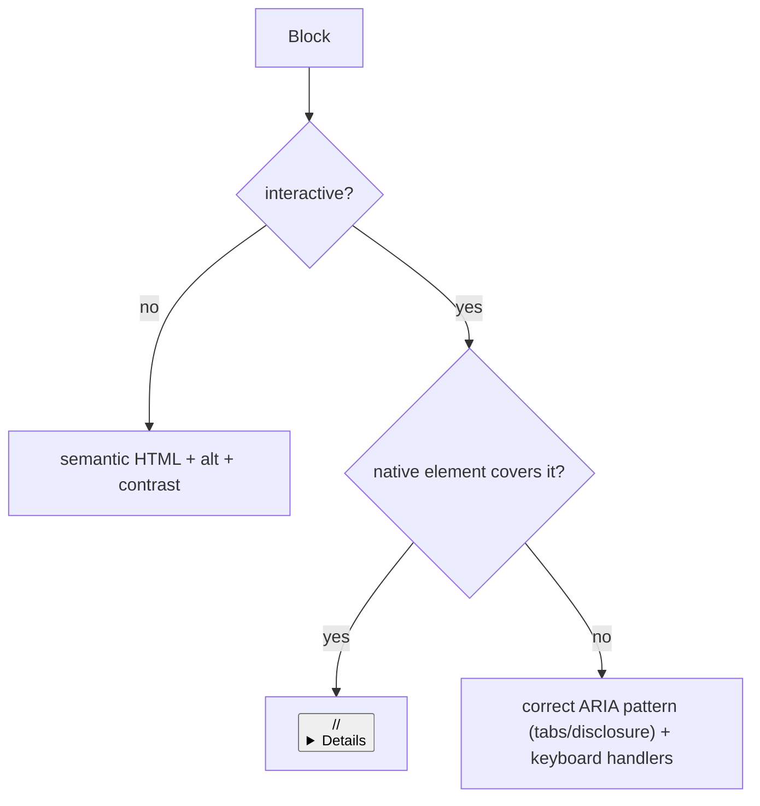

# 11 · Accessibility Engineering

## Purpose
Build blocks/pages to WCAG 2.1 AA — especially interactive components.

## When to use
- Every block; mandatory for interactive blocks (accordion, tabs, carousel, modal, nav).

## When NOT to use
- N/A — accessibility is a standing requirement.

## Inputs
- The block's DOM + interaction model; the design tokens (for contrast).

## Outputs
- Keyboard-operable, screen-reader-correct, contrast-compliant, motion-safe output.

## Decision logic


## Validation
- [ ] One `<h1>`, no skipped levels; semantic elements.
- [ ] `alt` on meaningful images, `alt=""` decorative.
- [ ] Keyboard: focusable, visible focus, logical order, `Esc`/arrows as pattern requires, no traps (except intentional modal + focus return).
- [ ] ARIA correct and non-contradictory; contrast AA; `prefers-reduced-motion` honored; forms labeled + errors announced.

## Performance considerations
Semantic native elements are lighter than ARIA-scripted `<div>`s. **Why:** less JS to reimplement behavior = better INP and fewer bugs.

## SEO considerations
Headings/alt/semantics double as SEO signals. **Why:** a11y and SEO overlap heavily; fixing one usually fixes the other.

## Accessibility considerations
(Core topic.) Prefer the a11y tree from Playwright `snapshot` to verify. **Why:** the snapshot shows what assistive tech actually exposes.

## Examples
```js
btn.setAttribute('aria-expanded', 'false');
btn.addEventListener('click', () => {
  const open = btn.getAttribute('aria-expanded') === 'true';
  btn.setAttribute('aria-expanded', String(!open));
  panel.hidden = open;
});
document.addEventListener('keydown', (e) => { if (e.key === 'Escape') close(); });
```

## Anti-patterns
- `<div onclick>` instead of `<button>`.
- ARIA that contradicts native roles.
- Removing focus outlines; color-only signaling; motion without the guard.

## Troubleshooting
- **Can't reach control by keyboard** → not a native interactive element / missing `tabindex`.
- **Screen reader announces wrong role** → incorrect/foreign ARIA; prefer native.
- **Contrast fails** → verify against tokens; adjust token or usage.
