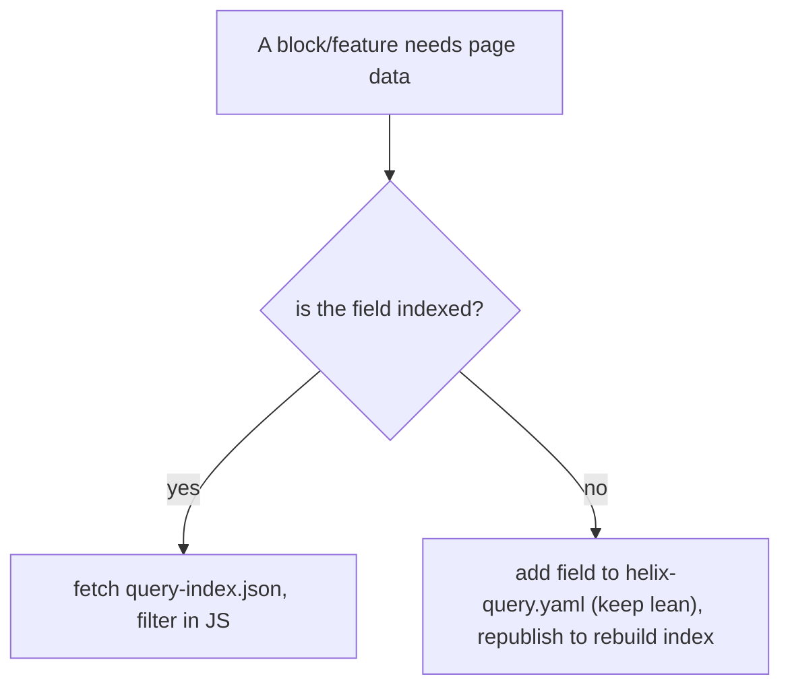

# 12 · Metadata & Indexing

## Purpose
Manage per-page metadata and the query index (`helix-query.yaml` → `query-index.json` → sitemap).

## When to use
- Setting page metadata; enabling a listing/search/sitemap that needs an indexed field.

## When NOT to use
- To build a runtime DB query — there is none; the index is a generated, edge-cached JSON.

## Inputs
- Per-page metadata (title/description/og/robots/canonical/lang).
- `helix-query.yaml` (which meta gets indexed).

## Outputs
- Correct `<meta>` per page; `query-index.json` with the fields consumers need; `sitemap.xml` (via `helix-sitemap.yaml`).

## Decision logic

## Validation
- [ ] Every page has title/description/og/robots/canonical as intended.
- [ ] `helix-query.yaml` indexes only consumed fields.
- [ ] `query-index.json` populates; sitemap generates.

## Performance considerations
Keep the index lean; fetch it off the eager path. **Why:** every consumer downloads `query-index.json`; bloating it or fetching eagerly hurts everyone/LCP.

## SEO considerations
(Core topic.) Correct metadata + canonical + robots + sitemap = discoverability. **Why:** the index also feeds the sitemap crawlers rely on.

## Accessibility considerations
`lang`/`hreflang` correctness aids assistive tech pronunciation. **Why:** screen readers switch voice/pronunciation by `lang`.

## Examples
Real `helix-query.yaml` indexes `title` (`og:title`), `description`, `image` (`og:image`), `lastModified`, `robots`.

## Anti-patterns
- Dropping metadata in migration.
- Over-indexing (bloated index).
- Depending on a field never added to `helix-query.yaml`.

## Troubleshooting
- **Listing/search missing a field** → not in `helix-query.yaml`; add + republish.
- **Sitemap stale/empty** → `query-index.json` not built or `helix-sitemap.yaml` source wrong.
- **Wrong social preview** → `og:*` meta missing/incorrect.
