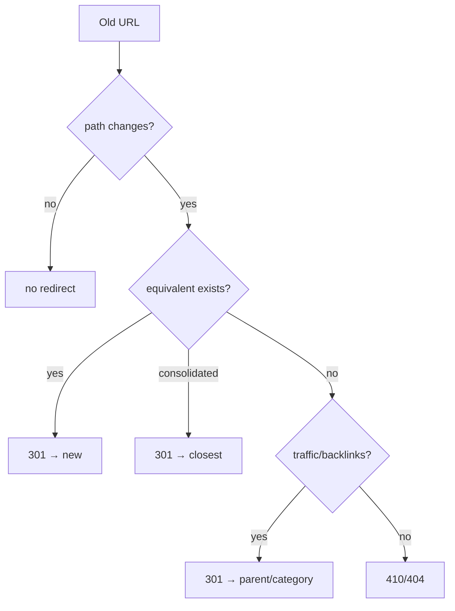

# 13 · SEO & Redirects

## Purpose
Preserve search ranking through changes/migration: metadata, redirects, structured data, crawlable content.

## When to use
- Migrating pages; changing URLs; building FAQ/product/article pages; any structural change.

## When NOT to use
- N/A — SEO is a standing concern for any public page.

## Inputs
- Old URL inventory (sitemap/CMS/analytics/Search Console); metadata ([12](12-metadata-and-indexing.md)); structured-data needs.

## Outputs
- 301 map (old→new); JSON-LD where relevant; crawlable, semantic pages; submitted sitemap.

## Decision logic

## Validation
- [ ] Metadata migrated + correct; heading hierarchy intact.
- [ ] Every old URL → 301 (crawl-test to 200); no chains/loops.
- [ ] Tab/accordion/FAQ content in the DOM (not interaction-injected); JSON-LD re-emitted; sitemap submitted.

## Performance considerations
CWV is a ranking factor. **Why:** SEO and performance ([10](10-performance-engineering.md)) reinforce each other.

## SEO considerations
(Core topic.) Prefer 301 to preserve link equity; avoid redirect chains. **Why:** chains bleed equity and slow crawlers; 302s don't pass equity like 301s.

## Accessibility considerations
Semantic headings/descriptive links serve SEO and a11y together. **Why:** both consume the same semantic structure.

## Examples
- FAQ page emits `schema.org/FAQPage` JSON-LD; answers stay in the DOM.
- Redirect map loaded at cutover; crawl old URLs post-launch asserting 301→200.

## Anti-patterns
- Silent 404s for high-value URLs.
- Content behind interaction that crawlers miss.
- Losing canonical/robots on migration.

## Troubleshooting
- **Traffic drop post-launch** → check redirects (chains/404s) + metadata regressions in Search Console.
- **No rich results** → JSON-LD missing/invalid; validate structured data.
- **Duplicate content** → canonical missing/incorrect.
