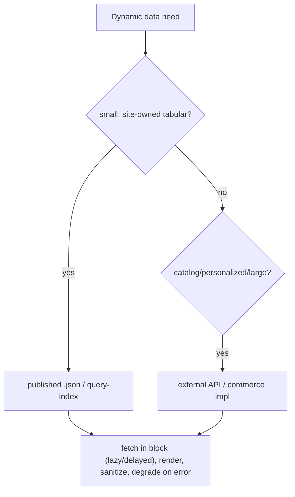

# 14 · Dynamic Content & Data

## Purpose
Render dynamic/data-driven content by fetching published JSON or external APIs client-side (there is no server tier of your own).

## When to use
- Content driven by data (rates, offers, listings) or personalization.

## When NOT to use
- Static content → author it (default content/blocks); don't fetch what could be authored.
- On the eager/LCP path → defer.

## Inputs
- A data source: published `.json` spreadsheet, `query-index.json`, or external API.
- CSP `connect-src` allowances (`head.html`).

## Outputs
- A block that fetches off the critical path, renders (sanitizing HTML), and degrades gracefully.

## Decision logic


## Validation
- [ ] Fetch off the eager path; failure degrades (hide sub-part, page still works).
- [ ] Any HTML from data sanitized with DOMPurify.
- [ ] External origin allowed by CSP `connect-src`; no secrets in client.

## Performance considerations
Never block LCP on a fetch. **Why:** network latency on the critical path directly inflates LCP; render static shell first, hydrate after.

## SEO considerations
Content that must be indexed shouldn't be fetch-only. **Why:** crawlers may not run the fetch; put indexable content in the delivered DOM.

## Accessibility considerations
Announce dynamic updates (`aria-live` where appropriate); keep focus stable. **Why:** silent DOM changes are invisible to screen-reader users.

## Examples
```js
try {
  const { data } = await (await fetch('/data/offers.json')).json();
  data.forEach((o) => block.append(renderOffer(o)));
} catch { block.hidden = true; } // graceful degradation
```

## Anti-patterns
- Embedding API keys in client code.
- Fetching large JSON eagerly.
- Injecting unsanitized HTML.

## Troubleshooting
- **Fetch blocked** → origin not in CSP `connect-src`.
- **Layout shift on data arrival** → reserve space / skeleton.
- **Content not indexed** → it's fetch-only; deliver it in the DOM instead.
