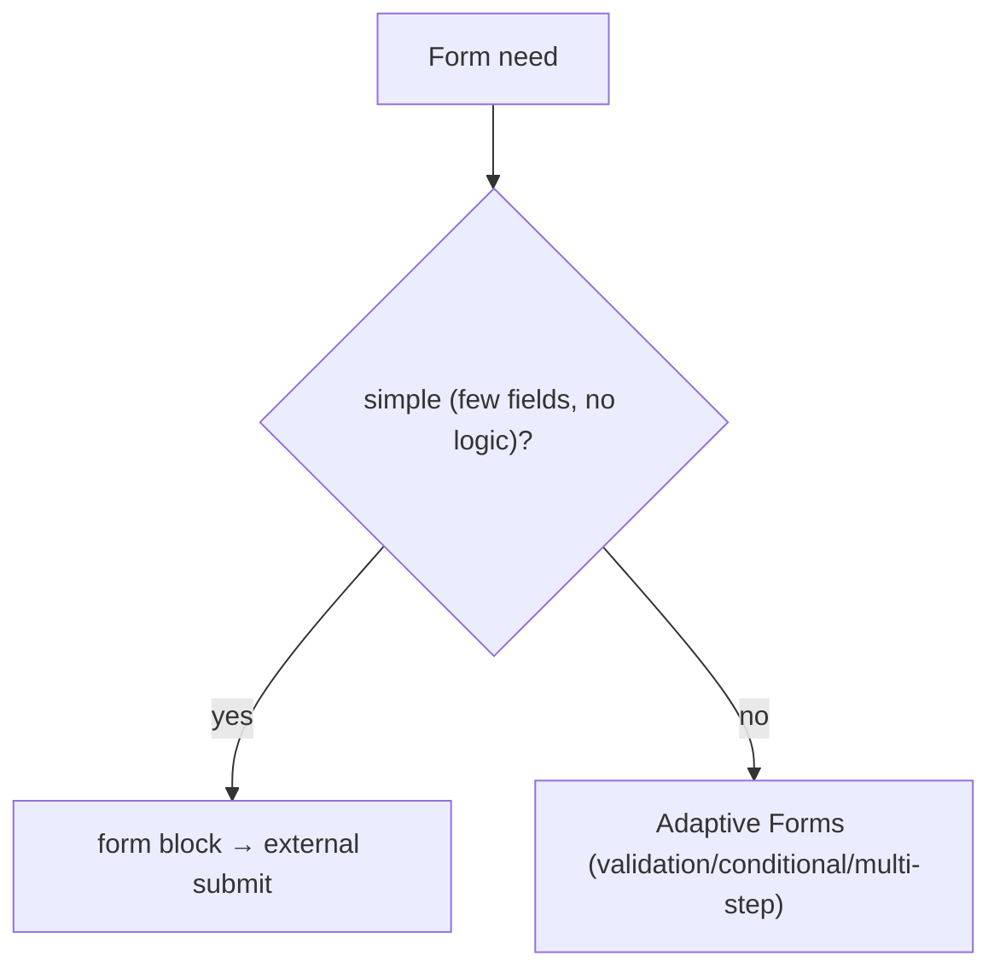

# 15 · Forms

## Purpose
Build forms — from a simple contact form to multi-step Adaptive Forms — that submit to an external/forms service.

## When to use
- Any input+submit page: lead capture, application, contact, eligibility.

## When NOT to use
- To POST to a Sling servlet — there is none. Submissions go to external/forms endpoints.
- To hand-roll complex validation/conditional logic — use Adaptive Forms.

## Inputs
- Field definitions (type, label, required, validation); the submit endpoint; CSP `connect-src`.

## Outputs
- A form block (or Adaptive Form JSON) with accessible fields and a working submit.

## Decision logic


## Validation
- [ ] Labels associated with controls; required/validation states accessible; errors announced.
- [ ] Submit origin allowed by CSP `connect-src`; no secrets/keys in client.
- [ ] Success/failure states handled; keyboard-operable end to end.

## Performance considerations
Load form logic lazily; don't block LCP. **Why:** forms are rarely the LCP element; defer their JS.

## SEO considerations
Ensure the form page's surrounding content is indexable. **Why:** the form itself isn't SEO content, but the page around it is.

## Accessibility considerations
(Critical.) Label every field; group with `<fieldset>/<legend>`; announce errors via `aria-live`/`aria-describedby`; visible focus. **Why:** an inaccessible form blocks the conversion entirely for AT users.

## Examples
```js
form.addEventListener('submit', async (e) => {
  e.preventDefault();
  try { await fetch(endpoint, { method: 'POST', body: new FormData(form) }); showSuccess(); }
  catch { showError(); } // never expose keys; origin must be CSP-allowed
});
```

## Anti-patterns
- API keys/secret endpoints in client JS.
- Unlabeled fields; color-only error indication.
- Reinventing multi-step/validation instead of Adaptive Forms.

## Troubleshooting
- **Submit blocked** → endpoint origin not in CSP `connect-src`.
- **Screen reader misses errors** → not announced; add `aria-live`/`aria-describedby`.
- **Validation inconsistent** → hand-rolled logic; move to Adaptive Forms.
