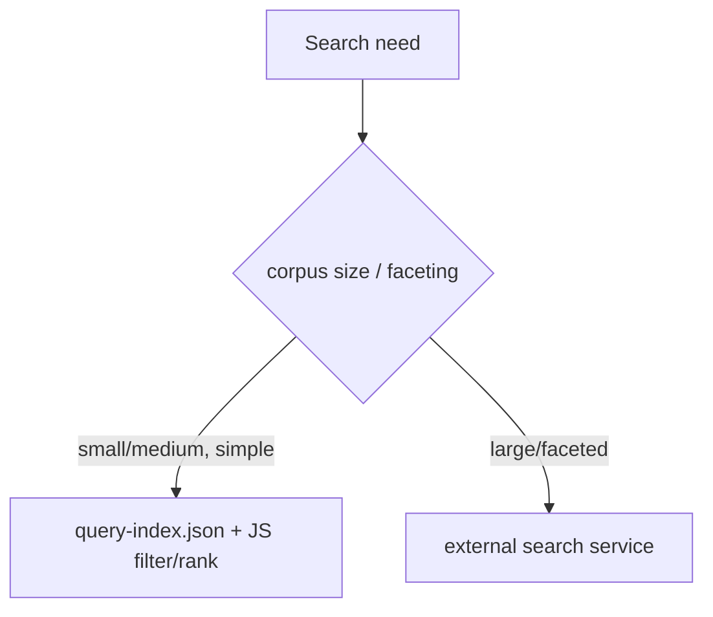

# 16 · Search

## Purpose
Implement site search on `query-index.json` (small/medium sites) or an external search service (large/faceted).

## When to use
- A search box / results page; filtered listings over site content.

## When NOT to use
- QueryBuilder/JCR at runtime — there is none; the index is the substitute.
- Client-filtering a huge corpus — delegate to a search service.

## Inputs
- `query-index.json` (fields via `helix-query.yaml`) or an external search API.
- The query/filter/sort requirements.

## Outputs
- A search block that fetches the index/API, filters/ranks, and renders results accessibly.

## Decision logic


## Validation
- [ ] Needed fields indexed in `helix-query.yaml` (lean); index fetched off eager path.
- [ ] Results keyboard-navigable; result count announced (`aria-live`).
- [ ] Empty/no-results and error states handled.

## Performance considerations
Fetch the index once, cache, filter in JS; don't fetch eagerly. **Why:** the index can be large; keep it off the critical path and reuse the parsed result.

## SEO considerations
Search *results* pages are usually `noindex`. **Why:** infinite query-driven pages create crawl bloat/duplicate content; index the underlying content, not the result permutations.

## Accessibility considerations
Announce result counts; manage focus to results; label the search input. **Why:** AT users need to know results changed and where they are.

## Examples
```js
const { data } = await (await fetch('/query-index.json')).json();
const hits = data.filter((p) => p.title.toLowerCase().includes(q)).slice(0, 20);
```

## Anti-patterns
- Over-indexing to power search (bloats every consumer).
- Client-filtering tens of thousands of rows.
- Indexable, crawlable search-result permutations.

## Troubleshooting
- **Missing results field** → not in `helix-query.yaml`; add + republish.
- **Slow search** → index too big / fetched repeatedly; cache + trim fields, or go external.
- **Crawl bloat** → results pages indexable; set `noindex`.
