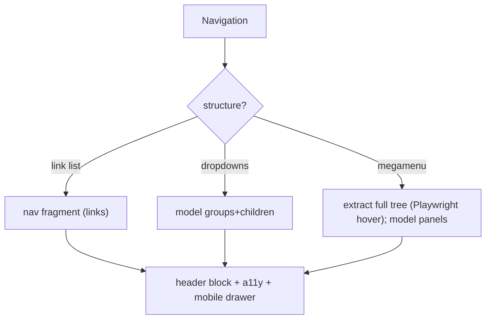

# 17 · Navigation (Header/Footer)

## Purpose
Build site chrome — header/nav and footer — as shared fragments decorated by the `header`/`footer` blocks, loaded in the lazy phase.

## When to use
- Migrating/building global navigation, megamenus, mobile drawers, footers.

## When NOT to use
- As per-page content — nav is shared chrome, authored once.
- In the eager phase — it's lazy (`loadHeader`/`loadFooter`).

## Inputs
- The full nav tree (including hover/click-revealed megamenu links).
- The nav/footer fragment content.

## Outputs
- `header`/`footer` blocks decorating a shared nav fragment; keyboard+ARIA-correct; responsive.

## Decision logic

## Validation
- [ ] Nav authored once as a fragment (not per page).
- [ ] Full tree captured (including hover-only megamenu links).
- [ ] Keyboard operable (arrows/`Esc`), correct ARIA (menu/disclosure), visible focus; mobile drawer accessible.

## Performance considerations
Nav loads lazily; don't ship desktop megamenu markup to mobile unnecessarily. **Why:** header isn't LCP; heavy nav markup on mobile wastes bytes.

## SEO considerations
Nav links are crawl paths; deep megamenu links must be in the DOM. **Why:** lost hover-only links remove internal-link equity and discoverability.

## Accessibility considerations
(Critical.) Full keyboard support, focus management, correct roles; skip-to-content link. **Why:** nav is the most-used, most-audited component; broken nav a11y blocks the whole site.

## Examples
- Megamenu: hover each top item with Playwright to reveal + capture the panel's links before modeling.

## Anti-patterns
- Migrating nav as page content.
- Dropping hover-only links.
- Mouse-only menus (no keyboard).

## Troubleshooting
- **Missing deep links** → not revealed during extraction; hover/click to capture.
- **Menu unusable by keyboard** → missing key handlers/ARIA.
- **Nav differs per page** → not sourced from one shared fragment.
