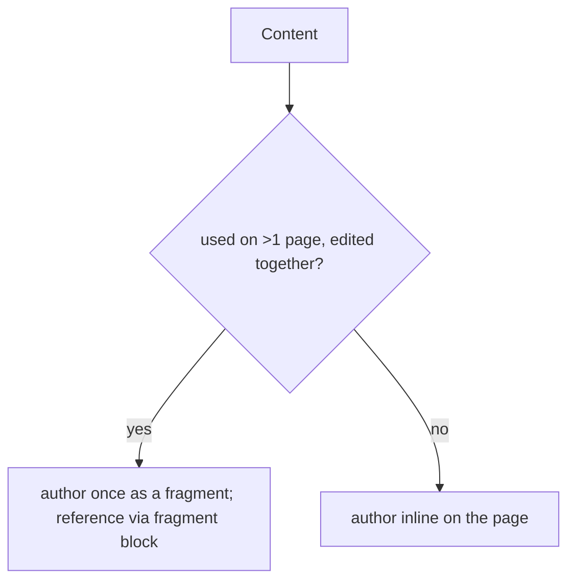

# 18 · Fragments & Reuse

## Purpose
Author reusable content once and reference it everywhere via the `fragment` block.

## When to use
- Content repeated across pages: banners, disclaimers, promos, nav/footer, legal snippets.

## When NOT to use
- One-off page content (author inline).
- Structured *data* reused across channels → consider Content Fragments (implies an AEMaaCS source; see migration [10](../migration/10-pre-migration-website-analysis.md)).

## Inputs
- The shared content, authored as a fragment page.
- The `fragment` block reference (link to the fragment).

## Outputs
- One authored source referenced by many pages; edits propagate everywhere.

## Decision logic

## Validation
- [ ] Shared content lives in one fragment; pages reference it (no duplication).
- [ ] Fragment renders correctly when transcluded; instrumentation intact for editing.

## Performance considerations
Fragments load with their host section's phase. **Why:** a heavy fragment in the first section still affects LCP — keep shared content lean.

## SEO considerations
Ensure transcluded content is in the delivered DOM. **Why:** fragment content must be crawlable like inline content.

## Accessibility considerations
The fragment's own semantics/headings apply in context. **Why:** a fragment with an `<h1>` dropped mid-page can break heading hierarchy — model heading levels for reuse.

## Examples
- A `/fragments/disclaimer` page referenced by the `fragment` block across product pages; editing it updates all.

## Anti-patterns
- Copy-pasting the same banner into many pages (drift guaranteed).
- A fragment whose heading level collides with host pages.

## Troubleshooting
- **Fragment not rendering** → bad reference path / not published.
- **Broken heading hierarchy** → fragment heading level wrong for its host context.
- **Edits not propagating** → content duplicated inline instead of referenced.
