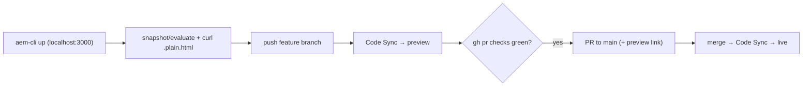

# 19 · Preview, Publish & Code Sync

## Purpose
Ship changes through the EDS delivery pipeline: local dev → branch preview → PR → publish (push-driven via AEM Code Sync).

## When to use
- Verifying and shipping any change; setting up the dev/preview loop.

## When NOT to use
- To perform a manual deploy — there is none; publishing is `git push`.
- To edit content in `content/` — content publishes via authoring, not code.

## Inputs
- A feature branch; the change; `gh` for CI/PR.

## Outputs
- Verified preview; green CI; PR to `main` with a preview link; published preview→live.

## Decision logic


## Validation
- [ ] Delivered markup inspected (`.plain.html`) before coding.
- [ ] Change verified on the branch preview at 3 widths; PSI on preview.
- [ ] `npm run lint` + `npm run build:json` clean; `gh pr checks` green; Code Sync published.
- [ ] PR includes the `…aem.page/{path}` preview link; no direct commits to `main`.

## Performance considerations
Measure on the preview, not localhost. **Why:** preview reflects real edge delivery (optimized images, CSP, caching); localhost doesn't.

## SEO considerations
Load redirects + submit the sitemap at cutover. **Why:** publishing without redirects/sitemap risks ranking/traffic loss.

## Accessibility considerations
Re-run a11y checks on the preview build. **Why:** verify the delivered artifact, not just local decoration.

## Examples
```bash
npx -y @adobe/aem-cli up --no-open --forward-browser-logs
curl http://localhost:3000/index.plain.html
gh pr checks
```

## Anti-patterns
- Committing to `main`; PR without a preview link.
- Handling credentials in-band (they're host-injected via the Settings opt-in).
- Merging with red CI or stale aggregates.

## Troubleshooting
- **Preview not updating** → Code Sync not triggered / push failed; check the GitHub App + Actions.
- **401/403 on push/publish** → enable the Settings opt-in; never paste a token.
- **CI red** → lint error or stale aggregates (`build:json`).
