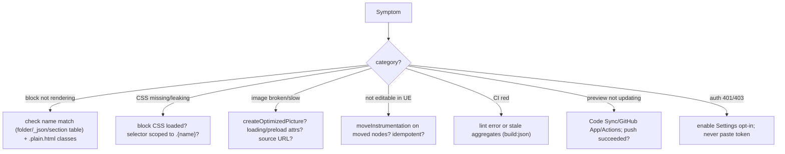

# 20 · Debugging & Troubleshooting

## Purpose
Systematically diagnose EDS issues — blocks not rendering, styles missing, images broken, CI failing, Code Sync not publishing.

## When to use
- Anything renders/behaves wrong; CI/preview/publish fails.

## When NOT to use
- N/A — this is the cross-cutting diagnostic skill.

## Inputs
- The symptom; the delivered markup (`.plain.html`); browser console/network; `gh pr checks`; PSI.

## Outputs
- Root cause + fix, verified on preview.

## Decision logic

## Validation
- [ ] Root cause identified (not masked by disabling a lint rule or editing `aem.js`).
- [ ] Fix verified on preview at the affected width(s).

## Performance considerations
Use PSI + Playwright `evaluate` to localize regressions. **Why:** measure to find the offending asset/phase rather than guessing.

## SEO considerations
For "content missing from crawl," check whether it's injected in the delayed phase or behind interaction. **Why:** those are invisible to crawlers.

## Accessibility considerations
Use the `snapshot` a11y tree to debug role/label/focus issues. **Why:** it shows what AT actually exposes.

## Examples
- **Block silent:** `curl …plain.html` shows `
` but folder is `k811-hero` → name mismatch.
- **Styles leak:** bare `.title` selector → scope to `.k811-hero .title`.
- **CI red:** edited `_block.json`, forgot `build:json` → aggregates stale.

## Anti-patterns
- Editing `scripts/aem.js` to "fix" a symptom.
- Disabling lint rules to make CI green.
- Guessing instead of reading `.plain.html`/console/network.

## Troubleshooting index (symptom → skill)
- Rendering/decoration → [01](01-block-development.md)/[02](02-decorate-pattern.md).
- Styling → [03](03-css-styling.md). Editing/overlays → [06](06-universal-editor-instrumentation.md).
- LCP/images → [09](09-lcp-and-images.md). Perf → [10](10-performance-engineering.md). A11y → [11](11-accessibility-engineering.md).
- Index/SEO → [12](12-metadata-and-indexing.md)/[13](13-seo-and-redirects.md). Publish → [19](19-preview-publish.md).
