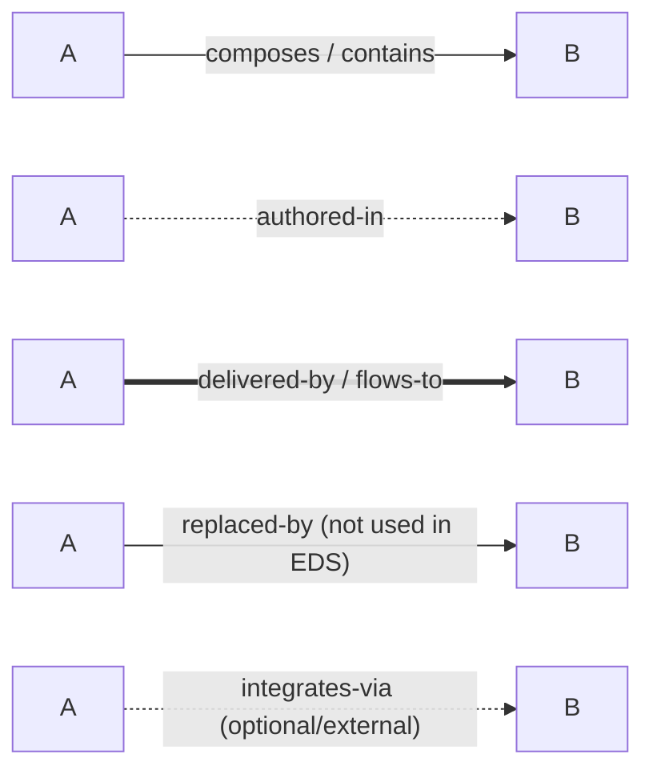
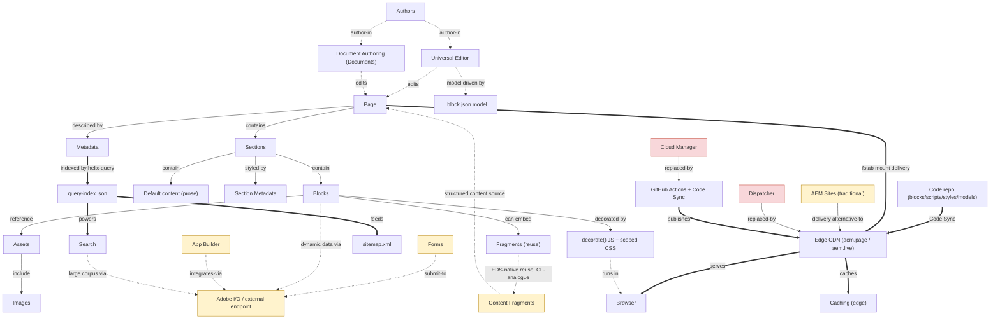
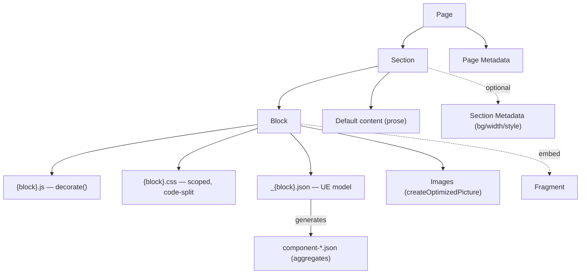
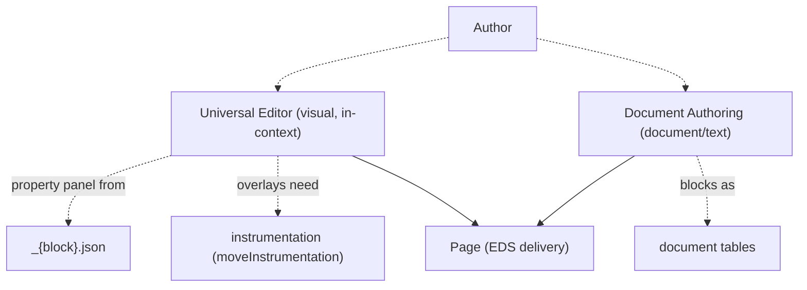
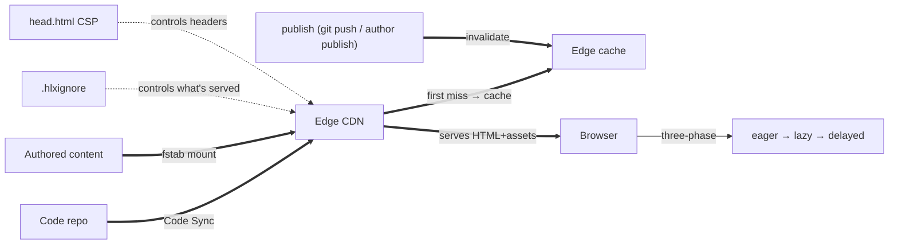
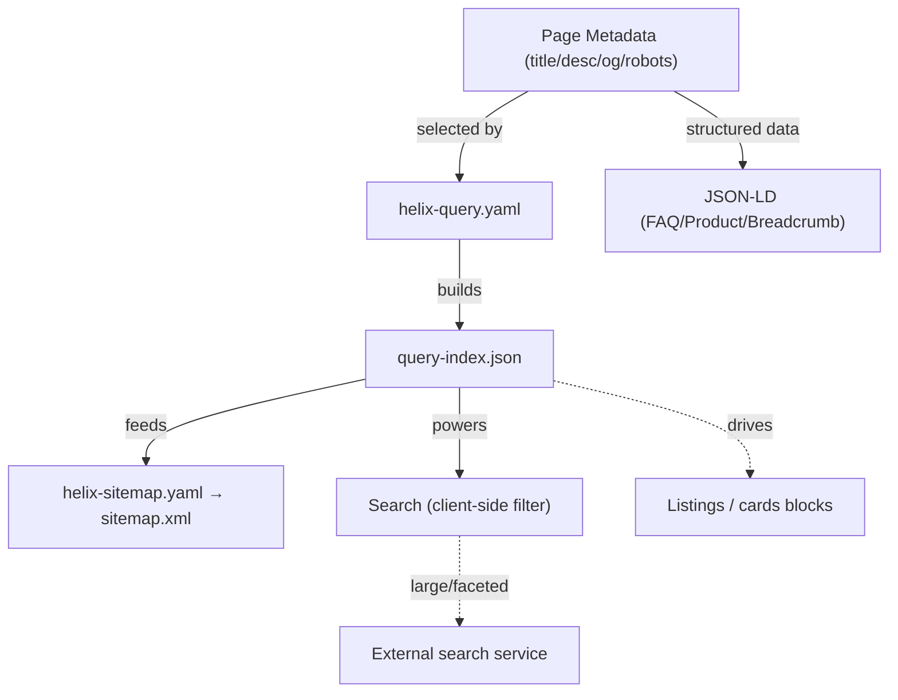
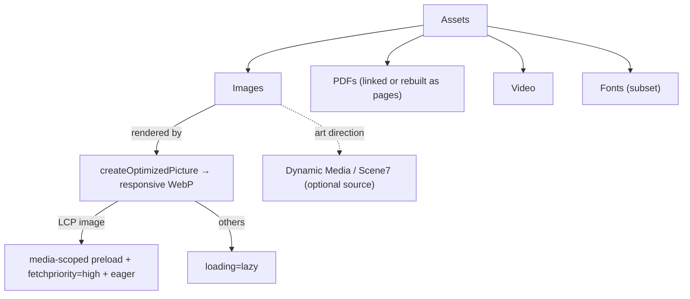
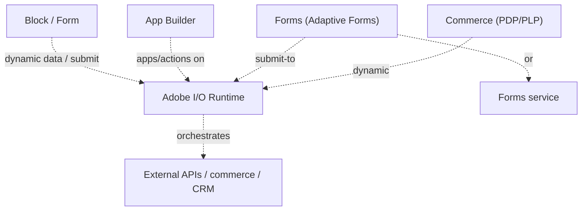
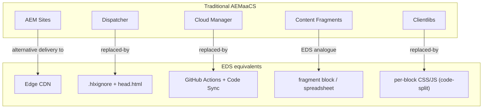

# 11 · EDS Knowledge Graph

How every AEM Edge Delivery Services concept relates to every other, as Mermaid graphs. The **master graph** shows the whole system; the **sub-graphs** zoom into each cluster; the **relationship legend** defines the edge types so a line's *meaning* is unambiguous.

> **Honesty about scope:** some requested nodes (Dispatcher, Cloud Manager, AEM Sites, App Builder, Adobe I/O, Content Fragments) are **adjacent** to EDS, not part of its delivery path. The graph includes them and labels the edge precisely — `replaced-by` (EDS supersedes it), `alternative-to` (a sibling delivery choice), or `integrates-via` (an optional external hook). Drawing them without that distinction would imply EDS uses a Dispatcher/Cloud Manager, which it does not.

## Relationship legend

- **solid arrow** = composition/containment ("a section contains blocks").
- **dotted arrow** = authoring/association ("a block is authored-in Universal Editor").
- **thick arrow** = delivery/dataflow ("code flows-to the Edge CDN").
- **replaced-by** = the traditional-AEM node EDS supersedes.
- **integrates-via** = an optional external system EDS can call, not part of core delivery.

---

## Master graph — the whole system

*Yellow = adjacent/optional; red = traditional-AEM replaced by an EDS mechanism. White = EDS core.*

---

## Sub-graph A — Content structure (how a page is built)

**Reading it:** a Page is Sections; a Section is Blocks + Default content (+ optional Section Metadata); a Block is JS + CSS + a model; the model generates the aggregates. Images and Fragments hang off blocks. *Key relationship:* the block's three files are a unit — code-split and loaded together only when the block appears.

## Sub-graph B — Authoring plane (who edits what, where)

**Reading it:** both surfaces produce the *same* EDS-delivered page — authoring surface ≠ delivery platform. UE is field/visual; DA is document/text. UE depends on the model (panel) and instrumentation (overlays). *Choose by content shape:* composed marketing → UE; high-volume text → DA.

## Sub-graph C — Delivery & caching plane (how it reaches the user)

**Reading it:** two inputs (code via Code Sync, content via the fstab mount) converge at the Edge CDN, which caches on first miss and serves to the browser (which runs three-phase loading). *Key relationship:* **publish = invalidate** — there's no separate cache-flush; `.hlxignore` and `head.html` are the only serving/header controls.

## Sub-graph D — Metadata, indexing, SEO, search (the data spine)

**Reading it:** metadata → indexed by `helix-query.yaml` → `query-index.json`, which is the *single source* that feeds the sitemap, powers search, and drives listing blocks. *Key relationship:* the query index is EDS's substitute for QueryBuilder/GraphQL — one generated, edge-cached JSON.

## Sub-graph E — Assets & images

**Reading it:** images flow through `createOptimizedPicture` to responsive WebP; the LCP image branches to the preload/eager treatment, everything else to lazy. *Key relationship:* the LCP image is the one asset that gets special, deliberate handling.

## Sub-graph F — Adjacent & external systems (how EDS connects out)

**Reading it:** EDS is static-first; dynamic behavior reaches *out* via client-side calls to Adobe I/O Runtime (where App Builder actions live) or external services. *Key relationship:* these are `integrates-via` edges — optional hooks, not part of core page delivery.

## Sub-graph G — Traditional AEM: replaced vs alternative

**Reading it:** **AEM Sites** is an *alternative* delivery choice (an org can run both); **Dispatcher, Cloud Manager, Clientlibs** are *replaced-by* EDS mechanisms; **Content Fragments** map to the `fragment` block / published data in a pure-EDS project. *Key relationship:* choosing EDS means you don't operate a Dispatcher or Cloud Manager pipeline — the CDN + git + Code Sync do those jobs.

---

## Concept relationship dictionary (edge-by-edge)
| From | Relationship | To | Meaning |
|---|---|---|---|
| Author | authored-in | Universal Editor / Document Authoring | who uses which surface |
| Universal Editor / DA | produces | Page (EDS) | both feed the same delivery |
| Page | contains | Sections | structural composition |
| Section | contains | Blocks + Default content | mixed content |
| Section | styled-by | Section Metadata | band-level styling |
| Block | composed-of | JS + CSS + model | the three-file unit |
| Block model | generates | component-*.json | build:json aggregates |
| Block | references | Assets → Images | media |
| Block | embeds | Fragment | reuse |
| Page | described-by | Metadata | SEO/social |
| Metadata | indexed-by | helix-query.yaml → query-index.json | the data spine |
| query-index.json | feeds | sitemap + search + listings | single source |
| Code repo | delivered-by (Code Sync) | Edge CDN | code publish |
| Authored content | delivered-by (fstab) | Edge CDN | content publish |
| Edge CDN | caches / invalidated-by | publish | publish = invalidate |
| Block/Form | integrates-via | Adobe I/O / App Builder / external | dynamic hooks |
| Dispatcher / Cloud Manager / Clientlibs | replaced-by | EDS mechanisms | not used in EDS |
| AEM Sites | alternative-to | EDS delivery | sibling choice |
| Content Fragments | analogue-of | fragment block | reuse in pure-EDS |

## Why represent the knowledge as a graph
Prose explains one concept at a time; a graph makes the *relationships* first-class — which is where EDS understanding actually lives (why publish invalidates cache, why the query index ties metadata to search, why authoring surface is independent of delivery). Encoding the edge *types* (compose / author / deliver / replaced-by / integrates-via) prevents the most common conceptual error: treating adjacent traditional-AEM systems as if EDS used them. The graph is the mental model; the other handbook chapters are its expansion.
