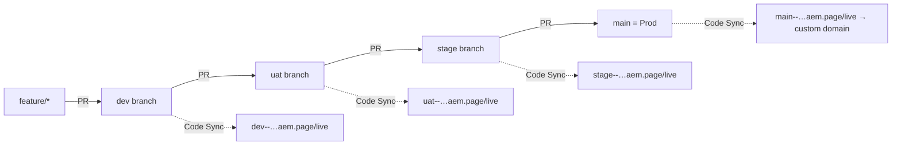
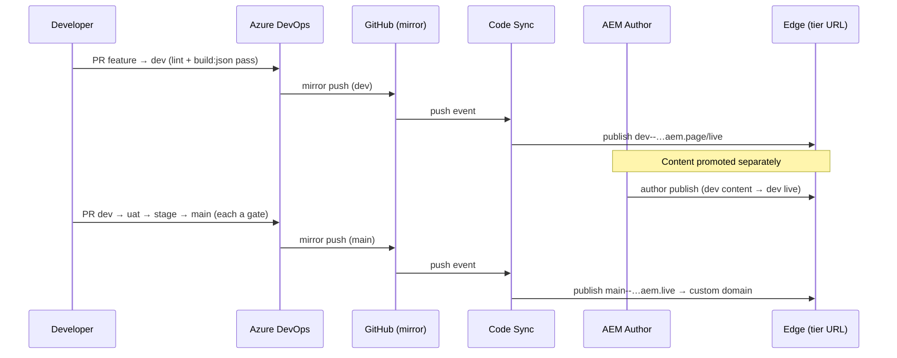

# 12 · Environments & Promotion (Dev / UAT / Stage / Prod)

How to run a traditional four-tier promotion model — **Dev → UAT → Stage → Prod** — on AEM Edge Delivery Services when the team's source of record is **Azure Git (Azure DevOps Repos)** and content is authored in **Universal Editor**. Every recommendation carries its **Why**, because the EDS environment model is *branch = environment*, which is not what a traditional AEMaaCS (author/publish + Cloud Manager pipeline) team expects.

> **Grounding.** This repo delivers via `git push → AEM Code Sync → *.aem.page (preview) / *.aem.live (live)` and mounts one AEMaaCS author in `fstab.yaml` (`author-p165370-e1760075.adobeaemcloud.com/.../xeragobiz/kotakbank/main`). See [01](01-architecture-and-runtime.md) (planes), [07](07-preview-publish-delivery.md) (preview/publish), [11](11-knowledge-graph.md) (Sub-graph C, G).

---

## The one idea that changes everything: branch = environment

In traditional AEMaaCS you have *N* long-lived server tiers (dev/stage/prod author+publish) and a Cloud Manager pipeline deploys a build artifact to each. **EDS has none of that.** A branch pushed to the code repo is published by Code Sync to its **own** preview/live pair at `https://{branch}--{repo}--{org}.aem.{page|live}`. There is no build artifact and no deploy target — the branch *is* the environment.

- **Recommendation:** model Dev/UAT/Stage/Prod as **long-lived git branches** (`dev`, `uat`, `stage`, `main`), and promote by **merging up the chain**. `main` is Prod.
  **Why:** it maps a four-tier expectation onto the only environment primitive EDS actually has (the branch), with zero extra infrastructure. Each tier gets an isolated, independently-publishable URL for free.
- **Recommendation:** keep **code promotion and content promotion mentally and operationally separate.**
  **Why:** [01](01-architecture-and-runtime.md) — code lives in the git plane (Code Sync), content lives in the authoring plane (`fstab` mount + author publish). "I merged to `stage` but the page still looks old" is almost always a *content* publish that hasn't happened, not a code problem. The two planes publish on different triggers.

---

## Environment topology

| Stage | Git branch | EDS preview (`aem.page`) | EDS live (`aem.live`) | Public? | Purpose |
|---|---|---|---|---|---|
| **Dev** | `dev` | `dev--kotakbank--xeragobiz.aem.page` | `dev--kotakbank--xeragobiz.aem.live` | gated | Integration of feature branches; developer verification |
| **UAT** | `uat` | `uat--kotakbank--xeragobiz.aem.page` | `uat--kotakbank--xeragobiz.aem.live` | gated | Business / QA sign-off |
| **Stage** | `stage` | `stage--kotakbank--xeragobiz.aem.page` | `stage--kotakbank--xeragobiz.aem.live` | gated | Pre-prod parity; release candidate |
| **Prod** | `main` | `main--kotakbank--xeragobiz.aem.page` | `main--kotakbank--xeragobiz.aem.live` → **custom domain** | public | Production |

Feature branches (e.g. `k811-page-migration`) still get their own throwaway preview (`{feature}--kotakbank--xeragobiz.aem.page`) for day-to-day dev; they merge **into `dev`**.

- **Recommendation:** promote strictly up the chain — `feature → dev → uat → stage → main` — via pull request, never skipping a tier for a normal change.
  **Why:** each merge is the promotion gate. Skipping means the change was never verified on the tier it skipped, which defeats the point of having the tier.
- **Recommendation:** treat both `aem.page` (preview) **and** `aem.live` (live) of each non-prod branch as belonging to that tier.
  **Why:** on EDS "preview vs live" is a publish state, not an environment. Within a tier, `.aem.page` is the previewed/unpublished view and `.aem.live` is the published view; the *tier* is the branch.



---

## Azure Git integration — Azure DevOps as system-of-record, mirror to GitHub

**Working assumption (verify against aem.live before build):** **AEM Code Sync is a GitHub App.** It installs on a GitHub org/repo and reacts only to GitHub push/PR events. **Azure DevOps Repos is not a supported Code Sync source, and there is no self-hosted Code Sync.** Therefore code cannot reach the EDS code bus directly from Azure DevOps.

The resolution is a **one-way mirror**: humans work in Azure DevOps; a pipeline mirrors the four environment branches to the GitHub repo that Code Sync watches.

- **Recommendation:** keep **Azure DevOps Repos as the system-of-record** — developers, PRs, branch policies, work-item links, and CI (lint / `build:json` freshness) all live in Azure. Add the GitHub repo (`xeragobiz/kotakbank`) as an **EDS delivery mirror only**; no human opens a PR there.
  **Why:** it preserves the mandated Azure workflow and audit trail while still feeding the only source Code Sync accepts. One source of truth for people, one for the platform, kept in sync automatically.
- **Recommendation:** implement the mirror as an **Azure Pipeline triggered on push** to `dev`/`uat`/`stage`/`main` that does a mapped `git push` to the same-named GitHub branch. Store the GitHub credential (deploy key or fine-grained PAT) in **Azure Key Vault / a pipeline secret** — **never in-band, never committed** ([09](09-antipatterns-mistakes-validation.md)).
  **Why:** a push-triggered mirror keeps latency to seconds and maps each Azure branch to its EDS environment 1:1. Secrets in Key Vault satisfy the "everything committed is public" rule — nothing sensitive touches the repo.
- **Recommendation:** make the mirror **branch-scoped and fast-forward-only per environment branch**; do not mirror every feature branch (only the four tiers + optionally active feature branches that need an EDS preview).
  **Why:** Code Sync publishes *every* branch it sees; mirroring all of Azure's branches would spray dozens of stale previews and waste the platform's attention. Fast-forward-only avoids the mirror rewriting GitHub history under Code Sync.
- **Recommendation:** document the **conflict/divergence policy** — GitHub is downstream and must never be edited directly; if it diverges, Azure wins and the mirror force-aligns it during a maintenance window.
  **Why:** two remotes invite drift. A single, written "Azure is upstream, GitHub is a mirror" rule prevents the classic "someone hotfixed GitHub and the mirror clobbered it" incident.

```mermaid
flowchart LR
  DEVS["Developers"] -->|PR + review| AZR["Azure DevOps Repos (system-of-record)"]
  AZR -->|branch policies + CI: lint / build:json| AZR
  AZR ==>|Azure Pipeline: mapped git push (Key Vault secret)| GH["GitHub repo (EDS mirror)"]
  GH ==>|Code Sync (GitHub App)| EDGE["Edge CDN — per-branch aem.page/live"]
```

> If a later check of aem.live reveals a supported Azure-native or generic-webhook Code Sync path, prefer it and drop the mirror — the rest of this chapter (topology, content, config, promotion) is unchanged either way.

---

## Content source per environment (Universal Editor)

EDS content is delivered via the `fstab.yaml` mount, not from git. So "which content does this environment show?" is answered by **which author host (and path) the branch's `fstab.yaml` points to** — the primary env-divergent file.

### Option A — Multiple AEMaaCS authors (recommended for a bank)

Separate AEMaaCS author environments (e.g. `dev` / `stage` program tiers) back the tiers; each branch's `fstab.yaml` points to the **matching author host**.

```yaml
# fstab.yaml on branch `dev`
mountpoints:
  /:
    url: "https://author-DEV.adobeaemcloud.com/bin/franklin.delivery/xeragobiz/kotakbank/dev"
    type: "markup"
    suffix: ".html"
```
(`uat`/`stage` point at the stage author; `main` at the prod author.)

- **Recommendation:** use Option A when ≥2 AEMaaCS author instances are licensed.
  **Why:** full content isolation. UAT/Stage can hold in-review or divergent content (new campaign pages, unpublished legal copy) without any risk to Prod — essential for regulated financial content where "test copy leaked to prod" is a real incident.

#### Still one repo, still branches — not multiple repos
The EDS environment hostname is `{branch}--{repo}--{org}.aem.page`. `repo` (`kotakbank`) and `org` (`xeragobiz`) are fixed; only `branch` varies. So the four tiers **must** be branches of the **one** repo — separate repos would be separate *sites* on separate hostnames and would forfeit promotion-by-merge. Option A multiplies the *authors*, never the repo: **one Azure repo, four branches, one GitHub mirror.** Multi-repo is for genuinely separate sites, never for environments of one site.

#### How authored content reaches each tier's `.page`/`.live` (the key mechanism)
Content **never travels through git.** Code (git → Code Sync) and content (author → admin preview/publish) are independent planes ([01](01-architecture-and-runtime.md)) that meet only at the edge. The branch's `fstab.yaml` is the join: when the edge serves `dev--…aem.page`, it reads `fstab.yaml` **from the `dev` branch**, which names the Dev author — so that tier's content is pulled from that author.

Publishing a page on a tier is therefore an **admin preview/publish action scoped to that tier's ref**, which pulls from the author that ref's `fstab.yaml` names:
1. Author edits in **Universal Editor** → writes to the tier's AEM author (JCR only; edge unaware).
2. **Preview** (admin `preview`, ref = `dev`) → edge fetches HTML from the Dev author (via that branch's `fstab`) and caches it at `dev--…aem.page`.
3. **Publish** (admin `live`, ref = `dev`) → promotes it to `dev--…aem.live`.

The **branch selects the author; the preview/publish action selects preview-vs-live.** No content commit, no content merge.

- **Recommendation:** do you need **Sidekick** with Universal Editor? UE can edit and preview/publish on its own, so Sidekick is not *strictly* required — but keep it (this repo already ships `tools/sidekick/config.json`).
  **Why:** in a multi-tier setup Sidekick's env switcher, bulk preview/publish, and its `editUrlPattern` (`{{contentSourceUrl}}{{pathname}}?cmd=open`) deep-link authors from any delivered page back into UE **on the correct author** — because `{{contentSourceUrl}}` resolves from that branch's `fstab.yaml`. Authors/QA never have to know which author backs which tier; the config does. UE covers editing; Sidekick covers cross-tier navigation and bulk ops.

- **Recommendation:** promoting **content** between the separate authors is explicit AEM work (content packages / Content Transfer Tool / author-to-author copy), **not** a side effect of the git merge.
  **Why:** each tier has its own author repository, so a Dev publish only fills the Dev edge — it cannot touch the Prod author. For a bank this separation *is* the feature (unreleased content stays on the gated non-prod author until sign-off), and the transfer step is its price. Budget for it as a distinct runbook.

#### Full A vs Lighter A — the choice is only about the `dev` branch
Both variants keep the **prod↔non-prod content wall** (a dedicated Prod author) — the boundary regulators care about. They differ in exactly one place: whether `dev` gets its own author.

| Branch | Full A (3 authors) | Lighter A (2 authors) |
|---|---|---|
| `dev` | **Dev author** (isolated sandbox) | Non-prod author (shared) |
| `uat` | Stage author | Non-prod author (shared) |
| `stage` | Stage author | Non-prod author (shared) |
| `main` | Prod author | Prod author |

- **Full A** adds a second, *internal-quality* wall: **dev↔uat**. It isolates developers churning throwaway test content from content business users are mid-sign-off on. The Dev author sits **off** the release path (release path is still the single hop Stage→Prod).
- **Lighter A** drops that internal wall: `dev`/`uat`/`stage` share one non-prod author, so a developer restructuring/deleting a page to test a block does so in the same instance where UAT content is being prepared — a collision risk (mitigate with separate `franklin.delivery` folder paths per branch or with process discipline).

- **Recommendation:** **prefer Full A when the AEMaaCS program already provisions Dev/Stage/Prod authors** (the standard layout). Because EDS delivers from the *author* via `franklin.delivery` (the AEM publish tier is unused), those three author instances already exist — Full A costs nothing extra and gives the cleaner Dev sandbox and stronger sign-off fidelity.
  **Why:** an earlier framing that Lighter A "halves licences" only holds if a third author would be a *net new purchase*. When the authors are already provisioned, Lighter A saves no licence cost — its only benefit is **operational** (2 instances vs 3 to keep aligned on config/DAM/taxonomy, one fewer place content can drift).

- **Recommendation:** **choose Lighter A only when** a third author would be an added cost (or the Dev author would sit idle), the content team is small with low dev/UAT collision risk, and minimizing instances-to-maintain outweighs an isolated Dev sandbox.
  **Why:** it still satisfies the compliance-critical prod↔non-prod wall at the lowest operational footprint; you trade away only the internal dev↔uat isolation, which a small team can cover with folder scoping or discipline.

- **Recommendation:** in **both** variants the release path is a **single content-transfer hop** (non-prod/Stage author → Prod author) via content package / Content Transfer Tool / author-to-author copy — never a side effect of the git merge.
  **Why:** each tier's author is a separate repository, so publishing on a lower tier only fills that tier's edge. Full A merely adds the isolated Dev author beside this path; it does not add a release hop.

### Option B — Single author, branch/folder-scoped (low-cost fallback)

One author instance; environments differ by git branch (and optionally a **content sub-path** in the mount).

```yaml
# fstab.yaml on branch `uat` — same host, scoped path
mountpoints:
  /:
    url: "https://author-p165370-e1760075.adobeaemcloud.com/bin/franklin.delivery/xeragobiz/kotakbank/uat"
    type: "markup"
    suffix: ".html"
```

- **Recommendation:** use Option B only if a single author must serve all tiers; accept that content is effectively **shared** and UAT/Stage cannot diverge from Prod content.
  **Why:** cheapest, but the tiers then validate *code* changes against shared content, not a content release. State this limitation explicitly so no one treats Stage as a content-parity environment when it isn't.

- **Recommendation (both options):** the `fstab.yaml` **URL is the only value that should differ between branches**; keep everything else about the file identical.
  **Why:** minimizes merge conflicts when promoting up the chain — a promotion PR should show a clean diff, not a tangle of per-env config.

---

## Universal Editor + Sidekick wiring

- **Recommendation:** authors edit against the **AEM author** for the tier and preview against **that tier's branch** `*.aem.page`. Configure the UE/Sidekick entry point (`tools/sidekick/`) per environment so authors land on the correct author + preview pair.
  **Why:** UE opens a page from a specific author and renders it through a specific branch preview; a mismatched pairing shows the wrong content or the wrong code. Explicit per-tier entry points prevent editing prod content while previewing dev code (or vice-versa).
- **Recommendation:** keep the **component models identical across all branches** — never let `_{block}.json` / the `component-*.json` aggregates diverge between `dev` and `main`.
  **Why:** the model is the author's interface ([06](06-authoring-and-content-modeling.md)). If Dev's model has a field Prod's doesn't, content authored on Dev can't promote cleanly. The CI `build:json` freshness gate ([00](00-README.md)) enforces this per branch; keep it green everywhere.
- **Recommendation:** author on the **lowest tier that owns the content**, then use the authoring **publish** action to move it up (Option A) — code promotion does **not** carry content.
  **Why:** the two planes are independent ([01](01-architecture-and-runtime.md)). Expecting a `stage → main` code merge to also publish content is the single most common EDS environment mistake.

---

## Access control & indexing

- **Recommendation:** **gate all non-prod tiers** (Dev/UAT/Stage, both `.aem.page` and `.aem.live`) behind authentication or an IP allowlist, and mark them `noindex`.
  **Why:** everything on `*.aem.live` is publicly reachable by default. For a bank, an un-gated UAT tier means unreleased rates, offers, or legal copy are crawlable — a compliance and reputational risk. `noindex` keeps non-prod out of search results even if a URL leaks.
- **Recommendation:** **Prod (`main`) only** carries the **custom domain**, the real `sitemap.xml`/`robots.txt`, and BYO-CDN push-invalidation; non-prod stays on `.aem.live` with a restrictive `robots`.
  **Why:** one canonical public origin avoids duplicate-content SEO problems and ensures crawlers and the CDN only ever touch production.

---

## Env-aware config surface

With no OSGi/Dispatcher, the entire configurable surface is a handful of YAML/HTML files ([01](01-architecture-and-runtime.md)). Keep divergence to the minimum and drive it by branch.

| Config file / surface | Divergence across tiers | Rule |
|---|---|---|
| `fstab.yaml` | **Differs** (content mount URL/path per tier) | The primary env-divergent file; only the `url` changes. |
| `head.html` (CSP, martech) | Differs (prod-only martech/keys) | Prod-only analytics/tag-manager loads; keep CSP consistent, add prod origins on `main` only. |
| `scripts/delayed.js` (analytics IDs) | Differs (prod keys on `main` only) | Non-prod uses test/no-op keys so UAT traffic never pollutes prod analytics. |
| `helix-sitemap.yaml` | Prod-only real sitemap | Non-prod: no sitemap or `noindex`. |
| `helix-query.yaml` | **Same** across tiers | Keep indexing identical so listings behave the same on every tier. |
| `_{block}.json` / `component-*.json` | **Same** across tiers | Model = author interface; must not diverge (CI gate enforced per branch). |
| `blocks/` / `scripts/` / `styles/` | **Same** (this is what promotes) | Code is the thing being promoted up the chain. |
| Custom domain / BYO-CDN | Prod-only | Only `main` binds the public domain and invalidation. |

- **Recommendation:** implement env-divergent values via **branch-local config** (the file simply differs on that branch), not runtime hostname sniffing where avoidable — but if a value must be chosen at runtime, key it off `window.location.hostname` in `delayed.js`, never in the eager phase.
  **Why:** branch-local config keeps the eager/LCP path free of environment branching ([04](04-loading-and-performance.md)); pushing any unavoidable runtime switch into the delayed phase protects LCP. The tradeoff is that env-divergent files create promotion-PR diffs — so keep the divergence tiny (ideally just `fstab.yaml`'s URL).

---

## Promotion & rollback flows



- **Recommendation (rollback):** revert the offending commit on the tier branch and let the mirror + Code Sync re-publish; **publish = invalidate** — there is no separate cache flush ([04](04-loading-and-performance.md), [11](11-knowledge-graph.md) Sub-graph C).
  **Why:** the Edge cache refreshes on publish, so a revert-and-push *is* the rollback for code. It's fast and auditable (a normal commit), and needs no platform intervention.
- **Recommendation (content rollback):** roll back **content** via the authoring surface's version/unpublish, independently of any code revert.
  **Why:** the planes are independent; a code revert won't restore prior content, and re-publishing old content won't undo a bad code merge. Know which plane broke before you act.
- **Recommendation (hotfix):** branch the fix from `main`, PR it straight into `main` after CI passes, then **back-merge `main` into `stage`/`uat`/`dev`** so the lower tiers don't regress the fix on the next promotion.
  **Why:** a hotfix that only lands on `main` gets silently reverted the next time `stage → main` promotes. Back-merging keeps the chain monotonic.

---

## Validation checklist — environments & promotion

- [ ] Four long-lived branches exist (`dev`/`uat`/`stage`/`main`); `main` = Prod; features merge into `dev`.
- [ ] Azure DevOps is system-of-record; the branch-scoped mirror to GitHub runs on push with the credential in Key Vault (never in-band).
- [ ] Code Sync's GitHub source is confirmed against aem.live (or a supported Azure-native path adopted instead).
- [ ] Content-source option chosen (A multi-author recommended / B single-author documented); `fstab.yaml` URL is the only value differing per branch.
- [ ] UE/Sidekick entry points pair each tier's author with its branch preview; component models identical across all branches (CI `build:json` gate green on every tier).
- [ ] Non-prod tiers gated + `noindex`; Prod-only custom domain, sitemap, and BYO-CDN invalidation.
- [ ] Env-divergent config minimized (ideally just `fstab.yaml`); any runtime switch lives in `delayed.js`, never the eager phase.
- [ ] Promotion is `feature → dev → uat → stage → main` via PR; code and content publish tracked as separate planes.
- [ ] Rollback path rehearsed: code = revert-and-push (publish invalidates cache); content = authoring version/unpublish; hotfix back-merged down the chain.
- [ ] No secrets committed; `scripts/aem.js` untouched; no Java/Maven/HTL/OSGi/Dispatcher/Cloud-Manager artifacts introduced.
