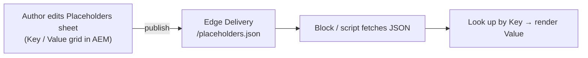
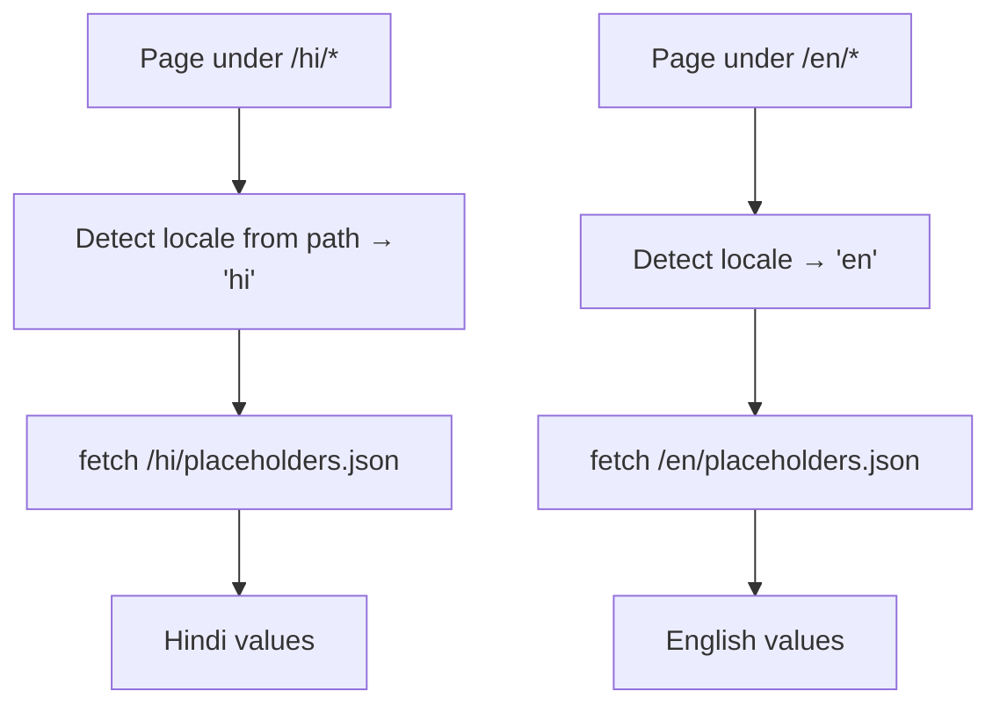
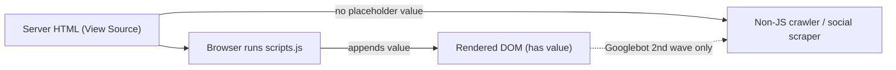

# 13 · Global Values & Placeholders

How this project shares site-wide values — site name, labels, contact details,
URLs, feature flags — across many blocks and pages **without hardcoding them in
code**, using the Edge Delivery **placeholders** mechanism. This document is the
architecture reference produced from the placeholders POC.

---

## The problem

Migration pages repeat the same values everywhere: the site name, CTA labels
("Open account", "Learn more"), the customer-care number, login/search URLs,
default OG images, feature toggles. Hardcoding each of these into individual
blocks means:

- a value change (e.g. a new care number) requires a **code change + deploy**;
- the same string drifts out of sync across blocks;
- translation is impossible without forking the code per language.

**Goal:** one author-managed source of truth, consumed by any block/page,
changeable by publishing — no code deploy.

---

## The mechanism: a placeholders sheet

Authors edit a **spreadsheet** (created in AEM via *Create Page → Placeholders*);
the platform delivers it as JSON at the sheet's path. Blocks fetch that JSON at
runtime and look values up by key.



### Delivered shape

```json
{
  "total": 2, "offset": 0, "limit": 2,
  "data": [
    { "Key": "SiteName", "Value": "Kotak Bank" },
    { "Key": "openAccount", "Value": "Open account" }
  ],
  ":type": "sheet"
}
```

- Delivered at the **sheet's path** as JSON — e.g. root `placeholders` →
  `/placeholders.json`; a locale sheet `en/placeholders` → `/en/placeholders.json`.
- **Key/Value rows.** Keys are **case-sensitive** (`SiteName` ≠ `sitename`).
- Author-editable; a value change takes effect on **publish**, no deploy.

---

## What belongs in the sheet — and what does not

| Kind of value | Home | Why |
|---|---|---|
| Scalars / strings (site name, currency, care number, labels) | **Placeholders sheet** | Single value, reused, author-editable |
| URLs (login, branch locator, search) | **Placeholders sheet** | Same |
| Feature flags, default config | **Placeholders sheet** | Same |
| Row-based structured data (rates, locator dataset) | **Spreadsheet** (generic sheet) | Records, not key/value |
| Header / footer / social **link lists** | **Nav / footer fragments** | Variable-length content, not flat values |
| SEO metadata (title/description/og/robots/canonical) | **Metadata sheet / page metadata** | Must be **server-rendered** — see the SEO caveat below |

> Do **not** flatten variable-length link lists into the placeholders sheet — that
> is authored content and belongs in nav/footer documents (see
> [06 · Authoring & Content Modeling](06-authoring-and-content-modeling.md)).

---

## Consuming placeholders in code

Blocks fetch the sheet once and cache the promise so multiple blocks on a page
share a single network request. Reference implementation
(`blocks/placeholder-demo/placeholder-demo.js`):

```js
let placeholdersPromise;

async function fetchPlaceholders(prefix = '') {
  if (!placeholdersPromise) {
    placeholdersPromise = fetch(`${prefix}/placeholders.json`)
      .then((resp) => (resp.ok ? resp.json() : { data: [] }))
      .then((json) => (json.data || []).reduce((map, row) => {
        if (row.Key) map[row.Key] = row.Value;
        return map;
      }, {}))
      .catch(() => ({}));
  }
  return placeholdersPromise;
}
```

**Rules for consumers:**

- **Fail soft.** A missing key or a failed fetch must never throw — fall back to
  a sensible default or leave the UI unchanged.
- **Cache per page.** One fetch, shared; don't refetch per block.
- **Exact keys.** Match the sheet's casing exactly (or normalise deliberately).

---

## Localisation (/en and /hi)

This site serves content under locale prefixes (`/en`, `/hi`). Because placeholder
**values are translated** (e.g. `openAccount` = "Open account" / "खाता खोलें"),
**one shared sheet cannot serve both locales.**



### Two valid sheet models

| Model | Sheets | Lookup behaviour | Trade-off |
|---|---|---|---|
| **Per-locale, complete** | `/en/placeholders.json`, `/hi/placeholders.json` — each holds **all** keys | Fetch the current locale's sheet only | Simple; some duplication of language-neutral values |
| **Root + locale overrides** | Root `/placeholders.json` (neutral: SiteName, URLs, flags) + `/en`, `/hi` (translatable only) | Fetch locale sheet, **fall back to root** for missing keys | Less duplication; slightly more logic |

### Consumer must be locale-aware

The naive `fetch('/placeholders.json')` (root-only) is a **bug** on a
locale-prefixed site: on a `/hi/` page it returns English (or 404). Consumers
should derive the locale prefix from the URL and fetch the matching sheet:

```js
// derive '/en' or '/hi' from the first path segment; default to '' (root)
const seg = window.location.pathname.split('/')[1];
const prefix = ['en', 'hi'].includes(seg) ? `/${seg}` : '';
const placeholders = await fetchPlaceholders(prefix);
```

---

## SEO caveat — the critical constraint

Placeholders are read by **JavaScript at runtime**, which mutates the **DOM after
load**. That value is **not present in the raw server HTML** (View Source) and is
**not reliably seen by non-JS crawlers / social scrapers**.



**Therefore:**

- ✅ Placeholders (JS) are fine for **UX text** — labels, ARIA strings, in-page
  copy, the browser-tab title nicety.
- ❌ Placeholders (JS) are **not** an SEO mechanism. `<title>`, `description`,
  `og:*`, `canonical`, `robots` must be in the **server-rendered HTML**.

For SEO "global variables", use the **Metadata sheet** (server-rendered, applied
by URL pattern) — see [06 · Metadata & Redirects](../migration/06-metadata-and-redirects.md).
Note the platform has **no server-side interpolation**: a Metadata cell stores a
**literal** value; you cannot expand `{{SiteName}}` server-side. A brand-suffix in
the *raw* title must be **baked into the title text** at author/import time, not
appended at runtime.

| Need | Use | Server-rendered (SEO-safe)? |
|---|---|---|
| In-page labels / tab title | Placeholders sheet (JS) | ❌ No |
| Global `description` / `og:image` / `robots` by URL pattern | **Metadata sheet** | ✅ Yes |
| Brand suffix inside the indexed `<title>` | Bake at import/author time | ✅ Yes |

---

## Reference implementation in this repo

| Artifact | Path | Role |
|---|---|---|
| Demo block | `blocks/placeholder-demo/` | Reads a key from the sheet and renders it (JS/CSS/UE model) |
| Title suffix | `scripts/scripts.js` → `appendSiteNameToTitle()` | Appends ` \| <SiteName>` to the tab title (UX only — **not** SEO) |
| English sheet (local snapshot) | `content/placeholders.json` | Dev-server reference; real sheet authored in AEM |
| Hindi sheet (local snapshot) | `content/hi/placeholders.json` | Translated values |

> Files under `content/` are authored in AEM and are **not** hand-edited in the
> repo; the local copies are dev-server snapshots only.

---

## Decision summary

- **Reuse a single value across blocks/pages** → placeholders sheet.
- **Different values per language** → one sheet per locale (`/en`, `/hi`);
  make consumers locale-aware. A single root sheet is only enough if **no** value
  is translated.
- **SEO-critical metadata** → Metadata sheet / page metadata (server-rendered),
  never the JS placeholder path.
- **Variable-length link lists** → nav/footer fragments, not the sheet.

## Related

- [06 · Authoring & Content Modeling](06-authoring-and-content-modeling.md)
- [07 · Preview, Publish & Delivery](07-preview-publish-delivery.md)
- [12 · Environments & Promotion](12-environments-and-promotion.md)
- [Migration · 06 · Metadata & Redirects](../migration/06-metadata-and-redirects.md)
