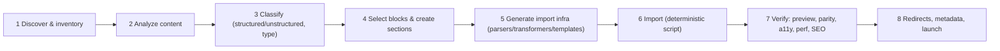

# Enterprise Website Migration to AEM Edge Delivery Services — Methodology

The complete, end-to-end methodology for migrating an enterprise website to **AEM Edge Delivery Services (EDS)**. Grounded in this repo's real migration tooling (`tools/importer/` — parsers, transformers, `page-templates.json`, bulk-import bundles) and the EDS conventions in `AGENTS.md`.

> **Stack:** EDS (xwalk / Universal Editor). Vanilla JS/CSS/JSON, no Java/HTL/OSGi/Dispatcher. Content is authored in Universal Editor / Document Authoring and delivered via AEM Code Sync. Every migration decision below targets these primitives.

## The methodology at a glance

## Documents
| # | Document | Covers |
|---|---|---|
| 01 | [Analysis & Classification](01-analysis-and-classification.md) | how content is analyzed & classified; structured vs unstructured; the master decision tree |
| 02 | [Source Types](02-source-types.md) | existing HTML, existing CMS, PDFs, Word docs — how each is ingested |
| 03 | [Content Patterns → Blocks](03-content-patterns-to-blocks.md) | tables, cards, forms, accordions, tabs, FAQs, hero banners — block selection per pattern |
| 04 | [Sections & Authoring Model](04-sections-and-authoring.md) | how sections are created; how authors edit |
| 05 | [Landing Pages & Navigation](05-landing-pages-and-navigation.md) | landing page assembly; nav migration |
| 06 | [Metadata & Redirects](06-metadata-and-redirects.md) | metadata mapping; redirect strategy |
| 07 | [Performance, SEO & Accessibility](07-performance-seo-accessibility.md) | how each is preserved through migration |
| 08 | [Import Tooling & Execution](08-import-tooling-and-execution.md) | parsers, transformers, page-templates.json, bulk import |
| 09 | [Decision Trees](09-decision-trees.md) | consolidated Mermaid decision trees for every fork |
| 10 | [Pre-Migration Website Analysis](10-pre-migration-website-analysis.md) | crawl URLs · classify pages · identify page types · route to EDS/AEM Sites/Content Fragments/UE/Doc Authoring/Dynamic |
| 11 | [Automated Migration Engine](11-automated-migration-engine.md) | the 18-stage engine: discovery→…→publishing→rollback→QA, as an idempotent artifact-driven pipeline |

## The governing principle
**Migrate to intent, not to markup.** The goal is not to reproduce the source HTML byte-for-byte, but to map each piece of source *content* to the EDS block that best expresses its *intent* — so authors can edit it, the platform can optimize it, and it stays fast, accessible, and indexable. A faithful pixel result is the *output* of correct intent-mapping, not the method.
