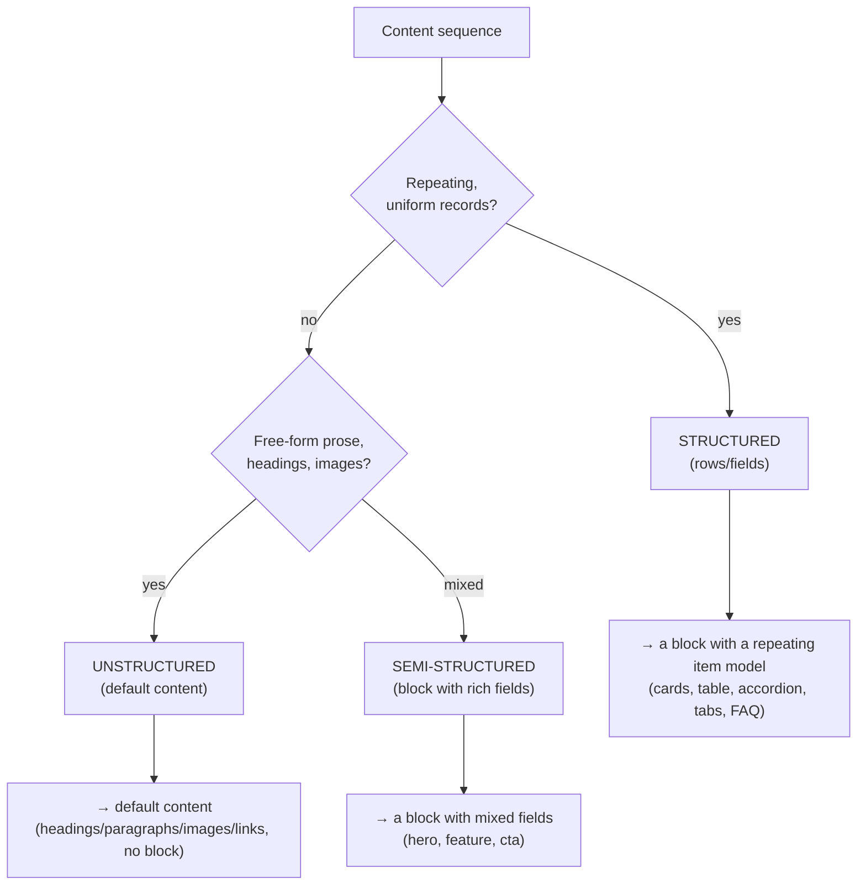
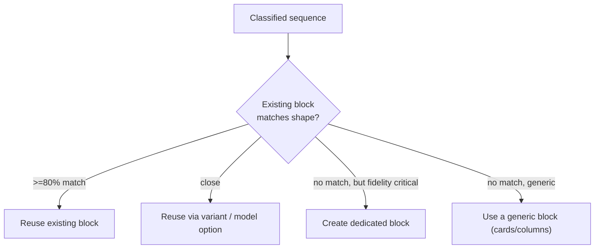

# 01 · Analysis & Classification

How source content is analyzed and classified before any block is chosen. This is the phase that determines migration quality — a misclassification here propagates through every later stage.

## Step 1 — Discovery & inventory
Build a complete picture of what exists before touching anything.
- **URL discovery:** sitemap first, crawl as fallback. Produce the full URL list.
- **Page grouping into templates:** cluster URLs by structural similarity (a "product page" template, a "landing page" template, an "article" template). *Why:* you migrate *templates*, not 5,000 snowflakes — one template's parsers/transformers serve every page of that shape.
- **Asset inventory:** images, PDFs, videos, fonts.
- **Integration inventory:** forms, search, personalization, analytics, third-party embeds.
- **Output:** a scope report — page count, template count, block variants needed, risk items (forms, commerce, megamenus).

## Step 2 — Two-level content analysis (per page)
For each page (or template representative), analyze in two passes:
1. **Section-level:** identify the top-level horizontal bands (hero → intro → features → FAQ → CTA → footer). These become **EDS sections**.
2. **Sequence-level (within each section):** identify each content sequence and describe it *neutrally* — "3 repeating items, each an icon + heading + short text + link." Do **not** name a block yet.

*Why neutral descriptions first:* naming a block prematurely biases the analysis. Describe the *content shape*, then match it to a block. This separation is the single biggest lever on classification accuracy.

## Step 3 — Structured vs unstructured classification
The first fork for every content sequence:

- **Structured:** repeating uniform records → a block whose model has an item structure (cards, rows, FAQ pairs).
- **Semi-structured:** one composite unit with heterogeneous fields → a block with named fields (hero: image + heading + body + CTA).
- **Unstructured:** free-flowing prose/media → **default content** (plain headings, paragraphs, images, links) with no block at all.

*Why default content matters:* over-blocking is a common migration error. Prose that's just prose should be default content — it's simpler for authors, lighter to deliver, and more flexible. Reserve blocks for content with a *shape*.

## Step 4 — Content-type classification
For structured/semi-structured sequences, classify the *type* (drives block selection, [03](03-content-patterns-to-blocks.md)): table, cards, form, accordion, tabs, FAQ, hero, carousel, media+text, quote, stats, CTA band, navigation. Use content signals, not source class names (source CSS classes lie; content shape doesn't).

## Step 5 — Reuse decision
Before creating anything, check the existing block palette:

*Why an 80% threshold:* aggressive reuse keeps the block count and CSS surface small and consistent (this repo has 50 blocks, not 500). Only mint a dedicated block when bespoke fidelity would otherwise pollute a shared one — the documented `k811-*` rationale.

## Artifacts this phase produces
`analysis.json` (per page: sections + sequences + classifications), a template catalog, and `page-templates.json` entries with `blocks[]` to be filled by mapping. These are the deterministic inputs to import tooling ([08](08-import-tooling-and-execution.md)).

## Why analysis is the highest-leverage phase
Every downstream artifact — parser, transformer, block, section — is derived from this classification. Get "this is default content, not a block" or "this is the `cards` shape" right, and the rest is mechanical. Get it wrong, and you build a bespoke block for prose, or force a table into cards. Invest here.
