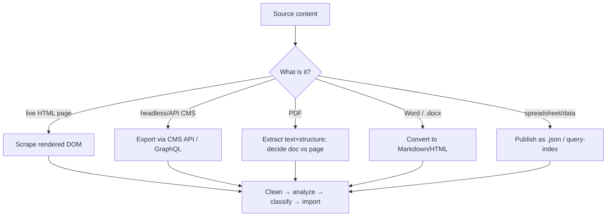
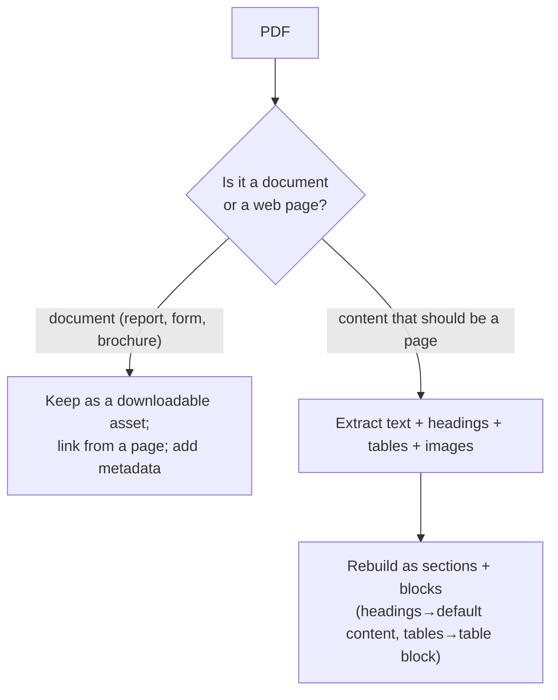

# 02 · Source Types

How each kind of source is ingested. The classification method ([01](01-analysis-and-classification.md)) is the same for all; ingestion differs.

## Decision tree — pick the ingestion path

## Existing HTML pages
The primary path (what `tools/importer/` is built for).
- **Scrape the rendered DOM** (not view-source) so JS-built content is captured. Download images; capture metadata.
- **Clean deterministically** before analysis: strip scripts, trackers, chrome, boilerplate → `cleaned.html`. *Why:* less noise → more reliable segmentation and cheaper analysis.
- **Hover/interaction-revealed content** (megamenus, tabs, accordions) needs Playwright interaction to reveal before scraping — static DOM misses it.
- Then analyze → classify → map → import.

## Existing CMS (WordPress, AEM Sites, Drupal, Sitecore, headless…)
- **Prefer structured export** over scraping when an API exists: the CMS already knows the field structure, so you skip re-inferring it. Export via REST/GraphQL/content API.
- Map CMS content types → EDS blocks (a CMS "Card" type → `cards` block; a "Hero" type → hero block). The CMS's own model is a strong classification hint.
- For headless/structured CMS data, consider delivering as a published `.json` the block fetches, rather than baking it into page content — keeps it editable at the source.
- **Redirects:** export the CMS's existing URL map ([06](06-metadata-and-redirects.md)).

## PDFs

- **Extraction:** pull text with reading order, headings, tables, and images. PDF structure is often flat — reconstruct heading hierarchy from font-size/weight cues.
- **Tables in PDFs** are the hard part: extract to a clean grid, then map to a table block ([03](03-content-patterns-to-blocks.md)).
- *Decision:* not every PDF should become a page. Reports/forms/brochures stay as linked assets; only PDFs that are *really web content in the wrong format* get rebuilt as pages.

## Word documents (.docx)
- **Convert to Markdown/HTML** preserving heading levels, lists, tables, links, and images. `.docx` heading styles map cleanly to `<h1>–<h6>` → default content.
- **Document Authoring** natively uses a doc-based model — Word content can flow in with minimal transformation.
- Tables → table block; call-out boxes → an appropriate block; the rest → default content.
- *Watch:* Word injects noisy inline styles and empty paragraphs — clean these in a transformer.

## Spreadsheets / tabular data
- Publish as a `.json` resource (or use `query-index.json`) and fetch in a block, rather than pasting a giant static table into page content. *Why:* keeps data editable, cache-friendly, and lets one block render many rows.

## Structured vs unstructured across sources (summary)
| Source | Usually structured | Usually unstructured |
|---|---|---|
| HTML | grids, tables, forms, nav | article body, rich sections |
| CMS | content-type records | rich-text body fields |
| PDF | tables, forms | narrative report text |
| Word | tables, lists | prose, headings |
Regardless of source, the classification fork in [01](01-analysis-and-classification.md) is applied to each sequence.

## Why ingestion is separated from classification
Different sources need different *extraction* (scrape vs API vs PDF parse), but the *decision* of "block vs default content, which block" must be identical across all of them — otherwise the same content migrates inconsistently depending on where it came from. One classifier, many ingesters.
