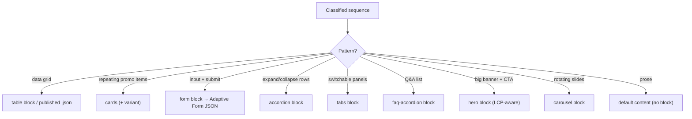

# 03 · Content Patterns → Blocks

For each common enterprise content pattern: how to recognize it, which EDS block to select, the authoring model, and the gotchas. Block selection follows the reuse decision tree in [01](01-analysis-and-classification.md).

## Master pattern → block map

## Tables
- **Recognize:** uniform rows/columns of data (rates, comparisons, specs).
- **Select:** a `table` block for display data; for large/editable datasets, publish a `.json` and render it (keeps data out of page markup).
- **Model:** header row + data rows; or `columns` for a comparison layout.
- **Gotchas:** don't force a *comparison* table (few columns, marketing) into a data table — it's often better as `columns` or `cards`. Preserve semantic `<th>`/scope for accessibility ([07](07-performance-seo-accessibility.md)). Responsive: tables must reflow or scroll on mobile, not overflow.

## Cards
- **Recognize:** repeating uniform items — image/icon + title + short text + optional CTA.
- **Select:** the `cards` block (this repo has many variants: `cards-benefits`, `cards-featured`, `cards-product`, `cards-quicklink`, `cards-story`). Reuse a variant before creating one.
- **Model:** one row per card; cells classified by content (image / copy / CTA — never by index).
- **Gotchas:** variable-length titles/bodies must not break the grid; equalize via CSS, not fixed heights.

## Forms
- **Recognize:** inputs + labels + submit; validation; a submission target.
- **Select:** a **form block**; convert the HTML form to **Adaptive Form JSON** (a dedicated forms migration path). Submissions POST to an external/forms service — never a servlet (there is none).
- **Model:** field definitions (type, label, required, validation) as JSON.
- **Gotchas:** never embed secrets/endpoints-with-keys in client code; respect the CSP `connect-src`; preserve label/field association and error messaging for accessibility. Multi-step and conditional forms need the Adaptive Forms capability, not a hand-rolled block.

## Accordions
- **Recognize:** list of headers that expand to reveal content; one/many open.
- **Select:** an `accordion` block.
- **Model:** repeating (summary, detail) pairs.
- **Gotchas:** use native semantics (`
`/`
` or button + `aria-expanded` + controlled region); keyboard operable; `Esc`/Enter/Space; animate height via transform where possible.

## Tabs
- **Recognize:** a tab strip switching between panels showing one at a time.
- **Select:** a `tabs` block.
- **Model:** repeating (tab label, panel content) pairs.
- **Gotchas:** ARIA tabs pattern (`role=tablist/tab/tabpanel`, `aria-selected`, arrow-key navigation); ensure all panel content is in the DOM for SEO (don't lazy-inject tab bodies that crawlers miss).

## FAQs
- **Recognize:** question/answer list (a specialized accordion).
- **Select:** a dedicated `faq-accordion` block (this repo has `faq-accordion` and `k811-faq`).
- **Model:** repeating (question, answer) pairs.
- **Gotchas:** emit **FAQ structured data** (schema.org `FAQPage` JSON-LD) for SEO where appropriate; keep answers in the DOM (not fetched) so they're indexed; full keyboard support.

## Hero banners
- **Recognize:** large above-the-fold banner — background image/video + heading + subtext + CTA.
- **Select:** a `hero` block (this repo: `hero`, `carousel-hero`, `k811-hero`, `k811-video-hero`, `k811-about-hero`).
- **Model:** image (reference) + heading + body + CTA link/text; art-directed mobile/desktop images.
- **Gotchas — this is the LCP element:** use `createOptimizedPicture`, media-scoped `<link rel=preload>`, `fetchpriority="high"`, `loading="eager"` ([07](07-performance-seo-accessibility.md)). Everything else on the page is lazy. Video heroes must not autoplay-block LCP; poster image first.

## Carousels
- **Recognize:** rotating slides.
- **Select:** a `carousel` block (`carousel-hero`, `carousel-icons`).
- **Gotchas:** accessibility is hard — pause control, keyboard nav, `aria-live` off for auto-rotate, respect `prefers-reduced-motion`. Don't put the LCP image inside a JS-initialized carousel that delays it; render slide 1 eagerly. Consider whether a static grid serves the content better than a carousel at all.

## Unstructured prose → default content (not a block)
- **Recognize:** article bodies, rich sections, mixed headings/paragraphs/images/links with no repeating shape.
- **Select:** **default content** — plain semantic HTML, no block. Authors edit it as a document.
- *Why:* simpler for authors, lighter delivery, more flexible. The most common over-engineering in migration is blocking prose that should stay default content.

## Why pattern→block mapping is a lookup, not a judgment call each time
Enterprise sites reuse ~15 content patterns endlessly. Encoding each pattern's recognition signals, target block, model, and gotchas as a table makes classification consistent across pages and migrators, and makes the accessibility/performance gotchas impossible to forget at the moment of block selection.
