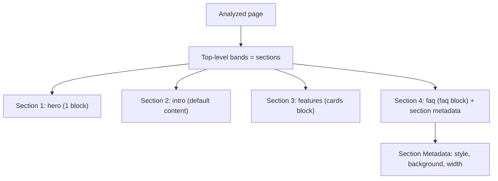
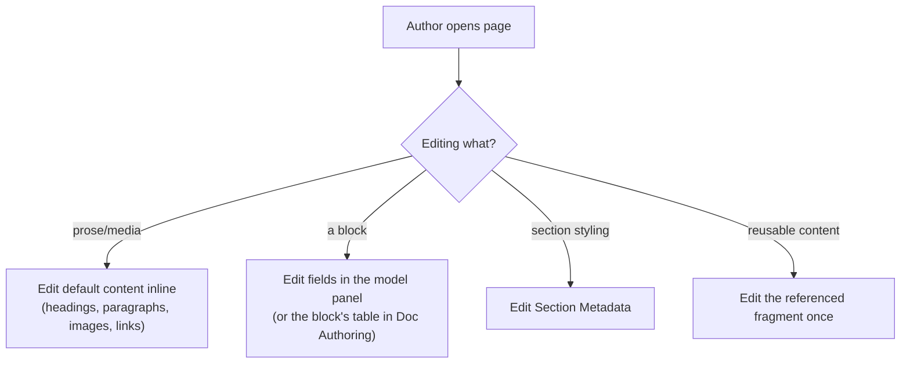

# 04 · Sections & Authoring Model

How sections are created during migration, and how authors edit the result. A migration isn't done when it renders — it's done when an author can *maintain* it.

## How sections are created
In EDS, a **section** is a group of blocks and/or default content between section breaks; it carries `.section` and can have section-level styling/metadata. The section-level analysis ([01](01-analysis-and-classification.md)) maps directly:

- **One visual band = one section.** Section breaks (`---` in the doc model) delimit them.
- **Section metadata** carries per-section styling (background color, spacing, width variant) via a Section Metadata block — not per-element CSS. *Why:* keeps presentation authorable and consistent.
- **Mixed sections** are fine: a section can hold default content *and* a block (intro paragraph + a cards grid).
- The importer's **sections transformer** (e.g. `tools/importer/transformers/kotak811-sections.js`) inserts these boundaries deterministically.

## The authoring contract (design it, don't stumble into it)
Each block's **content model** (`_{block}.json`) is the interface the author sees. Migration must produce models that are:
- **Semantically labeled** — "Video Thumbnail," "CTA Link," not "image0/text1."
- **Correctly typed** — `reference` (assets), `richtext`, `text`, `select`, `aem-content`.
- **Grouped sensibly** with optionals clearly optional.
- **Stable** — changing the model later breaks already-authored content, so get the fields right during migration.

## How authors edit the migrated content
Two authoring surfaces, depending on project setup:
- **Universal Editor** — WYSIWYG, in-context editing of blocks and default content; the block's model drives the property panel. Instrumentation (`moveInstrumentation()`) must be preserved through decoration so overlays attach.
- **Document Authoring** — document-based (Word/gdocs-like) editing; blocks are expressed as tables in the document.

## Authoring conventions migration must honor
- **Blocks tolerate omitted fields** — authors leave optionals blank; blocks must render (classify by content, guard every field).
- **Variants are author choices** — expose layout/theme options as a `select`, so authors switch variant without a developer.
- **Reusable content via `fragment`** — shared banners/disclaimers authored once, referenced everywhere; migrate duplicated source content into a single fragment.
- **No hand-editing `content/`** — authored content is produced by the importer or the author, never hand-edited in the repo.

## Validation: is it *authorable*?
Beyond "does it render," verify:
- The block is **insertable** and **editable** in the editor.
- Every field is reachable and labeled.
- Removing an optional field doesn't break layout.
- Variants switch correctly.
*Why this is a distinct gate:* a block that renders from imported content but can't be edited afterward is a migration failure — the author is stuck.

## Why authorability is a first-class migration goal
The point of a CMS migration is ongoing authoring, not a one-time render. If the models are cryptic, brittle, or missing variant options, every future content change needs a developer — which defeats the migration. Designing the authoring contract *during* migration (not after) is what makes the result maintainable.
