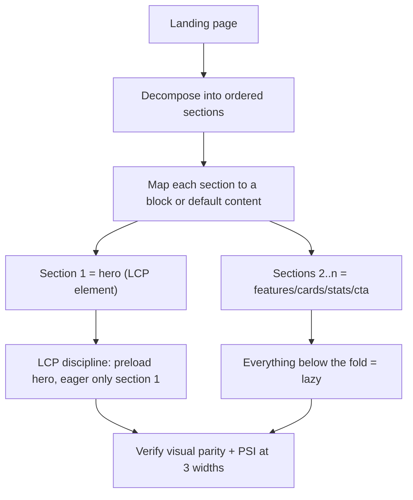
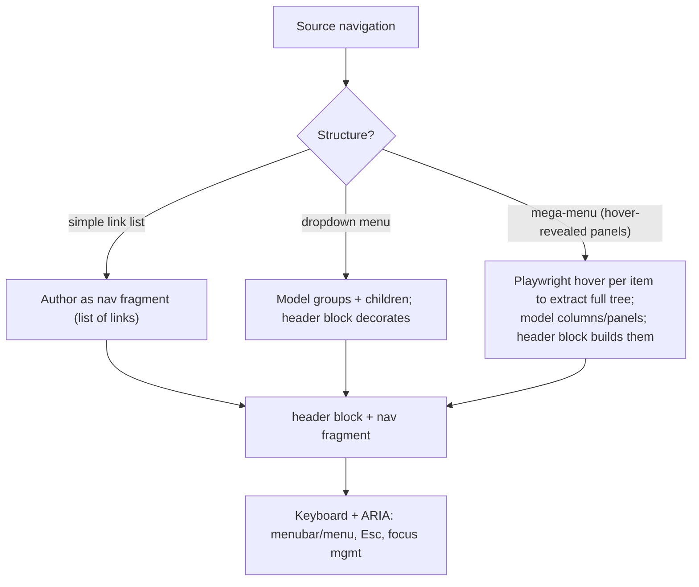

# 05 · Landing Pages & Navigation

Two enterprise-critical, structurally-distinct migration targets.

## Landing pages
Marketing landing pages are **section compositions** — a sequence of hero, feature, proof, and CTA bands. They are where fidelity and performance matter most (they're campaign entry points and LCP-sensitive).

### Assembly method

- **Hero first, and it's the LCP element** — apply the full LCP pattern ([07](07-performance-seo-accessibility.md)): `createOptimizedPicture`, media-scoped preload, `fetchpriority="high"`. This one decision drives the page's Core Web Vitals.
- **Reuse section-level blocks** — landing pages recombine the same feature/cta/proof blocks; the block palette should already cover most sections after the first few landing pages.
- **Section metadata for band styling** (backgrounds, spacing) rather than per-element CSS.
- **Fidelity + motion** — reproduce animations with the shared IntersectionObserver reveal, transform/opacity only, `prefers-reduced-motion` honored.
- **Dedicated blocks only where warranted** — a bespoke campaign section that would pollute a shared block gets its own block (the `k811-*` rationale); everything else reuses.

## Navigation
Navigation is **not page content** — it's site chrome loaded in the lazy phase (`loadHeader`/`loadFooter`), authored as fragments, and shared across all pages. It needs its own migration treatment.

### Method

- **Extract the full tree** — megamenus reveal content on hover/click; you must interact (Playwright) to capture every link and panel, or programmatically read the tree only if it's fully pre-rendered in the DOM/`__NEXT_DATA__`.
- **Author nav as a fragment** — the header is a shared fragment (link lists + structure), decorated by the `header` block. Editing nav once updates every page.
- **Accessibility is mandatory** — keyboard operable (arrow keys, `Esc` to close), correct ARIA (`menu`/`menuitem` or disclosure pattern), visible focus, focus trapping only where appropriate. Enterprise nav is the most-used and most-audited component.
- **Mobile nav** — hamburger + drawer; ensure it's keyboard/screen-reader operable and doesn't ship desktop megamenu markup that bloats mobile.
- **Footer** — same fragment approach (link columns, legal, social); usually simpler, but validate structure.

### Gotchas
- Don't migrate nav as per-page content — it must be one shared fragment.
- Don't lose deep megamenu links (the ones only visible on hover) — they're SEO and UX critical.
- Preserve current-page/active states and breadcrumb logic.

## Why nav and landing pages are documented separately
They sit at opposite ends: landing pages are **unique content compositions** (fidelity + LCP), navigation is **shared chrome** (structure + accessibility + one-source editing). Treating nav like page content, or landing heroes like ordinary images, are two of the most damaging migration mistakes — hence dedicated methods.
