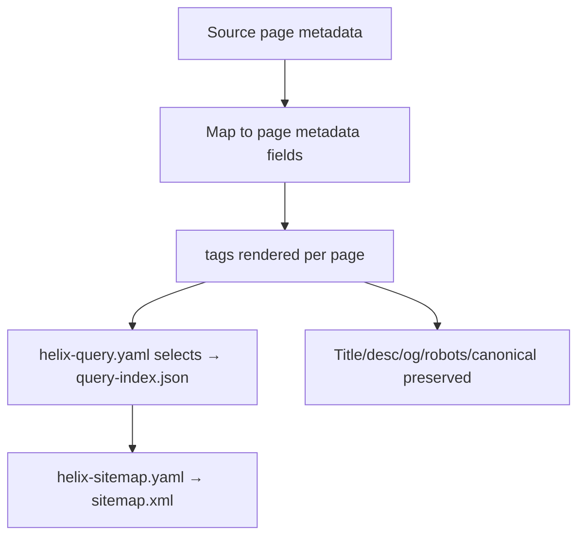
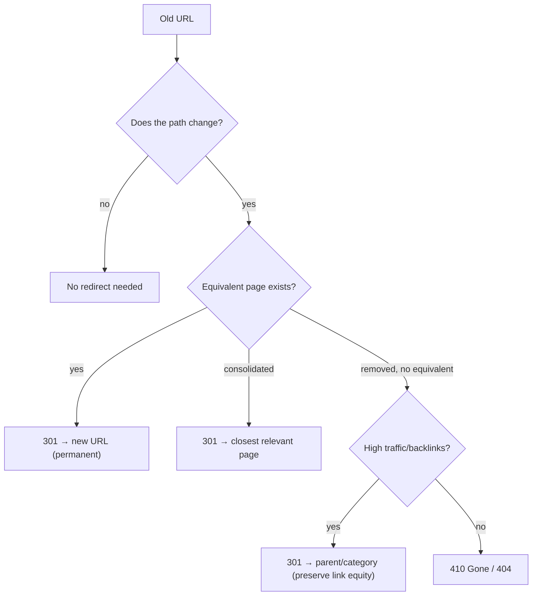
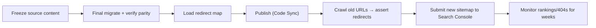

# 06 · Metadata & Redirects

The two things most likely to silently destroy SEO in a migration if mishandled.

## Metadata
Every page's metadata must survive the migration and land where EDS indexes it.

### What to migrate
| Source metadata | EDS destination |
|---|---|
| `<title>`, `og:title` | page title (indexed by `helix-query.yaml` → `og:title`) |
| meta description | `description` (indexed) |
| `og:image`, social cards | `og:image` (indexed) |
| `robots` (index/noindex) | `robots` meta (indexed) |
| canonical URL | canonical link |
| structured data (JSON-LD) | emitted per page/block (e.g. FAQPage) |
| lang / hreflang | `<html lang>` / hreflang links |
| custom meta (analytics keys, page type) | page metadata / Metadata block |

### How it's authored
Metadata is authored per page (a **Metadata** section/table in the document model or the page's properties) and exposed via `<meta>` tags. `helix-query.yaml` selects which tags flow into `query-index.json`, which in turn feeds `helix-sitemap.yaml`.

### Rules
- **Never drop metadata** — a lost description or wrong `robots` tanks rankings. Inventory metadata during discovery and verify it post-migration.
- **Index only what you consume** — add a field to `helix-query.yaml` when a block/sitemap needs it; keep the index lean.
- **Structured data** (FAQ, Product, Breadcrumb) is emitted as JSON-LD by the relevant block; migrate it deliberately for rich results.

## Redirects
URLs change in migration; every old URL that had traffic or backlinks must resolve.

### Method

- **Export the complete old URL inventory** (from CMS, sitemap, analytics, Search Console) — including PDFs and query-string URLs.
- **Map old → new** for every URL; prefer **301 (permanent)** to preserve link equity.
- **Implement redirects** via the EDS redirects mechanism (a redirects spreadsheet/`.json` the platform consumes) — not a Dispatcher (there is none).
- **Avoid redirect chains and loops** — map old directly to final new, not old→interim→new.
- **Preserve or consolidate**, don't silently 404 high-value URLs — send them to the closest relevant page.
- **Test** a sample and the full list post-launch (crawl old URLs, assert 301→200).

### Launch sequencing

## Why metadata + redirects get their own document
They're invisible until they fail, and they fail *in production* as ranking and traffic loss weeks later — long after the visible migration "looked done." Treating them as a first-class, verified deliverable (inventory → map → implement → crawl-test → monitor) is what protects the SEO the business actually cares about.
