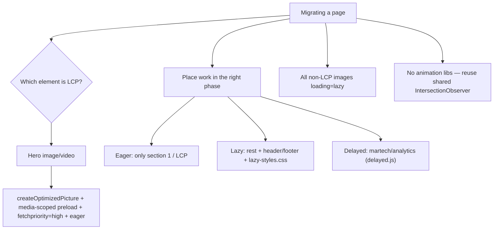
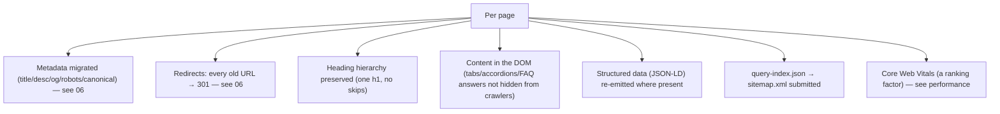
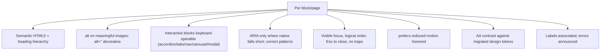

# 07 · Performance, SEO & Accessibility Preservation

How the three non-functional pillars are *preserved through* migration — not bolted on after. Each is a gate, not an afterthought.

## Performance preservation
EDS is fast by default, but migration can squander it. Preserve it by construction.

- **Protect LCP:** identify the LCP element per template (usually the hero); preload it; eager-load only the first section; lazy everything else. All non-LCP images `loading="lazy"`.
- **Three-phase discipline:** martech/analytics/chat widgets go in the delayed phase — the #1 way migrations regress performance is dumping the old site's script soup into eager load.
- **CSS split:** LCP-critical in `styles.css`, rest in `lazy-styles.css`; block CSS code-splits automatically.
- **No new dependencies:** reuse the shared reveal observer; transform/opacity animations only.
- **Assets:** re-optimize and subset everything (source sites are usually full of unoptimized images/fonts).
- **Gate:** PSI on the preview URL, target 100; verify LCP ≤2.5s, CLS ≤0.1, healthy INP at 3 widths before sign-off.

## SEO preservation
Migrations lose rankings when metadata, URLs, structured data, or crawlable content are dropped.

- **Metadata + redirects:** the big two ([06](06-metadata-and-redirects.md)).
- **Semantic heading hierarchy:** preserve one `<h1>`, no skipped levels — don't flatten headings into styled `
`s during block conversion.
- **Crawlable content:** answers behind tabs/accordions/FAQ must be in the rendered DOM, not fetched on interaction — otherwise crawlers miss them.
- **Structured data:** re-emit JSON-LD (FAQPage, Product, BreadcrumbList) that the source had.
- **Descriptive links & alt text:** double as SEO and accessibility signals.
- **Sitemap:** generated from `query-index.json` via `helix-sitemap.yaml`; submit post-launch.

## Accessibility preservation
Migration is the moment to *fix* accessibility, at minimum not regress it. Target WCAG 2.1 AA.

- **Semantics first:** map source content to correct elements (headings, lists, `<button>` vs `<a>`, `<table>` with `<th>`/scope). Block conversion often destroys semantics if you're not deliberate.
- **Interactive patterns:** accordions/tabs/nav/carousels/modals get full keyboard + ARIA support (the hardest, most-audited pieces).
- **Reduced motion:** all migrated animations gated on `prefers-reduced-motion`.
- **Contrast:** verify against the new design tokens; source contrast failures should be fixed, not carried over.
- **Gate:** headings, alt, keyboard, ARIA, contrast checked per changed block at 3 widths.

## The unifying idea: preserve by construction, verify by gate
Each pillar is (a) **built into** the migration method (LCP-aware hero mapping, metadata inventory, semantic block conversion) and (b) **verified at a gate** before sign-off (PSI, redirect crawl, a11y check). Neither alone suffices — construction without verification drifts; verification without construction just documents failures.

## Why these three share one document
They interlock: Core Web Vitals is an SEO ranking factor; semantic HTML serves both SEO and accessibility; alt text and descriptive links serve both. Migrating with all three in view at once — rather than in separate passes — is what produces a page that's fast, findable, and usable, which is the actual definition of a successful enterprise migration.
