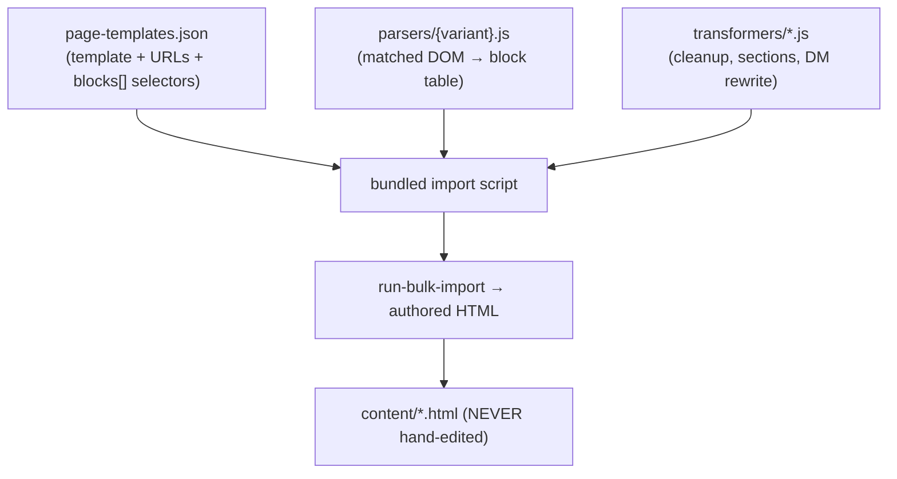

# 08 · Import Tooling & Execution

How the methodology is executed with this repo's real `tools/importer/` machinery. This is where analysis/classification becomes authored content — deterministically.

## The tooling model
Three artifact types combine into a repeatable import:

Real evidence in this repo: `tools/importer/parsers/` (e.g. `cards-benefits.js`, `k811-hero.js`, `cta-banner.js`), `tools/importer/transformers/` (`kotak811-cleanup.js`, `kotak811-sections.js`), `page-templates.json`, and bundle files (`import-kotak811-home.bundle.js`).

## Parsers (per block variant)
- **Responsibility:** take the matched source DOM for a variant and emit the EDS block's row/cell **table structure** the importer renders.
- **Discipline:** classify each field by content (image/title/body/CTA), exactly as the runtime `decorate()` will — parser and block agree on the model.
- **One per variant**, generated and validated independently, iterated until it produces correct block markup. *Why granular:* small testable units; a broken parser affects one variant, not the whole import.

## Transformers (per page/site)
- **Cleanup transformer** (`kotak811-cleanup.js`): strip scripts/trackers/boilerplate; normalize noisy markup (esp. from Word/CMS exports).
- **Sections transformer** (`kotak811-sections.js`): insert section boundaries per the section-level analysis ([04](04-sections-and-authoring.md)).
- **Dynamic Media / Scene7 rewrite:** rewrite image URLs to the target delivery.
- *Why separate from parsers:* transformers operate on the whole page (structure/cleanup); parsers operate on a matched block's DOM. Different scopes, different lifecycles.

## page-templates.json
- The catalog of templates: each entry has `name`, `urls[]`, `description`, and `blocks[]` (DOM selectors mapping regions to blocks).
- Created during site analysis (empty `blocks[]`), filled during block mapping.
- *Why a catalog:* it's the manifest that lets one import run process every page of a template — the reproducibility mechanism.

## Execution flow

## Rules of execution
- **The importer is the only path to `content/`.** Never hand-author or hand-edit content HTML — it's not reproducible and breaks on re-import.
- **Deterministic & resumable:** artifacts (`analysis.json`, `cleaned.html`, `page-templates.json`) persist; re-runs resume. Reports land in `tools/importer/reports/`.
- **Validate before bulk:** run a single-page import and verify before running the whole URL list.
- **Iterate parsers, not content:** if output is wrong, fix the parser/transformer and re-run — never patch the emitted HTML.

## Scaling to enterprise volume
- Migrate **by template**: build the parser/transformer set for a template once, then bulk-import all its pages.
- **Dedupe variants across the whole site** before generating CSS/blocks (a barrier step) so you don't create 12 near-identical card variants.
- Parallelize per-page analysis; serialize the deterministic import.

## Why determinism is the whole point
An enterprise migration is thousands of pages. Hand-crafting each is unauditable and unrepeatable; a content fix would mean re-doing manual work. By expressing the migration as **reusable parsers + transformers + a template catalog run by a script**, the entire site regenerates on demand, diffs cleanly, and any correction re-applies everywhere. Reproducibility is the deliverable — the authored pages are just its output.
