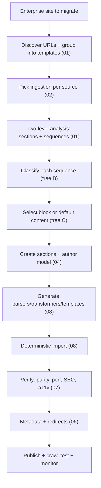
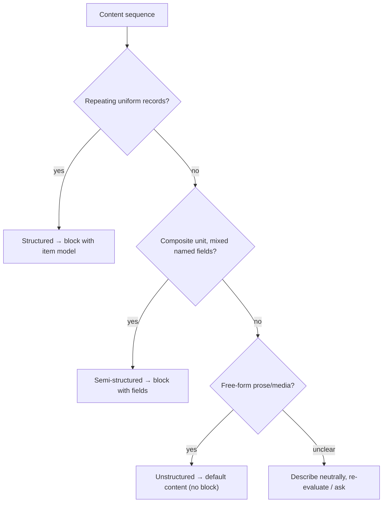
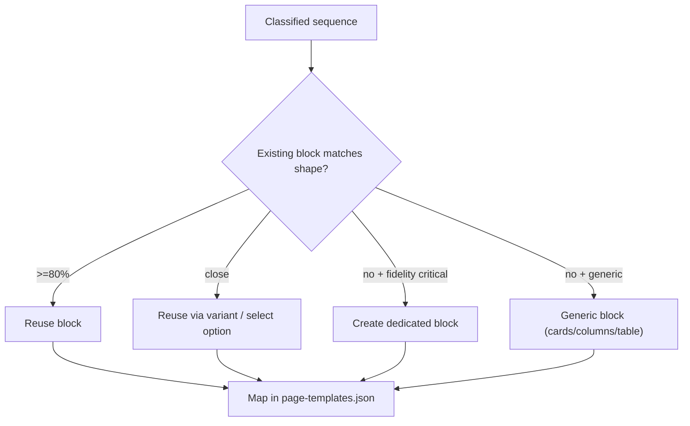
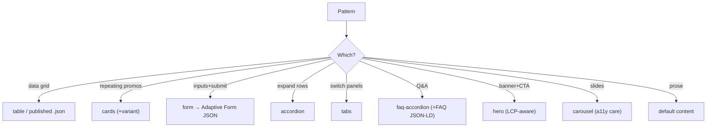
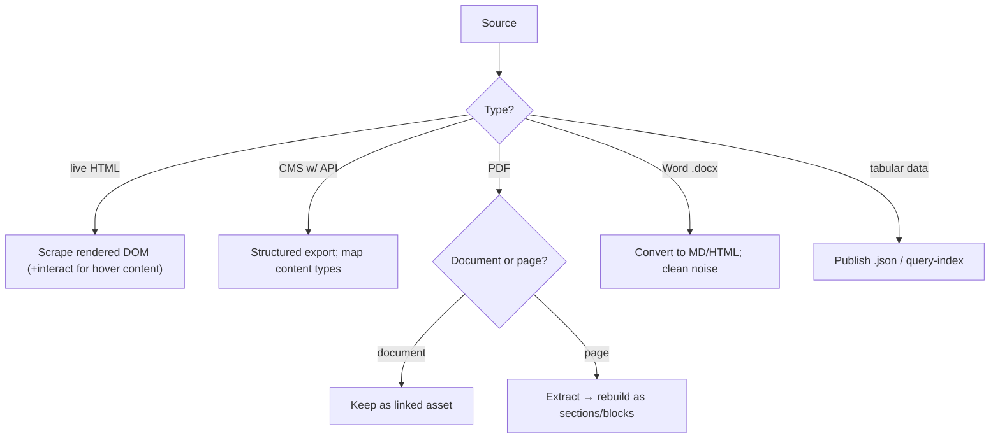
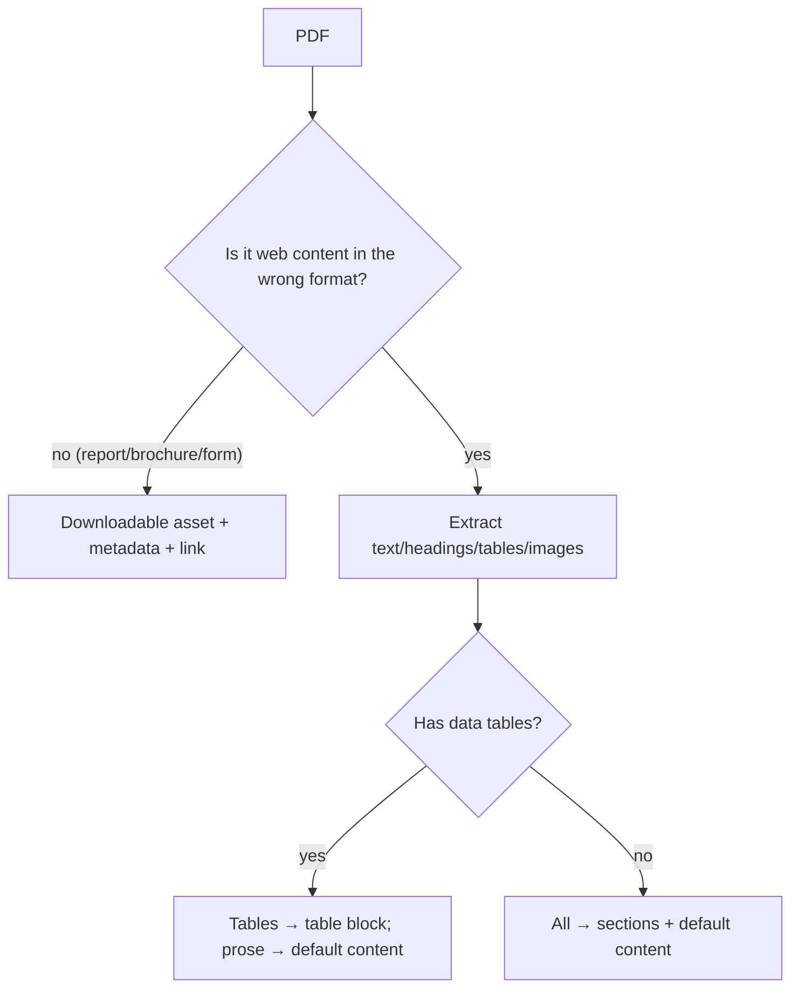
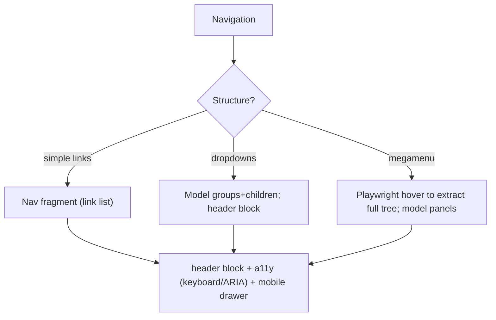
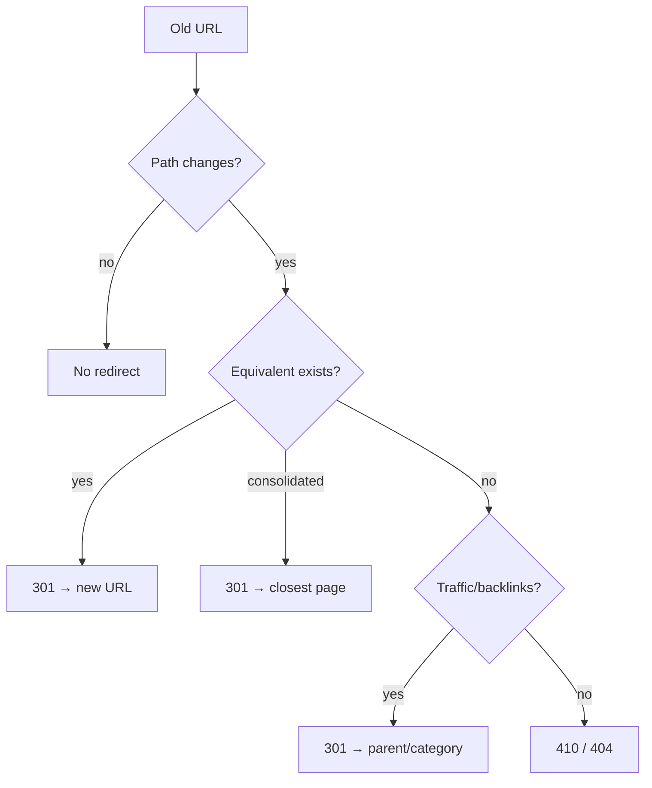
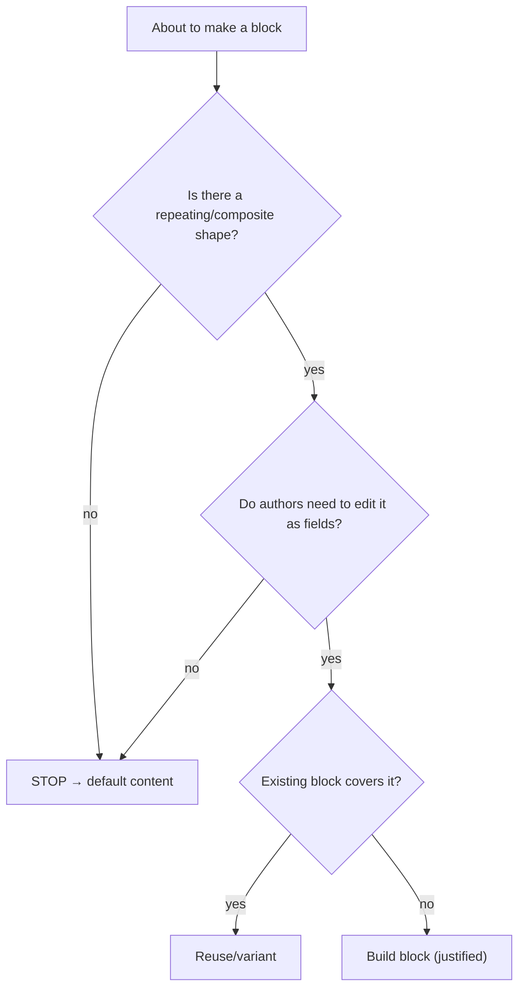
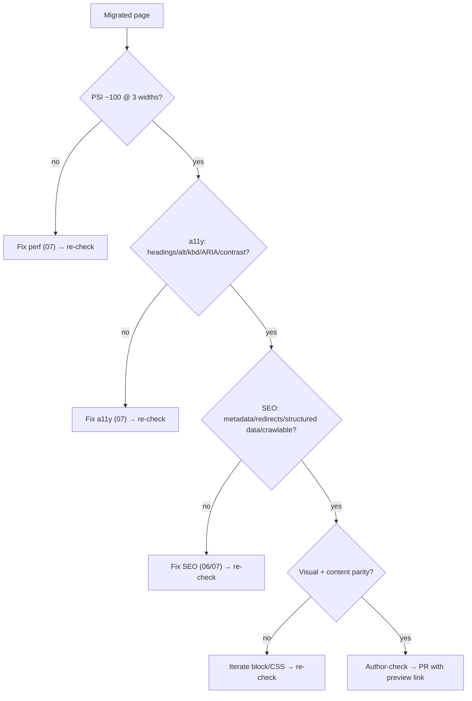

# 09 · Decision Trees (Consolidated)

Every migration fork in one place, as Mermaid trees. Use this as the quick-reference; the detail lives in the linked documents.

## A. Master migration flow

## B. Structured vs unstructured

## C. Block selection & reuse

## D. Pattern → block

## E. Source ingestion

## F. PDF disposition

## G. Navigation

## H. Redirects

## I. Block vs default content (the anti-over-engineering check)

## J. Verification gate (before sign-off per page)

## Why a consolidated tree document
During a live migration, the operator (human or assistant) needs the *fork*, fast, without re-reading prose. These trees are the executable spine; each links back to the document that explains the reasoning. Keep this open while migrating.
