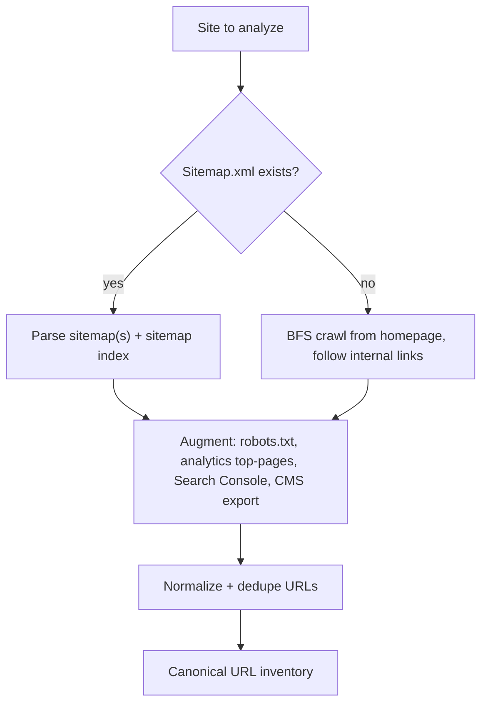
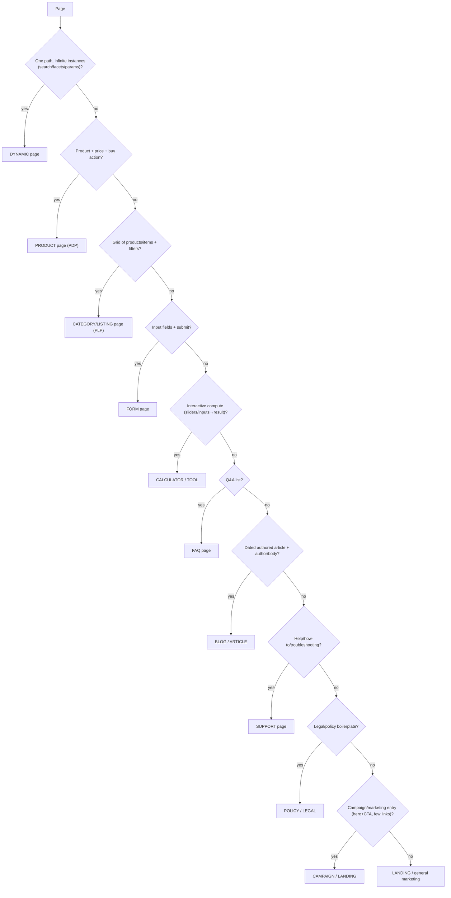
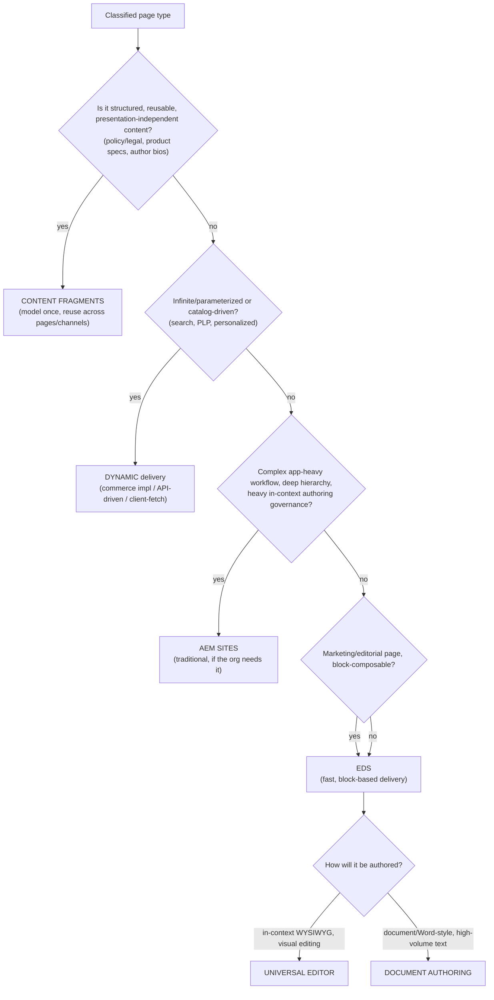

# 10 · Pre-Migration Website Analysis

How an AI (or engineer) analyzes an existing site *before* migrating it — from raw URLs to a routing decision per page. This precedes content classification ([01](01-analysis-and-classification.md)): first decide **what each page is** and **where it should live**, then decide how its content maps to blocks.

> **Why analyze before migrating at all:** a migration that starts by rebuilding page 1 has no plan. The purpose of analysis is to produce a *scoped, grouped, routed inventory* so the migration is reproducible by template and no page-type is discovered late (forms, commerce, dynamic pages all need different handling). Skipping analysis is the root cause of most migration overruns.

---

## Part 1 — Crawling URLs

### The method

### Rules, explained
- **Rule: sitemap first, crawl as fallback.**
  *Why:* the sitemap is the site owner's own declaration of canonical URLs — cheaper and more complete than crawling, and it avoids crawler traps. Crawl only when there's no sitemap or to catch orphan pages the sitemap misses.
- **Rule: augment with analytics + Search Console + CMS export.**
  *Why:* the sitemap tells you what exists; analytics tells you what *matters* (traffic, conversions) and Search Console tells you what *ranks* (backlinks, impressions). You migrate and QA high-value pages first, and you need the full URL set for redirects ([06](06-metadata-and-redirects.md)). A CMS export reveals templated pages a crawler sees as unique.
- **Rule: render with a headless browser, not raw fetch.**
  *Why:* modern sites build content with JS; `view-source` misses it. Crawl the *rendered* DOM so SPA/hydrated content is captured. Interaction-revealed content (megamenus, tabs) needs explicit hovering/clicking to surface.
- **Rule: normalize and dedupe.**
  *Why:* trailing slashes, case, query params, and tracking params (`?utm_*`) create duplicate URLs that inflate the inventory and produce redundant work. Canonicalize before counting.
- **Rule: respect robots.txt and rate-limit.**
  *Why:* you're crawling someone's production site; hammering it is abusive and can get you blocked mid-analysis. Analysis must not degrade the site it's studying.
- **Rule: record parameters and states, not just paths.**
  *Why:* `/search?q=`, `/product?id=`, faceted `/plp?filter=` are *dynamic* URLs — one path, infinite pages. Flagging these early prevents trying to statically migrate an infinite space.

### Output of Part 1
A canonical URL inventory annotated with: source (sitemap/crawl), traffic rank, last-modified, and a "dynamic?" flag.

---

## Part 2 — Classifying pages

### Cluster into templates first
- **Rule: group URLs into *templates* by structural + URL-pattern similarity before classifying types.**
  *Why:* enterprise sites are a few dozen templates instantiated thousands of times. You migrate a *template* once (its parsers/transformers serve every instance). URL patterns are the cheapest clustering signal: `/products/*`, `/blog/*`, `/*-calculator`, `/legal/*`.

### Classification signals (in priority order)
1. **URL pattern** — `/blog/`, `/products/`, `/faq`, `/legal/` are strong hints.
2. **CMS content type** (if exported) — the source's own model is the most reliable signal.
3. **Page structure** — presence of a form, a price + add-to-cart, a filter sidebar, a Q&A list.
4. **Content semantics** — headings, schema.org markup (`Product`, `FAQPage`, `Article`), breadcrumbs.
5. **Metadata / `og:type`** — `article`, `product`.
- **Rule: prefer content/structure signals over CSS class names.**
  *Why:* source class names lie (a `.card` might be anything); the *shape* of the content and its structured data are stable truth. (Same principle as content classification, [01](01-analysis-and-classification.md).)

### The page-type decision tree

*Why this order:* the most *structurally distinctive and highest-risk* types are tested first (dynamic, commerce, forms) because misclassifying them is the most expensive — they need entirely different delivery approaches (Part 4). Generic marketing/landing is the catch-all last.

---

## Part 3 — Identifying each page type (signals & why)

| Type | Recognition signals | Why it's called out |
|---|---|---|
| **Landing pages** | Hero + sequenced marketing sections + CTAs; few outbound links; often campaign-linked | LCP-critical, fidelity-critical marketing entry points; pure content → EDS |
| **Product pages (PDP)** | Single product, price, variants, add-to-cart, `schema.org/Product` | Commerce data + cart interaction; must route to a commerce implementation, not generic blocks |
| **Category pages (PLP)** | Grid of products, filters/facets, pagination, sort | Dynamic listing driven by a catalog; faceting = infinite URL space |
| **Campaign pages** | Landing page tied to a campaign (UTM traffic, short life, A/B variants) | Short-lived, high-traffic, experimentation-heavy; content but with martech/personalization needs |
| **Forms** | Input fields, labels, validation, submit target | Needs Adaptive Forms (validation/conditional/multi-step), not a static block |
| **FAQ** | Repeating Q&A, often `schema.org/FAQPage` | Structured content + FAQ JSON-LD for rich results; maps to a FAQ block |
| **Calculators** | Sliders/number inputs → computed result (EMI, savings, eligibility) | Client-side compute/logic; needs a JS block or an app, not static content |
| **Tools** | Interactive utilities (comparison, configurators, locators) | Application behavior, possibly external data/APIs; may exceed a block |
| **Blogs** | Dated posts, author, category/tags, feed | High-volume templated authored content; strong candidate for structured authoring |
| **Articles** | Long-form editorial body, headings, media | Mostly default content; authoring ergonomics matter |
| **Support** | How-to, troubleshooting, KB, often searchable | Volume + searchability; content reuse across articles |
| **Policies** | Terms, privacy, disclosures | Rarely-changed boilerplate; legal accuracy critical; often shared across pages/regions |
| **Legal** | Regulatory/compliance text, sometimes region-specific | Reuse + compliance; strong Content-Fragment candidate |

- **Rule: identify by *behavior and structure*, not by looks.**
  *Why:* two pages can look alike and behave differently (a static "savings" explainer vs an interactive savings *calculator*). The behavior determines the delivery approach — get it wrong and you migrate an app as static text.
- **Rule: flag high-risk types loudly (commerce, forms, calculators, dynamic).**
  *Why:* these blow up scope and timeline if found late. Surfacing them in the scope report lets the team plan the right sub-pipeline (commerce plugin, forms plugin, custom block, dynamic strategy) up front.

---

## Part 4 — Where should each page live? (routing decision)

The core question. EDS is not the answer for *everything* — the analysis must route each page-type to the right Adobe capability.

### The routing rules, each explained

**→ EDS (Edge Delivery Services)**
- **Rule: route marketing, landing, campaign, article, blog, FAQ, support, and most content pages to EDS.**
  *Why:* these are block-composable, presentation-oriented pages where EDS's speed (edge delivery, code-split blocks, LCP discipline) is a direct win and there's no server-side logic requirement. This is the default target for a modern content site.

**→ AEM Sites (traditional AEMaaCS)**
- **Rule: route to AEM Sites only when the org genuinely needs traditional capabilities EDS doesn't provide** — deep page hierarchies with fine-grained permissions/workflow governance, heavy server-side integration, existing large AEM investment, or component/app complexity beyond blocks.
  *Why:* AEM Sites brings Java/HTL/OSGi/workflow/Dispatcher — powerful but heavy and slower to deliver. Choosing it for simple content pages sacrifices EDS's performance and simplicity for capabilities you won't use. Only pay that cost when the requirement is real. *(Note: this project is EDS; routing a page to AEM Sites is an org-level architecture decision, not something you scaffold into this repo.)*

**→ Content Fragments**
- **Rule: route structured, reusable, channel-independent content (policies, legal, product specs, author bios, disclosures) to Content Fragments.**
  *Why:* this content is *data*, not a page — it's reused across many pages/regions/channels and must stay consistent. Modeling it once as a fragment and referencing it everywhere prevents drift and enables omnichannel reuse. Baking it into each page duplicates it and guarantees inconsistency. *(In a pure-EDS project the analogue is the `fragment` block + shared authored content; Content Fragments proper imply an AEMaaCS content source.)*

**→ Dynamic pages**
- **Rule: route search, faceted PLPs, personalized, and parameter-driven pages to a dynamic strategy** — commerce implementation for PDP/PLP, client-side fetch of published `.json`/`query-index.json` or an external API for the rest.
  *Why:* these pages are infinite or per-user; you cannot statically pre-render an infinite URL space. They need runtime data. EDS handles this via client-side fetch of edge-cached data or dedicated commerce tooling — not by generating a static page per state.

**→ Universal Editor (authoring surface for EDS pages)**
- **Rule: author pages in Universal Editor when the team needs in-context, visual, WYSIWYG editing with structured block fields.**
  *Why:* UE gives marketers a live-preview editing experience with a property panel driven by each block's model — ideal for composed marketing/landing/campaign pages where visual arrangement matters.

**→ Document Authoring (authoring surface for EDS pages)**
- **Rule: author in Document Authoring when content is high-volume, text-heavy, and document-shaped (blogs, articles, support KB, policies).**
  *Why:* DA lets authors work in a familiar Word/Docs model at scale; for hundreds of articles, document editing is far faster than assembling blocks in a visual editor. The delivery is still EDS — DA vs UE is an *authoring ergonomics* choice, not a delivery one.

- **Rule: EDS delivery and the authoring surface are independent decisions.**
  *Why:* a page delivered by EDS can be authored in either UE or DA. Conflating "which authoring tool" with "which delivery platform" is a common analysis error — decide delivery first (Part 4 top), then authoring surface (bottom).

---

## Part 5 — The analysis deliverable (scope report)

Analysis ends with a **scope report**, not code:
- URL inventory (count, grouped into templates, traffic-ranked).
- Page-type classification per template.
- **Routing decision** per template (EDS / AEM Sites / Content Fragments / Dynamic) + authoring surface (UE / DA).
- Risk register (commerce, forms, calculators, dynamic, megamenus, unusual auth).
- Redirect scope (old→new URL count).
- Effort estimate by template.

- **Rule: the report must state the routing decision *and its reason* per template.**
  *Why:* the routing is the highest-consequence, hardest-to-reverse decision in the whole migration. Recording the reasoning lets stakeholders challenge it before thousands of pages are built on it, and lets a later engineer understand why a page-type went where it did.

## Why analysis is a distinct, gated phase
Every later phase — infra generation, import, verification — is derived from this analysis. If a PDP is misrouted as a static EDS page, or a calculator is treated as prose, the error is baked into hundreds of pages before anyone notices. Making analysis an explicit phase with a reviewed scope report is what turns a risky big-bang migration into a planned, template-by-template rollout.
