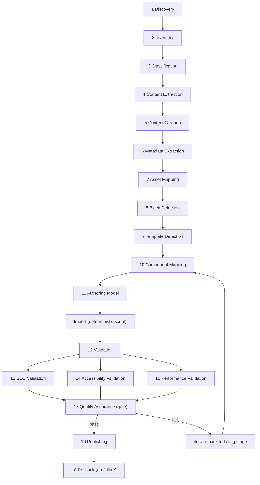
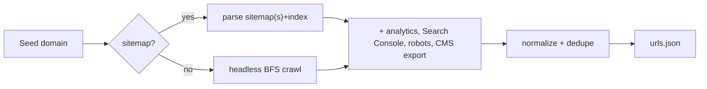
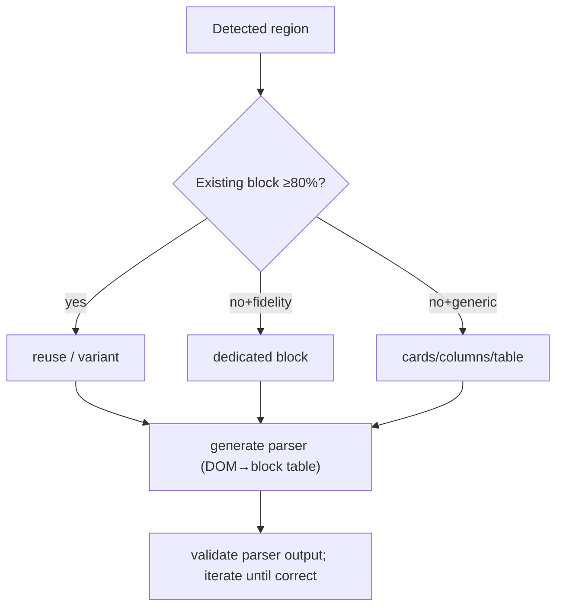
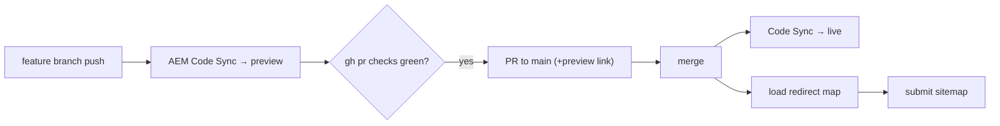
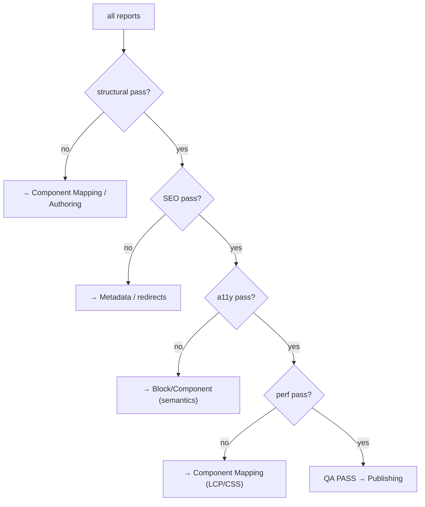
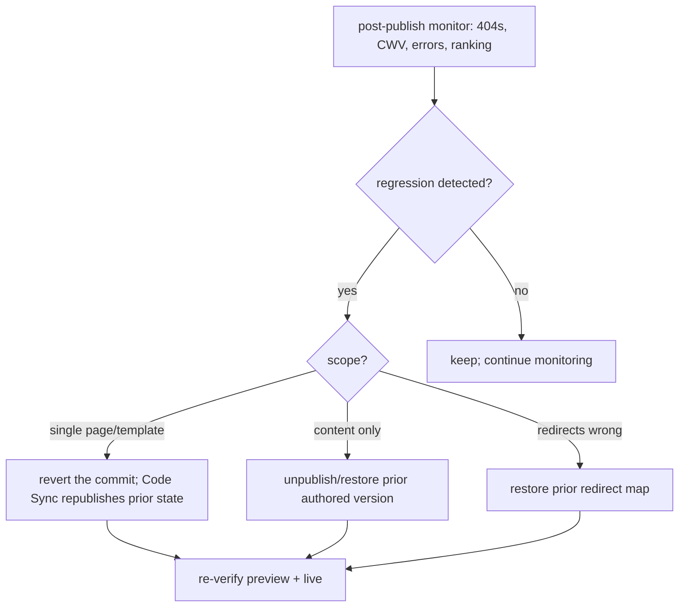

# 11 · Automated Migration Engine — Stage-by-Stage

How to build the migration methodology (docs 01–10) as an **automated engine**: 18 stages, each a pipeline node with typed inputs/outputs, a workflow, gates, and failure/rollback behavior. Grounded in this repo's real `tools/importer/` machinery.

> **Engine design principle:** every stage is **idempotent, resumable, and artifact-driven** — it reads the previous stage's artifact from disk, writes its own, and can re-run without redoing upstream work. This is what lets an enterprise migration of thousands of pages recover from a mid-run failure instead of restarting. Determinism where possible; model creativity only where genuinely needed.

## Master pipeline

## Engine data model (artifacts between stages)
| Artifact | Produced by | Consumed by |
|---|---|---|
| `urls.json` | Discovery | Inventory |
| `inventory.json` (URL + metrics + flags) | Inventory | Classification |
| `classification.json` (per-page type + route) | Classification | Extraction, Template Detection |
| `raw/{page}.html` | Content Extraction | Cleanup |
| `cleaned/{page}.html` | Content Cleanup | Block/Component detection |
| `metadata/{page}.json` | Metadata Extraction | Authoring Model, SEO |
| `assets/manifest.json` | Asset Mapping | Component Mapping, import |
| `blocks/{page}.json` (detected regions) | Block Detection | Component Mapping |
| `page-templates.json` | Template Detection | Component Mapping, import |
| `parsers/*`, `transformers/*` | Component Mapping | Import |
| `models/_*.json` | Authoring Model | import, build:json |
| `reports/*.json` | Validation stages | QA gate |

*Why a typed artifact bus:* stages communicate only through declared artifacts, so any stage is independently testable, replaceable, and resumable — the engine is a dataflow, not a monolith.

---

## Stage 1 — Discovery
**Purpose:** find every URL. **In:** seed domain. **Out:** `urls.json`.

- **Rule: sitemap-first, headless-render, respect robots, rate-limit.** *Why:* completeness without abusing the source; JS-built content needs rendering. (Detail: [10](10-pre-migration-website-analysis.md).)
- **Failure:** unreachable host → retry w/ backoff, then abort with a clear error (don't proceed on partial discovery silently).

## Stage 2 — Inventory
**Purpose:** enrich URLs into a decision-ready dataset. **In:** `urls.json`. **Out:** `inventory.json`.
- Annotate each URL: traffic rank, last-modified, content-length, has-form?, has-price?, is-parameterized?, response code.
- **Rule: flag dynamic/parameterized URLs and dead/redirecting URLs here.** *Why:* an infinite faceted space or a 404 must not enter the static-migration path; catching it in inventory prevents wasted extraction downstream.
- **Failure:** a URL that 500s is recorded with its status, not dropped — the redirect/QA stages need the full picture.

## Stage 3 — Classification
**Purpose:** assign each page a **type** and a **delivery route**. **In:** `inventory.json`. **Out:** `classification.json`.
- Type (landing/PDP/PLP/campaign/form/FAQ/calculator/tool/blog/article/support/policy/legal) via signal priority: URL pattern → CMS type → structure → semantics → metadata.
- Route (EDS / AEM Sites / Content Fragments / Dynamic) + authoring surface (UE / DA). (Full trees: [10](10-pre-migration-website-analysis.md).)
- **Rule: classify by behavior/structure, not CSS class names; route highest-risk types (commerce/forms/calculators/dynamic) explicitly.** *Why:* misroute here propagates into hundreds of pages; risk types need different sub-pipelines.
- **Gate:** low-confidence classifications are flagged for human confirmation rather than guessed.

## Stage 4 — Content Extraction
**Purpose:** capture the true rendered content. **In:** page URL + route. **Out:** `raw/{page}.html` + captured assets.
- Headless-render; capture full DOM including interaction-revealed content (hover megamenus, expand accordions/tabs) via scripted interaction.
- **Rule: extract the rendered DOM, and interact to reveal hidden content.** *Why:* raw fetch misses JS content; hover/click-revealed nav and panels are SEO/UX-critical and invisible to a static grab.
- **Failure:** partial render (timeout) → retry; persistent failure → quarantine the page for manual handling, continue the batch.

## Stage 5 — Content Cleanup
**Purpose:** strip noise to a canonical DOM. **In:** `raw/{page}.html`. **Out:** `cleaned/{page}.html`.
- Remove scripts, trackers, chrome, ad slots, empty wrappers; normalize whitespace and Word/CMS cruft. (Real analogue: `tools/importer/transformers/kotak811-cleanup.js`.)
- **Rule: clean deterministically before any model sees the DOM.** *Why:* less noise → cheaper, more accurate block/component detection; a transformer is repeatable where an LLM pass isn't.
- **Failure:** cleanup that empties a page → flag (over-aggressive rule), don't emit empty content.

## Stage 6 — Metadata Extraction
**Purpose:** preserve SEO/social/lang metadata. **In:** `raw/{page}.html`. **Out:** `metadata/{page}.json`.
- Extract title, description, `og:*`, `robots`, canonical, lang/hreflang, structured data (JSON-LD).
- **Rule: never drop metadata; capture structured data verbatim.** *Why:* lost metadata = silent ranking loss weeks post-launch; JSON-LD drives rich results. (Detail: [06](06-metadata-and-redirects.md).)
- **Failure:** missing description/title recorded as a gap for the SEO stage to surface, not silently blank.

## Stage 7 — Asset Mapping
**Purpose:** inventory and remap media. **In:** `raw` + captured assets. **Out:** `assets/manifest.json`.
- Catalog images/videos/PDFs/fonts; map source URLs → target delivery; flag Dynamic Media/Scene7 URLs for rewrite; record alt text, dimensions, format.
- **Rule: re-optimize and size-check; decide per PDF whether it's an asset or a page.** *Why:* source assets are usually unoptimized; the repo serves committed assets as-is. Not every PDF becomes a page ([02](02-source-types.md)).
- **Failure:** unreachable asset → record broken reference for QA, don't block.

## Stage 8 — Block Detection
**Purpose:** identify block-worthy regions in the cleaned DOM. **In:** `cleaned/{page}.html` + classification. **Out:** `blocks/{page}.json`.
- Segment into sections; within sections detect repeating/composite shapes (cards, table, accordion, tabs, FAQ, hero, carousel) vs prose (→ default content).
- **Rule: structured/composite → block; free prose → default content (don't over-block).** *Why:* over-blocking prose burdens authors and delivery ([01](01-analysis-and-classification.md), [03](03-content-patterns-to-blocks.md)).
- **Failure:** ambiguous region → describe neutrally, defer to Component Mapping/human.

## Stage 9 — Template Detection
**Purpose:** group pages into reusable templates. **In:** `blocks/*` + `classification.json`. **Out:** `page-templates.json`.
- Cluster pages by structural similarity + URL pattern; each template gets `name`, `urls[]`, `description`, `blocks[]` (selectors).
- **Rule: migrate by template; dedupe block variants across the whole set (barrier step) before minting new ones (≥80% reuse threshold).** *Why:* one template's parsers serve all its pages; dedupe keeps the block count small (50, not 500).
- **Failure:** a page matching no template → its own singleton template, flagged as bespoke.

## Stage 10 — Component Mapping
**Purpose:** map detected blocks to concrete EDS blocks + generate import infra. **In:** `page-templates.json` + `blocks/*`. **Out:** `parsers/*`, `transformers/*`, filled `blocks[]`.

- **Rule: reuse before build; one parser per variant, validated independently.** *Why:* small testable units; consistency. (Real analogue: `tools/importer/parsers/*`.)
- **Failure:** a parser that yields wrong markup loops (bounded) with the real diff; persistent failure → flag the variant.

## Stage 11 — Authoring Model
**Purpose:** produce the `_{block}.json` models authors will use. **In:** component mapping. **Out:** `models/_*.json` + run `build:json`.
- Fields typed (`reference`/`richtext`/`text`/`select`/`aem-content`), semantic labels, optionals marked, variants as `select`.
- **Rule: model designed to be editable, not just importable; run build:json; never hand-edit aggregates.** *Why:* a page that imports but can't be edited fails the migration's purpose ([04](04-sections-and-authoring.md)).
- **Gate:** the CI JSON-sync check (`git diff --exit-code` the aggregates).

### → Import (deterministic)
Bundle template + parsers + transformers + models → run bulk import → authored HTML. **The engine never hand-writes `content/`** ([08](08-import-tooling-and-execution.md)). *Why:* reproducibility is the deliverable.

## Stage 12 — Validation (structural)
**Purpose:** confirm the imported page is structurally correct + renders. **Out:** `reports/validation.json`.
- Lint (JS/CSS/xwalk); JSON-sync; render in preview (Playwright `snapshot`/`evaluate`); block insertable/editable; content/visual parity vs original at 3 widths.
- **Rule: verify on the preview, not localhost/chat; snapshot before screenshot.** *Why:* preview reflects real edge delivery; text inspection is cheap and checkable ([09](../handbook/09-antipatterns-mistakes-validation.md)).

## Stage 13 — SEO Validation
**Out:** `reports/seo.json`.
- Assert: metadata present + correct; every old URL → 301 (crawl-test); heading hierarchy intact; tab/accordion/FAQ content in the DOM; JSON-LD re-emitted; sitemap generated.
- **Rule: crawl old URLs and assert redirects resolve to 200.** *Why:* redirects and metadata are invisible until they fail in production as traffic loss ([06](06-metadata-and-redirects.md)).

## Stage 14 — Accessibility Validation
**Out:** `reports/a11y.json`.
- Assert WCAG 2.1 AA: one `<h1>`/no skips, alt text, keyboard operability of interactive blocks, correct ARIA, `prefers-reduced-motion`, AA contrast, labeled forms. Use the a11y tree from `snapshot`.
- **Rule: automated checks + targeted manual keyboard test for interactive blocks.** *Why:* automated tools miss operability/focus bugs that only manual keyboarding catches ([07](07-performance-seo-accessibility.md), [handbook/05](../handbook/05-accessibility.md)).

## Stage 15 — Performance Validation
**Out:** `reports/perf.json`.
- Run PSI on the preview URL; assert LCP≤2.5s, CLS≤0.1, healthy INP at 3 widths; verify LCP image eager+preloaded, others lazy, martech delayed.
- **Rule: measure on preview, target 100, at mobile/tablet/desktop.** *Why:* localhost isn't edge delivery; mobile is the constrained majority case ([handbook/04](../handbook/04-loading-and-performance.md)).

## Stage 16 — Publishing
**Purpose:** ship. **In:** passing QA. **Out:** published preview→live.

- **Rule: push-driven publish; PR must carry a preview link; load redirects + submit sitemap at cutover.** *Why:* no manual deploy; the preview link is the human's verification handle ([07](../handbook/07-preview-publish-delivery.md)).
- **Rule: never publish a page that failed the QA gate.** *Why:* the gate exists to keep regressions out of production.

## Stage 17 — Quality Assurance (the gate)
**Purpose:** consolidate all validation into a pass/fail decision. **In:** validation/seo/a11y/perf reports. **Out:** QA verdict.

- **Rule: QA is a hard gate routing each failure back to its owning stage; adversarial re-check on high-value pages.** *Why:* a single consolidated gate with typed routebacks makes failures actionable and keeps bad pages out of production. An independent "try to break it" pass catches what the generator believed.

## Stage 18 — Rollback
**Purpose:** recover safely from a bad publish. **In:** publish failure signal.

- **Rule: rollback is `git revert` + republish (code) or restore prior authored version (content); keep the old site/redirects reversible until the new one is proven.** *Why:* EDS publish is push-driven, so version control *is* the rollback mechanism — reverting the commit republishes the known-good state. Keeping the old URLs reversible protects against a redirect mistake tanking traffic. Rollback must be fast and boring, because it happens under pressure.
- **Rule: monitor after cutover (404s, CWV, ranking, JS errors) for weeks.** *Why:* the worst regressions surface days later; the engine isn't "done" at publish.

## Cross-cutting engine concerns
- **Idempotency & resume:** every stage keys off input artifacts; re-running with unchanged inputs is a no-op/cache hit. *Why:* recover a 5,000-page run from stage 12 without redoing 1–11.
- **Parallelism:** per-page stages (extraction→detection) fan out; barrier stages (template dedup) synchronize; import is serialized. *Why:* throughput without losing cross-page context.
- **Human-in-the-loop:** low-confidence classification, bespoke templates, and QA failures escalate to a human with the artifact + reason. *Why:* automation should defer, not guess, on consequential ambiguity.
- **Observability:** every stage writes a report to `reports/`; the run has a manifest of pass/fail/quarantine per page. *Why:* an enterprise migration must be auditable.

## Why an artifact-driven, gated engine (the summary decision)
A migration engine's value is **reproducibility, resumability, and auditability** at scale. Expressing it as typed artifacts flowing through idempotent stages, with a hard QA gate and a git-based rollback, turns a risky big-bang into a monitored, template-by-template, reversible rollout — which is the only responsible way to move an enterprise site.
